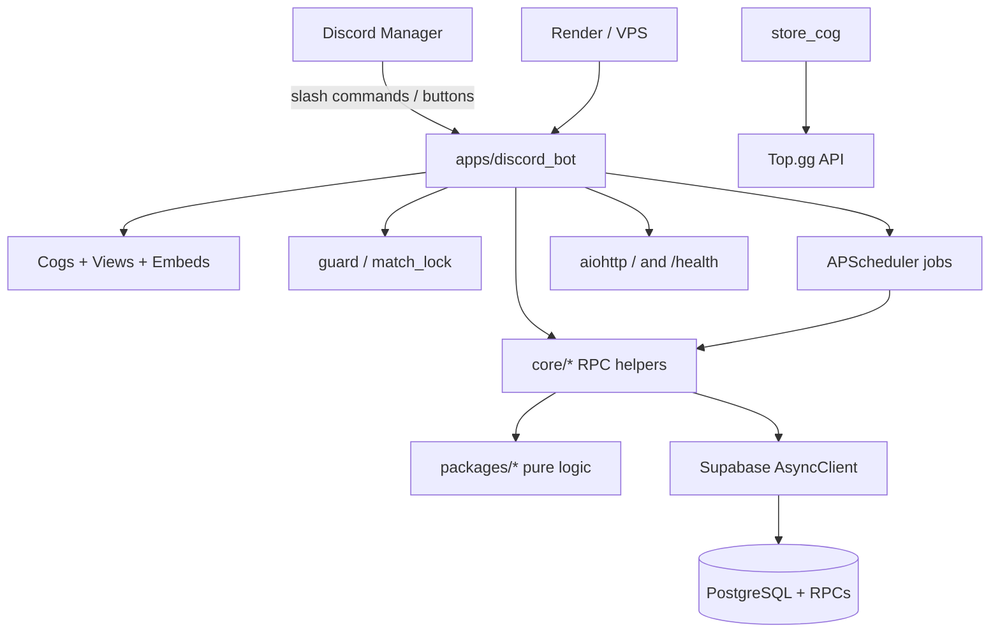
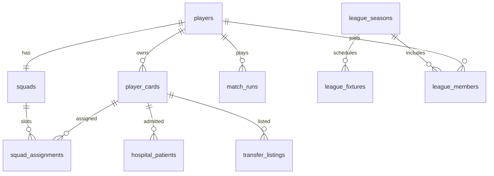

# Project Memory

> Evidence-based handoff document for ElevenBoss.  
> Generated from repository inspection on **2026-07-31**.  
> Claims cite file paths. Where evidence is missing: **Not verified from the current project files.**

---

## 1. Executive Summary

ElevenBoss is a **Discord-native football (soccer) manager game**. Managers register a club, build a squad, play bot/friendly/league matches, develop players (drills, evolutions, skills, academy), manage economy/energy, and compete on division and seasonal ladders.

**Architecture (verified):** Python monorepo with:

- `apps/discord_bot/` — Discord gateway (cogs, views, embeds, Supabase RPC wiring)
- `packages/` — pure game logic (no Discord, no DB IO)
- `supabase/migrations/` — PostgreSQL schema + RPCs (source of truth)
- `specs/` — Spec-Driven Development (SDD) feature folders `001`…`048`
- `tests/` — ~131 pytest modules

**Runtime:** Discord bot process (`python -m apps.discord_bot.main`) + aiohttp health endpoints for Render; data via Supabase async client; background work via APScheduler.

**Current HEAD:** `3d98e94` (2026-07-31) — expired league fixture auto-sim / forfeit settle (**048** / US-42.5). Branch `main`, clean working tree vs `origin/main`.

**Git history:** 121 commits; earliest `2026-06-30`; primary author `Nawal` (per `git shortlog`).

---

## 2. Project Purpose

### What it does

From `README.md`, `docs/DOCUMENTATION.md`, and `.specify/specs/v1.0.0/spec.md`:

- Discord slash-command football manager simulation
- Club registration → squad/formation → matches → XP/coins → player growth → leagues/leaderboards

### Who it appears built for

- Discord server communities / football manager fans (player docs + `/help`)
- Bot owner ops via `/admin` (DM, owner-only) and `game_config` / migrations
- AI agents via `AGENTS.md` and Speckit under `.specify/` / `.github/agents/`

### Problem it solves (from product copy, not inferred business strategy)

Provides an in-Discord closed loop: energy → matches/training → XP & coins → stronger squad → better results (`docs/DOCUMENTATION.md` §2).

### Main product features (implemented in code + docs)

| Area | Evidence |
|------|----------|
| Registration / onboarding | `apps/discord_bot/cogs/onboarding_cog.py` |
| Squad & formation | `apps/discord_bot/cogs/squad_cog.py`, `packages/match_engine/.../formation_positions.py` |
| Bot / friendly / league matches | `apps/discord_bot/cogs/battle_cog.py`, `league_cog.py` |
| Development hub | `apps/discord_bot/cogs/development_cog.py` |
| Store (login, energy, packs) | `apps/discord_bot/cogs/store_cog.py` |
| Marketplace | `apps/discord_bot/cogs/marketplace_cog.py` |
| Seasonal leagues | `league_cog.py`, `packages/leagues/`, migrations `007`/`070`/… |
| Profile / hospital / academy | `profile_cog.py`, `views/academy_hub.py`, hospital embeds |
| Help | `help_cog.py`, `docs/DOCUMENTATION.md` |
| Admin | `admin_cog.py` |

### Ranked matchmaking

Documented as **not live** in `docs/DOCUMENTATION.md` and `apps/discord_bot/core/help_catalog.py` (“Coming soon”). No ranked matchmaking command found under battle cog.

---

## 3. Current Project Status

| Area | Status | Evidence |
|------|--------|----------|
| Core Discord bot loop | **Implemented** | Cogs loaded in `main.py` `cogs_list` |
| Economy v2 (coins via RPC) | **Implemented** | `economy_rpc.py`, migration `028_economy_foundation.sql` |
| Progression XP pipe | **Implemented** | `match_xp.py`, `apply_card_xp` RPCs |
| Match engines v2 + v3 | **Implemented; v3 flag-gated** | `match_runs.py` keys `match_engine_v3_{bot,league,friendly}`; `change_log.md` |
| League lifecycle / automation | **Implemented** | `league_lifecycle_engine.py`, migrations `065`/`070` |
| Expired fixture settle (048) | **Implemented (just shipped)** | `league_expired_settle.py`, commit `3d98e94`, tasks mostly `[x]` |
| Public website (008) | **Planned/TODO** | `specs/008-public-website/spec.md` Status Draft; no `website/`/`frontend/` tree |
| PRIVACY.md / TERMS.md | **Removed** | Commit `5fd11d0` chore remove; site still Draft |
| Ranked battles | **Planned/TODO (docs only)** | Help + DOCUMENTATION |
| `packages/training`, `training_engine` | **Unused/Legacy** | No app imports; formulas superseded by `player_engine.progression` |
| `packages/energy` | **Implemented but not in `requirements.txt` editable list** | Used by `store_cog.py`; installed locally as editable |
| Sentry | **Configured in Render blueprint; unused in app code** | `render.yaml` `SENTRY_DSN`; `sentry-sdk` in `requirements.txt`; no `sentry` imports under `apps/` |
| Alembic | **Legacy dependency remnant** | In `requirements.txt`; constitution forbids ORM migrations; no `alembic/` folder |

Working tree at documentation time: **clean** (`git status` nothing to commit). Active SDD pointer: `.specify/feature.json` → `specs\048-fix-league-autosim`.

---

## 4. Technology Stack

| Concern | Technology | Evidence |
|---------|------------|----------|
| Language | Python (CI 3.12; constitution ≥3.11; local pip shows 3.13) | `.github/workflows/pytest.yml`, `.specify/memory/constitution.md` |
| Discord | `discord.py==2.7.1` | `requirements.txt` |
| DB client | `supabase==2.31.0` async (`acreate_client`) | `apps/discord_bot/db/client.py` |
| DB backend | Supabase / PostgreSQL | migrations + README |
| Validation | `pydantic==2.13.4` | packages + requirements |
| Scheduler | `APScheduler==3.11.3` | `main.py` |
| HTTP health | `aiohttp` | `main.py` `_start_render_health_server` / `_start_web_server` |
| Images | `pillow` | pitch/hospital assets under `assets/` |
| Config | `python-dotenv` | `.env.example`, `load_dotenv()` |
| Tests | `pytest`, `pytest-asyncio` | `tests/`, CI workflow |
| Deploy | Render (`render.yaml`); optional VPS systemd | `scripts/vps-ops.md` |
| Vote integration | Top.gg HTTP API | `core/topgg_vote.py`, `TOPGG_TOKEN` |

**Not present:** React/Next frontend app, Dockerfiles, Redis, message queues (beyond DB `league_outbox` table).

---

## 5. Architecture Overview



### Layer rules (constitution + AGENTS.md)

1. **Monorepo:** Discord only in `apps/discord_bot/`; packages never import `discord` (verified: no `import discord` under `packages/`).
2. **Stateless packages:** accept data / Pydantic; return models/primitives; no DB clients.
3. **Mutations:** prefer atomic Supabase RPCs; no app-level multi-row INSERT/UPDATE loops when an RPC exists.
4. **UI:** defer Discord interactions immediately (`ensure_registered` / hub handlers).
5. **SDD:** features designed under `specs/NNN-*` and/or `.specify/specs/v1.0.0/`.

### Request flow (typical hub)

1. Slash command → cog handler → `ensure_registered` (defer + `players` lookup)
2. Load state via table selects / RPCs (`get_client()`)
3. Pure math in `packages/`
4. Persist via RPC (`apply_club_economy`, `process_match_result`, …)
5. Render Discord embed + `discord.ui.View`

---

## 6. Repository Structure

```text
ElevenBoss/
├── apps/discord_bot/          # Discord bot application
│   ├── main.py                # Entry: bot, scheduler, health, login retry
│   ├── cogs/                  # Slash command hubs
│   ├── core/                  # RPC helpers, league/match/economy wiring
│   ├── db/client.py           # Supabase singleton
│   ├── embeds/                # Embed builders
│   ├── middleware/            # Registration guard, match locks
│   ├── tasks/                 # Startup notifiers / job helpers
│   └── views/                 # Persistent / shared UI views
├── packages/
│   ├── economy/               # Coins math, wages, transfer/scouting markets
│   ├── energy/                # Near-full energy helpers (not in requirements -e list)
│   ├── gacha/                 # Pack / starter / youth generation
│   ├── leagues/               # Standings, lifecycle, forfeit, expired settle
│   ├── match_engine/          # v2 + NSS v3 simulation
│   ├── player_engine/         # Progression, fatigue, card/club state, academy
│   ├── training/              # Legacy drill XP helper (unused by apps)
│   └── training_engine/       # Legacy training-week model (unused by apps)
├── supabase/
│   ├── migrations/            # 87 numbered SQL migrations
│   └── scripts/verify_required_schema.sql
├── specs/                     # Feature SDD 001–048
├── .specify/                  # Speckit + constitution + v1.0.0 SDD
├── tests/                     # pytest suite
├── scripts/                   # Ops / sims / VPS notes
├── scratch/                   # Local migration apply / smoke (not production API)
├── docs/                      # DOCUMENTATION.md (+ designpowers/)
├── assets/                    # Pitch / hospital / font assets
├── AGENTS.md                  # Agent architecture rules
├── change_log.md              # Player-facing patch notes
├── README.md
├── requirements.txt
├── render.yaml
└── .env.example
```

---

## 7. Major Features Implemented

1. **Club registration & identity** — `/register`, RPC registration, identity ownership RPCs (`074`)
2. **Squad management** — formations, XI, swaps, validity gates
3. **Matches** — bot, friendly (sandbox), league live + auto-sim
4. **Match engines** — classic/v2 stream + NSS v3 (feature-flagged)
5. **Progression** — XP, levels, skill points, drills (+ soft-capped +1), fusion, evolutions, mentor transfusion
6. **Economy** — coins via `apply_club_economy`, daily login, energy refill, packs (Top.gg vote), agent sales, P2P transfers
7. **Facilities / academy / hospital / fatigue recovery**
8. **Contracts & weekly payroll**
9. **Seasonal leagues** — registration, fixtures, standings, automation, pause/resume, lifecycle v1
10. **Leaderboards** — division rank, global LP, season
11. **Help hub** — `/help` + Jotbird docs link
12. **Admin panel** — owner-only DM `/admin`
13. **Game integrity (US-42 children)** — identity, card/club state, match/league integrity migrations `074`–`077` + specs `029`–`035`
14. **Hub performance** — config cache, batch config RPC, indexes (`038`–`040`, migration `080`/`081`)
15. **Expired fixture settle (048)** — sim or forfeit after window end

---

## 8. Detailed Feature Analysis

### 8.1 Onboarding (`/register`)

- **Where:** `apps/discord_bot/cogs/onboarding_cog.py`
- **How:** Thread + modal club/manager names → gacha starter squad → RPC insert
- **Depends on:** `gacha.generate_starter_squad`, `ThreadManager`, registration RPCs
- **Status:** Implemented
- **Tests:** `tests/test_register_idempotency.py`

### 8.2 Squad (`/squad`)

- **Where:** `squad_cog.py`, `embeds/squad_embeds.py`, `core/squad_fetch.py`, `core/squad_validity.py`
- **How:** Hub UI for formation/XI; validation via match_engine formation helpers
- **Status:** Implemented (swap compare images per change_log)
- **Tests:** `test_formation_reassign.py`, `test_squad_swap_confirm.py`, …

### 8.3 Battle (`/battle hub|bot|friendly`)

- **Where:** `battle_cog.py` (large live match UI), `match_runs.py`, `match_xp.py`, `match_rewards.py`, `match_recovery.py`
- **How:** Acquire match lock → create `match_runs` → stream v2 or v3 events → settle XP/coins/fatigue via RPCs
- **Friendly:** no energy/coins/XP (`change_log` / docs); history retained
- **Status:** Implemented; v3 ops-gated
- **Tests:** many `test_nss_v3_*.py`, `test_match_*.py`, `test_bot_match_squad.py`

### 8.4 League (`/league hub`)

- **Where:** `league_cog.py`, `core/league_*`, `packages/leagues/`
- **Hub buttons:** Register, Standings, My Fixtures, Player Stats, Scout, Match Center
- **Auto-sim:** scheduler every 10 min + hub-on-open; **048** routes through `settle_expired_fixture`
- **Status:** Implemented; multiple pacing modes (`legacy`, dynamics, lifecycle_v1) coexist — see leagues package + migrations
- **Tests:** `test_league_*.py`, `test_league_expired_settle.py`, `test_double_forfeit_standings.py`

### 8.5 Development (`/development`)

- **Where:** `development_cog.py`
- **Features:** drills (`process_stat_drill`), Recover (`process_recovery_batch`), fusion (`train_with_fodder`), evolutions, allocate skills, mentor transfer, claim rewards
- **Env gate:** `MENTOR_TRANSFUSION_ENABLED` (default on)
- **Status:** Implemented
- **Tests:** `test_drill_*.py`, `test_mentor_math.py`, `test_evolution_*.py`, …

### 8.6 Store (`/store`)

- **Where:** `store_cog.py`, `views/store_facilities.py`
- **Features:** daily login, energy refill, Top.gg free pack, facilities upgrades
- **Status:** Implemented
- **Tests:** `test_pack_*.py`, `test_topgg_vote.py`, `test_energy_near_full.py`, `test_facilities_embed.py`

### 8.7 Marketplace (`/marketplace`)

- **Where:** `marketplace_cog.py`, `views/marketplace_transfer.py`, `economy/transfer_market.py`, `market_intelligence.py`
- **Features:** agent sales, scouting pool, P2P listings, intelligence/sort
- **Status:** Implemented (migrations `044`, `062`, `086`)
- **Tests:** `test_marketplace_*.py`, `test_transfer_market_*.py`, `test_market_intelligence.py`

### 8.8 Profile / player card

- **Where:** `profile_cog.py`, `player_cog.py` (`/player-profile`), `economy_cog.py` (finances panel — **no slash command**, loaded as cog for panel helpers)
- **Status:** Implemented

### 8.9 Leaderboard (`/leaderboard`)

- **Where:** `leaderboard_cog.py`
- **Tabs:** Division Rank, Global LP, Season (aligned with league hub season — change_log)
- **Status:** Implemented

### 8.10 Help (`/help`)

- **Where:** `help_cog.py`, `help_catalog.py`, `views/help_hub.py`
- **External docs:** `https://share.jotbird.com/bright-serene-sandia`
- **Status:** Implemented

### 8.11 Admin (`/admin`)

- **Where:** `admin_cog.py`
- **Auth:** `interaction.client.is_owner` + DM-oriented panel; guilds where owner is Discord Administrator
- **Configures:** league announce channel/role, timezone, resolution hour, automation surfaces
- **Status:** Implemented
- **Tests:** `test_admin_surface_inventory.py`

### 8.12 Background jobs

Registered in `main.py` `setup_hook`:

| Job | Schedule | Module |
|-----|----------|--------|
| `season_aging_job` | Mon 00:00 UTC | `scheduler_jobs.py` |
| `youth_intake_job` | Mon 00:00 | + `youth_intake_notifier` |
| `regen_pool_job` | Mon 00:00 | `tasks/regen_pool_job.py` |
| `weekly_league_reset_job` | Mon 00:00 | division rank ladder |
| `auto_sim_expired_fixtures_job` | every 10 min | → league_cog settle |
| `league_matchday_reminder_job` | hourly | |
| `daily_recovery_job` | 00:05 UTC | |
| `league_state_machine_job` | 00:05 | |
| `league_lifecycle_wake_job` | every 5 min | |
| `weekly_payroll_job` | Mon 00:05 | `tasks/weekly_payroll_job.py` |
| `academy_growth_job` | 00:10 | `tasks/academy_growth_job.py` |
| `transfer_listing_expiry_job` | hourly | |

Idempotency helpers: `core/job_claims.py`.

Startup recovery: `match_recovery.recover_interrupted_matches`, `league_recovery.startup_recovery_pass`, level-reward + support-legendary notifiers.

---

## 9. Frontend

**There is no separate web frontend application in this repository.**

UI is Discord-native:

- Slash commands + ephemeral hubs
- `discord.Embed` builders under `apps/discord_bot/embeds/`
- `discord.ui.View` / buttons / selects in cogs and `views/`
- Generated images: pitch (`core/pitch_generator.py` + `assets/pitch.png`), hospital board, swap compare

**Public website:** Spec Draft only (`specs/008-public-website/`).  
**Health “frontend”:** JSON `{"status":"ok",...}` on `/` and `/health` for Render.

Player-facing long-form UI copy: `docs/DOCUMENTATION.md` + in-bot `/help`.

---

## 10. Backend

The Discord bot **is** the application backend:

| Component | Role |
|-----------|------|
| `ElevenBossBot` | discord.py Bot + app command tree |
| `db/client.py` | Singleton async Supabase client (HTTP/1.1, retries) |
| `core/*` | Domain adapters (economy, match, league, injury, …) |
| PostgreSQL RPCs | Authoritative mutations |
| APScheduler | Cron/interval automation |

**Ops scripts** (`scripts/`, `scratch/`) use `DATABASE_URL` / Supabase for migrations and smoke checks — not part of the Discord request path.

---

## 11. APIs

### 11.1 Discord application commands (primary “API”)

| Surface | Type | Auth / gate | Implementation |
|---------|------|-------------|----------------|
| `/register` | command | open | `onboarding_cog.py` |
| `/squad` | command | `ensure_registered` | `squad_cog.py` |
| `/battle hub` | group | guild + registered | `battle_cog.py` |
| `/battle bot` | group | public defer exception in guard | `battle_cog.py` |
| `/battle friendly` | group | registered | `battle_cog.py` |
| `/league hub` | group | guild_only | `league_cog.py` |
| `/development` | command | registered | `development_cog.py` |
| `/store` | command | registered | `store_cog.py` |
| `/marketplace` | command | registered | `marketplace_cog.py` |
| `/profile` | command | registered | `profile_cog.py` |
| `/player-profile` | command | registered | `player_cog.py` |
| `/leaderboard` | command | registered | `leaderboard_cog.py` |
| `/help` | command | open (topics) | `help_cog.py` |
| `/admin` | command | bot owner check | `admin_cog.py` |

**Not verified:** exhaustive Discord application command sync count in production (depends on live Discord API).

There is **no REST/GraphQL user API** for gameplay. Bot talks to Supabase PostgREST + RPC.

### 11.2 HTTP endpoints (bot process)

| Method | Path | Purpose | Auth |
|--------|------|---------|------|
| GET | `/` | Health JSON | None (Render probe) |
| GET | `/health` | Health JSON | None |

Evidence: `apps/discord_bot/main.py`.

### 11.3 External HTTP

| Integration | Purpose | Implementation |
|-------------|---------|----------------|
| Top.gg | Vote verification for free pack | `core/topgg_vote.py`, `store_cog.py` |
| Supabase | Data + RPC | `db/client.py` |
| Discord Gateway | All UX | discord.py |

---

## 12. Database and Data Models

### Technology

- **PostgreSQL** via **Supabase**
- Schema evolution: `supabase/migrations/*.sql` (**87** files, `001`…`087`)
- Guard: `supabase/scripts/verify_required_schema.sql`
- Constitution: no Alembic for schema (despite `alembic` package in requirements)

### Core tables (from migrations + verify script)

| Table | Role |
|-------|------|
| `players` | Club / manager account (PK `discord_id`) |
| `player_cards` | Roster cards |
| `squads` / `squad_assignments` | Formation + XI |
| `match_history` / `match_runs` / `match_events` / `match_locks` | Matches |
| `leagues` / `league_seasons` / `league_participants` / `league_fixtures` / `league_members` | Leagues |
| `league_registrations` / `league_divisions` / `league_matchdays` / `league_outbox` / … | Lifecycle v1 |
| `game_config` | Tunables |
| `economy_ledger` | Coin audit |
| `pending_level_rewards` / `fusion_daily_log` / `player_drill_daily_log` | Progression caps |
| `hospital_patients` | Injuries |
| `transfer_listings` / `transfer_sales_log` / `card_ownership_history` | Market |
| `guild_config` | Per-server league settings |
| `scouting_pool_players` / `scouting_reports` | Scouting / academy |
| `payroll_runs` | Wages |
| `pack_claim_runs` | Pack claim idempotency |
| `support_legendary_rewards` | Support gift |



Relationships above are simplified from FK patterns in migrations (`001`, `007`, `015`, `019`, `050`, `062`, …). Full column lists live in SQL files — do not invent columns; check `verify_required_schema.sql` / migrations.

### Important mutation RPCs (sample; ~242 `CREATE OR REPLACE FUNCTION` occurrences across migrations)

| RPC | Purpose |
|-----|---------|
| `apply_club_economy` | Coin mutations |
| `apply_card_xp` | XP / levels |
| `process_match_result` | Match settle + XP wiring |
| `process_stat_drill` | Drills |
| `process_recovery_batch` / `process_recovery_session` | Fatigue recovery |
| `claim_daily_login` / `purchase_energy_refill` / `claim_daily_pack` | Store |
| `renew_contract` | Contracts (idempotency fixed in `087`) |
| `train_with_fodder` | Fusion |
| `start_player_evolution` / `claim_evolution_reward` | Evolutions |
| `allocate_skill_point` / `transfer_mentor_xp` | Skills / mentor |
| `process_agent_sale` / transfer RPCs | Marketplace |
| `process_season_aging` / `process_youth_intake` | Lifecycle jobs |
| `distribute_season_prizes` / promo-relegation RPCs | League end |

### Data access pattern

Bot uses `db.table(...).select/insert/update` for reads/simple writes and `db.rpc(...)` for mutations. Packages never call Supabase.

---

## 13. Authentication and Authorization

### Authentication (who is the user?)

- **Discord identity:** `interaction.user.id` is the club key (`players.discord_id`).
- **Bot token:** `DISCORD_TOKEN` authenticates the bot to Discord.
- **Database:** bot uses **Supabase service role key** (`SUPABASE_KEY`) on the trusted server (`.env.example` / README). This is server-side trust, not end-user OAuth into Supabase.
- **No password/email login** for managers in this repo.

### Authorization (what can they do?)

| Mechanism | Evidence |
|-----------|----------|
| Registration gate | `middleware/guard.py` `ensure_registered` |
| View ownership | Many views check `interaction.user.id != self.owner_id` |
| Match locks | `middleware/match_lock.py` + `match_locks` table / RPCs |
| Bot owner admin | `admin_cog.is_owner` → `bot.is_owner` |
| Card/club state machines | SQL asserts + `player_engine.card_state` / `club_state` (US-42.2/42.3) |
| RLS policies | Migrations e.g. `030_league_members_rls.sql`, `031_rls_policy_guard.sql` |

**Distinguish:** Discord user auth ≠ Postgres role auth. Managers never hold Supabase credentials; the bot does.

---

## 14. External Integrations

| Service | Use | Config | Files |
|---------|-----|--------|-------|
| Discord | Gateway, slash commands, threads, DMs | `DISCORD_TOKEN`, optional `GUILD_ID` | `main.py`, all cogs |
| Supabase / Postgres | Persistence + RPCs | `SUPABASE_URL`, `SUPABASE_KEY`, optional `DATABASE_URL` | `db/client.py`, migrations |
| Top.gg | Vote check for free pack | `TOPGG_TOKEN`, `TOPGG_BOT_ID` | `topgg_vote.py`, `store_cog.py` |
| Render | Hosting + health port | `PORT`, `RENDER`, env vars in `render.yaml` | `main.py`, `render.yaml` |
| Sentry | Listed optional | `SENTRY_DSN` in `render.yaml` | **No app instrumentation found** |
| Jotbird | External docs host | Hardcoded URL in help/docs | `help_catalog.py`, `DOCUMENTATION.md` |

---

## 15. Environment Variables and Configuration

| Variable | Purpose | Referenced In | Required? |
|----------|---------|---------------|-----------|
| `DISCORD_TOKEN` | Bot login | `main.py` | **Yes** (bot exits if missing) |
| `SUPABASE_URL` | API URL | `db/client.py` | **Yes** for DB |
| `SUPABASE_KEY` | Service role / API key | `db/client.py` | **Yes** for DB |
| `DATABASE_URL` | Direct Postgres for migrations/scripts | `scratch/*`, `scripts/*`, some tests | Ops / migrations |
| `GUILD_ID` | Guild-scoped command sync (dev) | `main.py` `on_ready` | Optional |
| `TOPGG_TOKEN` | Top.gg API | `store_cog.py` | Needed for live vote pack |
| `TOPGG_BOT_ID` | Listing bot snowflake override | `topgg_vote.py` | Optional |
| `ENVIRONMENT` | Label | `.env.example`, `render.yaml` | Documented; usage breadth **not fully traced** |
| `PORT` | Health server bind | `main.py`, `render.yaml` | Render yes; VPS docs say do **not** set |
| `RENDER` | Triggers longer Discord login delays | `main.py` | Set by Render platform |
| `DISCORD_LOGIN_INITIAL_DELAY_SECONDS` | Override login delay | `main.py` | Optional |
| `DISCORD_LOGIN_RETRY_DELAYS_SECONDS` | Comma-separated retry delays | `main.py` | Optional |
| `MENTOR_TRANSFUSION_ENABLED` | Feature toggle (`1` default) | `development_cog.py` | Optional |
| `SENTRY_DSN` | Optional monitoring | `render.yaml` only | Optional; unused in app code |
| `SUPABASE_SERVICE_KEY` | Alt key name in some scripts | `scripts/recalculate_potentials.py` | Script-specific |
| `BOT_TOKEN` | Alt Discord token in some scratch notify scripts | `scratch/notify_*.py` | Scratch only |

**Never commit real `.env`.** Tracked template: `.env.example` only (`git ls-files`).

Tunables also live in DB table `game_config` (not env).

---

## 16. Important Dependencies

Grouped from `requirements.txt` + usage:

| Group | Packages | Why |
|-------|----------|-----|
| Framework | `discord.py` | Bot |
| Database | `supabase`, `httpx`, `postgrest`, `realtime`, … | Async Supabase client stack |
| Local packages | `-e packages/{economy,gacha,leagues,match_engine,player_engine}` | Game logic |
| Scheduling | `APScheduler`, `tzlocal`, `tzdata` | Jobs |
| Validation | `pydantic` | Models |
| Config | `python-dotenv` | Env |
| Images | `pillow` | Pitch/UI images |
| HTTP | `aiohttp` | Health server |
| Auth crypto (transitive/stack) | `PyJWT`, `cryptography` | Supabase client stack |
| Testing | `pytest`, `pytest-asyncio` | CI |
| Present but weakly used | `sentry-sdk`, `alembic`, `SQLAlchemy`, `asyncpg` | Sentry unused in apps; Alembic forbidden by constitution; SQLAlchemy/asyncpg may support tooling — **app path uses supabase async client** |

**Gap:** `packages/energy` and `packages/training` exist and can be installed editable, but only `energy` is imported by the bot (`store_cog`) and **neither** appears in the `-e` lines of `requirements.txt`. Fresh `pip install -r requirements.txt` may miss `energy` unless installed separately.

---

## 17. Testing

- **Runner:** `pytest tests/ -q` (README + CI)
- **CI:** `.github/workflows/pytest.yml` on push/PR to `main`/`master`, Python 3.12
- **Count:** ~131 test modules under `tests/`
- **Style:** Mostly pure unit tests of packages + bot helpers; some SQL guard string tests; optional DB tests skip without `DATABASE_URL` (e.g. `test_transfer_market_race.py`)
- **Notable coverage clusters:** NSS v3 (`test_nss_v3_*`), leagues, economy flows, progression/drills, marketplace, integrity guards, hub hot paths
- **048:** `tests/test_league_expired_settle.py` + `scratch/smoke_048_expired_settle.py`

**Not verified:** live CI pass status on remote at documentation time (only workflow definition inspected).

---

## 18. Development Workflow

Verified commands / flows:

```bash
# Install
pip install -r requirements.txt

# Configure
cp .env.example .env   # fill DISCORD_TOKEN, SUPABASE_*, etc.

# Run bot
python -m apps.discord_bot.main

# Tests
pytest tests/ -q

# Migrations (pattern)
# 1. Add supabase/migrations/NNN_name.sql
# 2. Apply via scratch/apply_migration_NNN.py with DATABASE_URL
# 3. Verify: psql $DATABASE_URL -f supabase/scripts/verify_required_schema.sql
```

Evidence: `README.md`, `AGENTS.md` §8, existing `scratch/apply_migration_*.py`.

**Lint/format commands:** **Not verified from the current project files** (no ruff/black/flake8 config found at root during inspection).

**SDD workflow:** Speckit agents under `.github/agents/`; feature dir in `.specify/feature.json`.

---

## 19. Deployment and Infrastructure

### Render (confirmed)

- Blueprint: `render.yaml`
- Service type: `web`, name `elevenboss-bot`
- `buildCommand: pip install -r requirements.txt`
- `startCommand: python -m apps.discord_bot.main`
- Env: `PORT=10000`, `ENVIRONMENT=production`, secrets `SUPABASE_*`, `DISCORD_TOKEN`, optional `SENTRY_DSN`
- Health: bot binds `0.0.0.0:$PORT` before/during login

### VPS (documented)

- `scripts/vps-ops.md` — Ubuntu systemd user `elevenboss`, clone from `https://github.com/Naawaal/ElevenBoss.git`
- Explicitly: do **not** set `PORT`/`RENDER` on VPS

### Docker

- **No Dockerfile found.**

### CI/CD

- GitHub Actions pytest only (no deploy workflow found in `.github/workflows/`).

---

## 20. Work Completed So Far

Reconstructed from git (121 commits, 2026-06-30 → 2026-07-31) and code:

1. **Bootstrap (2026-06-30–07-01):** project structure, Discord bot, DB schema beginnings, registration, squad UI
2. **Match & league core (early July):** simulators, battle cog, league cog, fixtures
3. **Modular monorepo hardening:** packages split, AGENTS/constitution, migrations growth
4. **Progression & economy v2 (≈2026-07-05–07):** XP pipe, drills, evolutions, `apply_club_economy`, development/store hubs
5. **Marketplace & agents:** sales, scouting, later P2P + intelligence
6. **Fatigue / hospital / recovery / academy / wages / contracts** (mid-July specs 002–019, 023…)
7. **League automation & lifecycle rulebook** (021, 026, 027, 037)
8. **Game integrity epic US-42** (029–035) + SQL guards
9. **Hub performance waves** (038–040)
10. **NSS Match Engine V3** (041, 044) flag-gated
11. **UX polish:** help hub, marketplace polish, visuals (042–046)
12. **Fixes:** contract renew idempotency (047 / migration `087`), expired autosim (048)

Player-facing narrative of recent work: `change_log.md`.

---

## 21. Development Timeline

### Phase 1 — Initial setup (2026-06-30)

- Commits from `48934d6` initialize structure, Alembic-era notes later superseded by Supabase SQL migrations
- Evidence: `git log --reverse`

### Phase 2 — Core gameplay modules (2026-07-01–07-06)

- Registration, squad, match engine v2, leagues, AGENTS.md
- Evidence: commits such as `e5e8590`, `9ad7f2b`, `c901563`, …

### Phase 3 — Progression, economy, marketplace (2026-07-05–07-08)

- `0f4f76a`, `8b868c4`, `737cc50`, energy/Render resilience commits

### Phase 4 — Lifecycle systems (2026-07-08–07-17)

- Aging, academy, fatigue recovery, injury ETA, youth workflow
- Specs `001`–`024` folders created in this window

### Phase 5 — League autonomy & integrity (2026-07-21–07-22)

- Lifecycle rulebook, Top.gg packs, pause/resume, US-42 children, drill boost, scalability

### Phase 6 — Match V3 & UX (2026-07-22–07-24)

- NSS V3, help hub, marketplace intelligence/polish

### Phase 7 — Stability fixes (2026-07-28–07-31)

- Contract renew fix (`d317bac`)
- Expired league autosim settle (`3d98e94` / **048**)

---

## 22. Important Technical Decisions

| Decision | Evidence | Visible consequence |
|----------|----------|---------------------|
| Pure packages vs Discord app split | `AGENTS.md`, constitution | Testable logic; no Discord in packages |
| Supabase RPC as mutation authority | constitution II, `economy_rpc.py`, migrations | Harder to bypass economy/XP; schema must ship before bot |
| Single XP / coin pipes | AGENTS §7 | Callers must use `apply_card_xp` / `apply_club_economy` |
| Process-local `game_config` cache | `config_cache.py` ponytail note | Multi-instance cache invalidation not solved |
| Match Engine V3 behind flags | `match_runs.py`, change_log | Safe dual-run / gradual rollout |
| HTTP/1.1 Supabase client | `db/client.py` comments | Avoids HTTP/2 ConnectionTerminated under gather |
| Render login cooldown | `main.py` ponytail + long delays when `RENDER` | Health server stays up during Cloudflare 1015 |
| Expired settle uses forfeit not skip | `expired_settle.py`, 048 contracts | Seasons no longer stuck on past-grace XI |
| Forfeit `resolved_by='auto_sim'` | 048 tasks note + CHECK constraint | Distinguishes via `result_type` column |
| Spec-driven feature folders | `specs/`, Speckit | Traceability US-42 citations |

---

## 23. Known Issues and Technical Debt

| Item | Classification | Evidence |
|------|----------------|----------|
| `packages/training` & `training_engine` unused | maintainability / legacy | No app imports; progression comment says keep in sync manually |
| `energy` not in `requirements.txt` `-e` list | likely risk for fresh installs | `requirements.txt` vs `store_cog` import |
| `alembic`/`SQLAlchemy` in requirements without app usage | maintainability | requirements + constitution forbids Alembic migrations |
| `sentry-sdk` unused | incomplete observability | requirements + render.yaml vs no imports |
| Public website / Privacy / Terms | incomplete product surface | Spec 008 Draft; PRIVACY/TERMS removed |
| Ranked matchmaking | planned only | docs/help “Coming soon” |
| Config cache single-process | known ceiling | `config_cache.py` ponytail |
| Large cogs (`battle_cog`, `development_cog`, `league_cog`) | maintainability | file size / complexity |
| Dual match engines (v2+v3) | intentional transition | flags; more code paths to test |
| Spec `048` status still “Draft” in `spec.md` while tasks checked and code shipped | doc lag | `specs/048-fix-league-autosim/spec.md` |

**Confirmed bug:** none newly asserted here beyond what change_log / 048 already fixed (pending autosim, contract renew). Do not treat historical bugs as still open without re-verification.

---

## 24. TODOs and Incomplete Work

| Item | Status | Evidence |
|------|--------|----------|
| Public website 008 | Draft / not coded in repo | `specs/008-public-website/spec.md` |
| Ranked battles | Docs only | `DOCUMENTATION.md`, `help_catalog.py` |
| Match Engine V3 full rollout | Code ready; flags/ops | change_log “pending enable” / soak notes |
| Shared config invalidation multi-instance | Deferred | `config_cache.py`, specs 038 |
| Reconcile 048 `spec.md` Status field | Doc cleanup | still says Draft |
| Sentry wiring | Config present, code absent | render.yaml vs apps |

Codebase uses sparse classic `TODO`/`FIXME` in production Python; intentional shortcuts use `ponytail:` comments (AGENTS.md). Speckit templates still contain TODO placeholders under `.github/agents/` / `.specify/templates/` — those are tooling, not product debt.

---

## 25. Security Observations

| Observation | Notes |
|-------------|-------|
| Service role key on bot | Expected for trusted server; never expose to clients (README) |
| `.env` not tracked | Only `.env.example` in git |
| Owner-only `/admin` | `is_owner` check |
| Interaction owner checks on views | Prevents hijacking another user’s hub buttons |
| RLS + policy guards | Migrations `030`/`031` and verify script policy entries |
| Match locks / identity RPCs | Reduce double-booking and orphan identity issues |
| Pack / renew / economy idempotency | Migrations `082`, `087`, pack claim runs |
| Secrets scan | No committed `.env` found; **do not paste secrets into docs** |
| Top.gg token | Optional bypass flag mentioned in `store_cog` ponytail (ops emergency) — treat carefully |

**Not labeled vulnerabilities** without exploit proof. Main risk surface is **service role key compromise** on the host and Discord token leakage.

---

## 26. Important Files Reference

| File | Purpose | Connected To | Notes |
|------|---------|--------------|-------|
| `apps/discord_bot/main.py` | Entry, scheduler, health, login retry | All cogs | Render-aware |
| `apps/discord_bot/db/client.py` | Supabase singleton | Entire bot | HTTP/1.1 |
| `apps/discord_bot/middleware/guard.py` | Registration + defer | Most commands | |
| `apps/discord_bot/core/economy_rpc.py` | Economy / energy / config cache | Matches, store, drills | |
| `apps/discord_bot/core/match_xp.py` | Match XP RPC payload | battle/league settle | |
| `apps/discord_bot/core/match_runs.py` | Match run lifecycle + V3 flags | battle_cog | |
| `apps/discord_bot/core/league_expired_settle.py` | 048 settle | league_cog, scheduler | |
| `apps/discord_bot/core/league_lifecycle_engine.py` | Lifecycle state machine | jobs / seasons | |
| `apps/discord_bot/cogs/battle_cog.py` | Live matches | match_engine | Very large |
| `apps/discord_bot/cogs/league_cog.py` | League hub + autosim | leagues package | |
| `apps/discord_bot/cogs/development_cog.py` | Training hub | player_engine RPCs | |
| `packages/player_engine/player_engine/progression.py` | XP formulas | match_xp, drills | |
| `packages/economy/economy/flows.py` | Coin formulas | economy_rpc | |
| `packages/match_engine/match_engine/v3/` | NSS V3 | battle_cog | |
| `packages/leagues/leagues/expired_settle.py` | Pure settle decision | league_expired_settle | |
| `supabase/migrations/` | Schema SoT | everything | 87 files |
| `supabase/scripts/verify_required_schema.sql` | Deploy guard | migrations | |
| `AGENTS.md` | Agent constraints | all contributors | |
| `.specify/memory/constitution.md` | Locked principles | SDD | |
| `render.yaml` | Deploy blueprint | Render | |
| `change_log.md` | Player patch notes | releases | |

---

## 27. Current Working Context

### What another engineer/agent should know first

1. **Product:** Discord football manager; hubs not ad-hoc slash spam.
2. **Active feature pointer:** `.specify/feature.json` → `048-fix-league-autosim` (just merged on `main` as `3d98e94`).
3. **048 fix:** Expired fixtures must settle via **sim or forfeit**; do not reintroduce silent XI skips after window end. Live Play gate stays strict. Cite **US-42.5**.
4. **Do not break pipes:** XP → `apply_card_xp` / `process_match_result`; coins → `apply_club_economy`; fatigue only via fatigue RPCs.
5. **Do not import Discord into `packages/`.**
6. **Schema first:** new columns/RPCs need a new migration + verify script extension before bot wiring.
7. **Match V3:** feature flags in `game_config` / `match_runs.resolve_engine_version`; do not assume v3 is on for league.
8. **Hub performance:** prefer batched config (`get_game_config_many`) and existing fetch helpers; don’t add N+1 round-trips.
9. **Likely next work candidates (from open specs / docs — not assigned):** website 008, ranked battles, V3 league soak/enable, multi-instance config cache, dependency cleanup (`energy` in requirements, unused training packages, Sentry or remove).
10. **Handoff files to read before coding:** `AGENTS.md`, relevant `specs/NNN-*/`, `change_log.md`, then the cog + package + migration for that domain.

### Important conventions

- Defer interactions immediately
- Ephemeral hubs for private management UIs
- `ponytail:` comments mark intentional shortcuts with ceilings
- Speckit task checklists under `specs/*/tasks.md`
- `scratch/` is ops-only — never import from production modules

---

## 28. Recommended Next Steps

Evidence-based suggestions (not invented roadmap commitments):

1. **Ops verify 048** on live seasons still showing Pending — use `specs/048-fix-league-autosim/quickstart.md` / `scratch/smoke_048_expired_settle.py`.
2. **Mark 048 spec Status** to match shipped code (doc reconciliation).
3. **Add `-e packages/energy` to `requirements.txt`** (or stop depending on it) so CI/Render installs match imports.
4. **Decide fate of `training` / `training_engine`** — delete or wire; today unused.
5. **Either wire Sentry or drop unused dependency/env.**
6. **Continue V3 soak** per `044-match-v3-rollout` / ops scripts (`scratch/ops_match_v3_rollout.py` exists).
7. **Website 008** if public invite/legal pages are required for Discord verification (PRIVACY/TERMS currently absent at repo root).
8. Keep integrity checklist discipline for mutating PRs (`specs/029-game-integrity/`).

---

## 29. Evidence / Source File Index

### Entry & deploy

- `apps/discord_bot/main.py`
- `README.md`
- `requirements.txt`
- `.env.example`
- `render.yaml`
- `scripts/vps-ops.md`
- `.github/workflows/pytest.yml`

### Discord app

- `apps/discord_bot/cogs/*.py` (13 cogs including economy panel cog)
- `apps/discord_bot/core/*.py`
- `apps/discord_bot/db/client.py`
- `apps/discord_bot/middleware/guard.py`
- `apps/discord_bot/middleware/match_lock.py`
- `apps/discord_bot/views/*.py`
- `apps/discord_bot/embeds/*.py`
- `apps/discord_bot/tasks/*.py`

### Packages

- `packages/economy/economy/`
- `packages/player_engine/player_engine/`
- `packages/match_engine/match_engine/` (+ `v3/`)
- `packages/leagues/leagues/` (incl. `expired_settle.py`)
- `packages/gacha/gacha/`
- `packages/energy/energy/`
- `packages/training/`, `packages/training_engine/` (legacy)

### Database

- `supabase/migrations/*.sql` (001–087)
- `supabase/scripts/verify_required_schema.sql`

### Specs & governance

- `AGENTS.md`
- `.specify/memory/constitution.md`
- `.specify/specs/v1.0.0/spec.md`
- `.specify/feature.json`
- `specs/029-game-integrity/`
- `specs/048-fix-league-autosim/`
- `specs/008-public-website/` (unimplemented)

### Docs & history

- `docs/DOCUMENTATION.md`
- `change_log.md`
- Git log (`3d98e94`, `d317bac`, … back to `48934d6`)

### Tests & smoke

- `tests/` (≈131 modules)
- `tests/test_league_expired_settle.py`
- `scratch/smoke_048_expired_settle.py`

---

*End of Project Memory. Prefer re-reading cited files over trusting summary alone when making production changes.*
