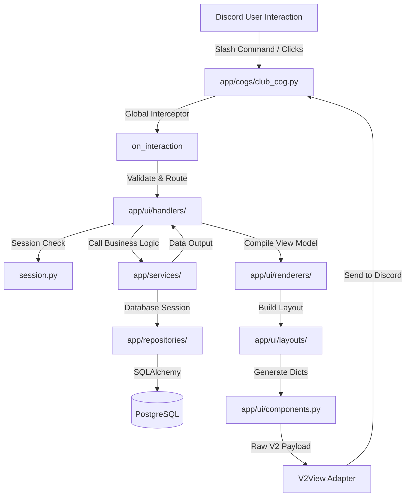

# Milestone Documentation — Discord Components V2 UI System & Locker Room

This document describes the design, architecture, and implementation details for the Football Club Manager Discord bot's Components V2 UI system.

---

## 1. What Was Implemented

We created a reusable Components V2 UI architecture for the bot, isolating the Discord presentation layer from database queries and football engine calculations:
*   **Low-Level Components V2 Builders**: Structured payload factories for containers, sections, text displays, separators, action rows, and styled buttons.
*   **Raw Payload Adapter (`V2View`)**: A custom subclass of `discord.ui.View` that forces Discord to render the message using the Components V2 system and set the appropriate `IS_COMPONENTS_V2` flag (`32768`).
*   **Versioned Custom ID Schema**: A compact colon-separated scheme supporting type safety, length checking, and scopes/actions mapping.
*   **In-Memory UI Session Manager**: A thread-safe session coordinator validating user ownership, tracking state (like active page indexes), and enforcing sliding expirations.
*   **Interactive Screen Layouts**: Beautiful, grid-like layouts for the Locker Room hub, Club Dashboard, paginated Squad Overview (with custom select menu), and Player Detail views.
*   **Thin Cog commands & Gateway Router**: The `ClubCog` command mappings (`/club`, `/squad`, `/player`) and a centralized `on_interaction` event listener intercepting clicks, validating sessions, and routing updates.
*   **Test Suite**: 16 dedicated unit tests verifying custom ID safety, pagination boundaries, and component/layout validation.

---

## 2. Why Embedded App SDK Is Intentionally Not Used (Yet)

The **Discord Embedded App SDK** (used for building Activities, HTML5/iframe webapps, and custom canvas frontends) requires:
1. An external web-hosting provider for frontend assets.
2. A separate OAuth2 flow for authenticating players via Discord.
3. Substantial build overhead and latency.

To ensure rapid iteration and keep the experience lightweight and native to Discord, **V1.0.0 is built entirely using Discord's built-in message component layouts**. This eliminates hosting complexities, avoids canvas/WebGL performance concerns on mobile, and allows managers to view their squad instantly in standard Discord messages.

---

## 3. Components V2 Message Rules

When sending messages utilizing the Components V2 layout:
*   **Exclusive Rendering**: Set the `IS_COMPONENTS_V2` (`32768`) flag on the message payload.
*   **No Mixed Payloads**: You cannot specify legacy message fields like `content` or `embeds`. Doing so will cause Discord to return a `400 Bad Request`.
*   **Text as Components**: All visible text (including statistics, tables, and titles) must be rendered as `TextDisplay` components nested inside `Section` or `Container` objects.
*   **Component Limits**:
    *   Maximum 10 sections/components per container.
    *   Maximum 40 total components per message.
    *   Total text length across all components must not exceed 4,000 characters.

---

## 4. UI Architecture & Separation of Concerns

We adhere strictly to the clean architecture rules specified in `AGENTS.md`:


---

## 5. Custom ID & Session Validation Model

### Custom ID Format
All component `custom_id`s follow a versioned, colon-delimited structure:
```text
fcm:v1:<scope>:<action>:<target>:<nonce>
```
*   **Length Safety**: Dataclasses assert that the full ID does not exceed Discord's 100-character limit.
*   **Version Pinning**: Rejects any incoming payload that does not match `v1`.
*   **Scope & Action Enums**: White-lists known scopes (`locker`, `squad`, `player`, `nav`) and actions (`open`, `view`, `page`, `back`, `close`, `refresh`, `help`) to protect against injection.

### In-Memory Session Validation
On every component click, the gateway validates:
1. **Guild Existence**: The interaction must not originate from a DM.
2. **Session Validity**: The session matching the `nonce` must exist in-memory.
3. **Expiration**: The session must not have exceeded its 15-minute lifetime.
4. **Ownership**: The clicking user ID must match the session owner's registered ID.
5. **Registration & Authority**: The manager's club must own the requested entity (players, stats), verified securely by checking the database via the service layer.

---

## 6. Known Limitations

*   **In-Memory Session Storage**: Active session states are stored in-memory. Bot restarts will invalidate active interactive menus (clicking their buttons will prompt a friendly "Session expired" message).
*   **Fixed Page Size**: Squad pagination is hardcoded to 8 players per page to ensure comfortable layout margins on mobile devices.

---

## 7. Next Milestone Recommendations

1.  **Distributed Session Backing**: Replace the in-memory `SessionManager` with a Redis or PostgreSQL cache backend to persist session state across bot restarts.
2.  **Lineups & Formations Layout**: Build a V2 screen representing the starting XI formation grid, allowing players to assign tactics and toggle squad roles.
