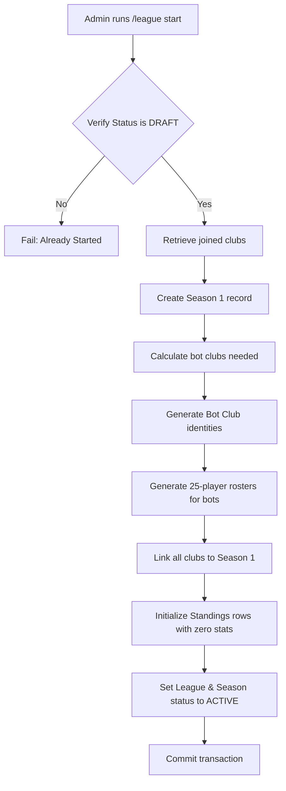

# Milestone Documentation: League Creation + Season Bootstrap + Bot Filler Clubs

## 1. Overview & What Was Implemented

This milestone establishes the competitive framework for **ElevenBoss**. Managers can now set up leagues inside their Discord servers, join them with their registered clubs, automatically fill the remaining slots with procedures-based bot clubs, and bootstrap a season with zero-state standings.

Key accomplishments:
- **League & Season Lifecycle Control**: Complete flow from `draft` to `active` leagues and seasons.
- **Procedural Bot Club Generation**: Complete balancing logic ensuring bot clubs are created with appropriate rosters and starting ratings.
- **Standings Initialization**: High performance zero-state standing record initialization.
- **Components V2 Dashboards**: Rich, interactive dashboards for league status and standings tables.

---

## 2. League Lifecycle

Leagues progress through three main statuses:
1. **DRAFT**:
   - Created using `/league create`.
   - Managers can join using `/league join` or the interactive dashboard button.
   - Closed to simulations or fixture generation.
2. **ACTIVE**:
   - Bootstrapped using `/league start` or the interactive dashboard button.
   - Joined clubs are locked; remaining slots are filled by bot clubs.
   - Ready for matchday scheduling and simulations.
3. **COMPLETED / ARCHIVED**:
   - Locked after all match weeks are simulated.

---

## 3. Season Bootstrap Flow

Starting a league (bootstrapping) is executed atomically in a single database transaction. If any part of the setup fails, the entire change is rolled back:

---

## 4. Bot Filler Club Generation

Bot filler clubs are procedurally generated to bring the league count to the selected size (8, 10, 12, or 16).
- **Identity**: Randomly selected from a pool of original, fictional names (e.g., *Ironvale FC*, *Riverside Rovers*). Name uniqueness is validated against existing clubs in the guild.
- **Roster Balance**: Reuses `generate_squad` to build balanced squads of exactly 25 players:
  - 3 Goalkeepers (GK)
  - 8 Defenders (DEF)
  - 8 Midfielders (MID)
  - 6 Attackers (ATT)
- **Club Rating**: The bot club's overall rating is calculated as the average overall of its 25 generated players.
- **Budget**: Set to `10,000,000` coins, matching human starter clubs.
- **Reputation**: Set to `500` starting reputation points.
- **Stadium Capacity**: Initialized to `10,000` seats.

---

## 5. Standings Initialization

During bootstrapping, a `league_standings` record is created for each participating club.
- **Initial Values**: All performance metrics (`played`, `wins`, `draws`, `losses`, `goals_for`, `goals_against`, `goal_difference`, `points`) are initialized to `0`.
- **Table Ordering**: Ordered by points (descending), goal difference (descending), goals for (descending), and club name (ascending).

---

## 6. Components V2 UI & Layouts

Two major dashboards were added:
1. **League Status Dashboard**: Shows league name, status, size, human/bot counts, current season/week, and suggests next actions. Buttons include:
   - `Join League` (Draft only; disables when full or already joined)
   - `Start League` (Draft only; requires administrator permissions; disabled for non-admins)
   - `Refresh`
   - `View Table`
   - `Back to Locker Room`
   - `Close`
2. **Standings Table Dashboard**: Renders the current standings in an aligned fixed-width code block. Buttons include:
   - `Refresh`
   - `League` (returns to league dashboard)
   - `Locker Room`
   - `Close`

---

## 7. Added Commands

- `/league create [league_name] [league_size]`: Instantiates a draft league (Admin only).
- `/league join`: Joins the draft league with your registered club.
- `/league start`: Fills open slots and starts the league (Admin only).
- `/league status`: Shows the interactive league dashboard.
- `/table`: Shows the standings table.

---

## 8. Validation Rules

- **League Size**: Must be exactly 8, 10, 12, or 16.
- **Guild Constraint**: Only one active or draft league is allowed per Discord server.
- **Name Validation**: Must be 3–40 characters, letters/numbers/spaces/hyphens/apostrophes, case-normalized, mass mentions blocked, and URLs blocked.
- **Manager Registration**: Normal commands (`/league join`, `/table`) verify that the manager and their club are registered.
- **Double Joining**: A club cannot join multiple draft/active leagues, nor join the same league twice.
- **Permission Enforcement**: `/league create` and `/league start` require server administrators or members with a role matching `admin_role_id` in `guild_configs`.

---

## 9. Known Limitations

- **Fixture Generation**: Schedule is not generated during season bootstrap (planned for the next milestone).
- **Match Simulation**: Standings are initialized to zero and cannot be updated since matches are not yet simulated.

---

## 10. Next Milestone Recommendation

**Milestone — Fixture Generation + Round-Robin Scheduler**
- Generate round-robin match fixtures for all weeks of the season when `/league start` is executed.
- Enforce home/away scheduling rules.
- Set up schedule timers for match execution.
