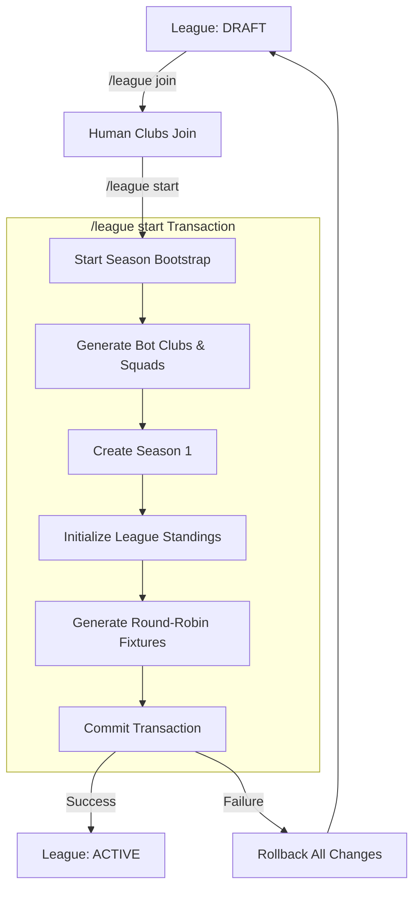

# Milestone: League Start Auto Fixtures

This document explains the unified league starting flow, where starting the league season automatically schedules the full round-robin fixture list.

---

## Why `/fixtures generate` Was Removed

Previously, starting a league was a multi-step admin process:
1. `/league start` (creates bot clubs, sets up season, sets up standings)
2. `/fixtures generate` (generates matches)

This was prone to administrative errors, such as starting the season but forgetting to generate fixtures. By removing `/fixtures generate` and moving it directly into the atomic `/league start` transaction, the league setup process is now fully automated, and a league is guaranteed to have a complete fixture schedule as soon as it is set active.

---

## Updated League Lifecycle

---

## Automatic Fixture Generation Flow

When `/league start` runs:
1. **Validation Checks:**
   - The league must exist and be in the `draft` status.
   - The season must not already exist as `active`.
   - The user must have administrator permissions (or the game admin role).
2. **Bot Club and Squad Generation:**
   - Empty league slots are filled with bot clubs.
   - Each bot club is populated with a squad of 25 players.
3. **Season and Standings Setup:**
   - `Season 1` is created.
   - All clubs are linked to the season.
   - Initial league standing rows are created for all participating clubs.
4. **Fixture Generator:**
   - The list of club IDs is passed to the round-robin engine.
   - A schedule is created where every club plays every other club exactly once.
   - The fixtures are persisted with the `scheduled` status.
5. **Activation:**
   - The league status and season status are updated to `active`.
   - The current week of the season is set to `1`.

---

## Round-Robin Algorithm

The fixture schedule is generated using the Circle/Polygon Rotation Algorithm.
- **Deterministic:** Given the same club list, the generated schedule is identical.
- **Rules:**
  - Every club plays exactly one match per week.
  - No club plays itself.
  - Pairings are non-duplicate for single round-robin.
- **Sizes and Schedule Lengths:**
  - **8 clubs:** 7 weeks, 4 matches per week (28 total fixtures)
  - **10 clubs:** 9 weeks, 5 matches per week (45 total fixtures)
  - **12 clubs:** 11 weeks, 6 matches per week (66 total fixtures)
  - **16 clubs:** 15 weeks, 8 matches per week (120 total fixtures)

---

## Transaction Safety Rules

- **Atomicity:** The entire bootstrap (filling bots, generating squads, initializing standings, creating season, generating fixtures) is executed within a single SQLAlchemy transaction.
- **Rollback:** If any step fails (e.g. database constraint error, network issue), the transaction is fully rolled back. No partial state is written (e.g. no bot clubs without squads, no season without standings, no standings without fixtures).
- **Protection:** `/league start` cannot be run twice. If a league is already active or has an active season, any attempts to start it again are immediately rejected.

---

## Commands Available

| Command | Allowed Installs | Contexts | Description |
|---|---|---|---|
| `/league create` | Guilds only | Guilds only | Creates a draft league. |
| `/league join` | Guilds only | Guilds only | Joins the draft league with your registered club. |
| `/league start` | Guilds only (Admin) | Guilds only | Starts the league, generates filler bots, initializes standings, and creates all fixtures. |
| `/fixtures view` | Guilds only | Guilds only | Displays the current week's fixtures. Supports Prev/Next pagination. |
| `/fixtures week` | Guilds only | Guilds only | Displays fixtures for a specific week number. |
| `/table` | Guilds only | Guilds only | Displays the league standings. |

---

## Known Limitations

- **Even Club Counts Only:** The fixture generator currently rejects odd club counts. This matches the ElevenBoss design constraint where leagues can only be created with sizes 8, 10, 12, or 16.
- **Single Round-Robin:** For V1, the bot schedules a single round-robin tournament.
- **Static Matchdays:** All matches are scheduled for the current week and must be simulated before the week advances.

---

## Next Milestone Recommendation

**Matchday Simulation Engine:**
1. Implement a match simulation simulator (taking lineups, player skills, tactics, and home-advantage into account).
2. Create an automated matchday scheduler or `/matchday simulate` command to run all matches of the current week.
3. Update the standings rows atomically from match results (incrementing played, wins, draws, losses, goals, and points).
4. Implement the week advancement flow (`current_week += 1`).
