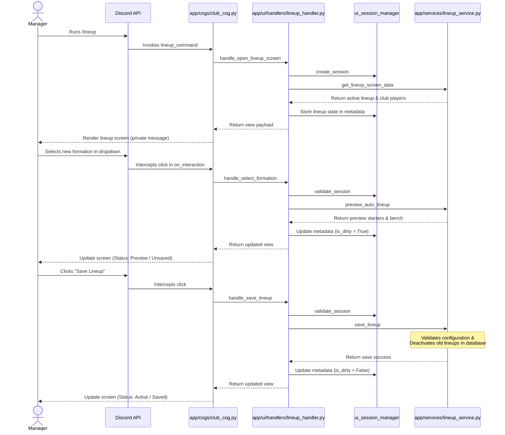

# Milestone Documentation — Formation + Lineup System

This document outlines the design, architecture, and implementation details for the Football Club Manager Discord bot's Formation and Lineup management system.

---

## 1. What Was Implemented

We created a V1 lineup management system using Discord Components V2, maintaining the clean separation of concerns and architectural boundaries defined in `AGENTS.md`:
*   **Slash Command**: Registered `/lineup` command that opens a private Components V2 lineup dashboard interface.
*   **Supported Formations**: Designed slot requirements and position rules for `4-4-2`, `4-3-3`, `4-2-3-1`, `3-5-2`, and `5-3-2`.
*   **Pure Engine Logic**:
    *   `formation_rules.py` maps formations to starter slots, and slots to allowed player positions.
    *   `lineup_builder.py` assigns players to slots using a score-maximizing greedy bipartite matching algorithm.
    *   `lineup_validator.py` validates lineup configurations (11 players, unique, not retired, correct slots).
*   **Database & Repositories**:
    *   `lineup_repository.py` implements queries for fetching active lineups (using `selectinload`) and persisting lineup changes inside an isolated transaction.
    *   `player_repository.py` got a `get_players_by_ids` method to fetch multiple players in one query.
*   **Discord UI Presentation Layer**:
    *   `layouts/lineup.py` builds the Components V2 dashboard grid.
    *   `handlers/lineup_handler.py` validates UI sessions, coordinates service calls, and manages temporary state transitions (storing previews in session metadata).
    *   `on_interaction` in `cogs/club_cog.py` intercepts lineup clicks and dispatches them to handlers.
    *   `layouts/locker_room.py` got a "📋 Lineup" button for easy navigation from the main dashboard.
*   **Comprehensive Test Suite**: Added 19 new unit tests verifying rules, matching score formulas, validation, mocked database services, and UI payload shapes.

---

## 2. Supported V1 Formations & Slot Rules

We support five formations. Each formation has 11 starting slots, and each slot defines its own `natural` and `compatible` positions:

*   **`4-4-2`**: GK, LB, CB1, CB2, RB, LM, CM1, CM2, RM, ST1, ST2
*   **`4-3-3`**: GK, LB, CB1, CB2, RB, CM1, CM2, CM3, LW, ST, RW
*   **`4-2-3-1`**: GK, LB, CB1, CB2, RB, LDM, RDM, LM, CAM, RM, ST
*   **`3-5-2`**: GK, CB1, CB2, CB3, LWB, RWB, CM1, CM2, CAM, ST1, ST2
*   **`5-3-2`**: GK, LWB, CB1, CB2, CB3, RWB, CM1, CM2, CM3, ST1, ST2

---

## 3. Pure Football Engine Logic

### Auto-Lineup Matching Algorithm
The builder utilizes a greedy pairing algorithm that ranks all `(slot, player)` pairs by score and assigns them:
```text
score = overall + position_bonus + fitness_modifier
```
*   **Natural Position Bonus**: `+8` (player plays in their exact role).
*   **Compatible Position Bonus**: `+3` (player plays in a closely related position, e.g. LWB in LB).
*   **Out-of-position Penalty**: `-8` (player plays in an unrelated position).
*   **GK Isolation Penalty**: `-50` (prevents goalkeepers playing outfield, or outfield players playing GK).
*   **Fitness Modifier**: `fitness / 20.0` (gives a slight preference to fully fit players).

### Validation Rules
A saved lineup is valid only if:
1. Exactly 11 starters are chosen.
2. Every slot for the formation is filled.
3. No duplicate players are selected.
4. All selected players are not retired and belong to the manager's club.
5. The chosen formation is supported.
6. The bench does not duplicate the starting XI.

---

## 4. Components V2 Interaction Flow

To guarantee resilience against Discord's strict 3-second response limit, the gateway immediately acknowledges non-close interactions by calling `await interaction.response.defer()`. Once database queries are resolved by the handler and service layers, the gateway updates the original deferred interaction using `await interaction.edit_original_response(content=None, embed=None, view=new_view)`.

The interaction lifecycle behaves as follows:


---

## 5. Database Behavior

We leverage the `lineups` and `lineup_players` tables.
*   **Single Active Lineup constraint**: A partial index `uq_active_lineup` ensures only one lineup per club can be active (`is_active = true`).
*   **Transaction safety**: Deactivating the previous lineup and inserting the new lineup/players occurs inside a single database transaction via `sqlalchemy`'s async transaction context. If any step fails, all operations roll back automatically, ensuring zero orphaned records.
*   **Tenant Isolation**: All selects, deletes, and updates filter strictly on `guild_id`.

---

## 6. Known Limitations

*   **No Manual Drag and Drop**: V1 lineup editing is automated via the "Auto-pick Best XI" button and formation selection. Manual position adjustments (e.g. swapping CB1 and CB2 manually) are not supported.
*   **In-Memory UI State**: The preview of unsaved changes is stored in the memory-cached `UiSession`. If the bot restarts, any unsaved previews are lost and the session expires.

---

## 7. Next Milestone Recommendations

1.  **Tactics & Chemistry**: Add tactic cards and tactical chemistry bonuses (e.g. green links for club mates or players with complementary traits).
2.  **Match Simulation Integration**: Feed the active lineup from `LineupRepository` directly into the match simulation engine when a match starts.
