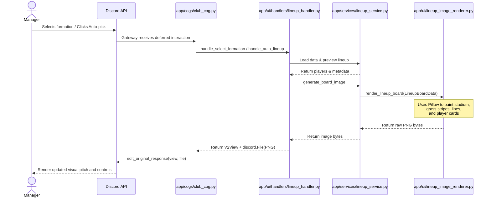

# Milestone — Visual Tactical Lineup Board

We implemented the Visual Tactical Lineup Board system for the `/lineup` command using server-side PNG rendering and Discord Components V2.

---

## 1. Overview & Architectural Strategy

To provide a premium game dashboard experience matching **ElevenBoss** aesthetic, we upgraded the lineup screen from a purely textual layout to a **Dynamic Visual Tactical Pitch Board** + **Components V2 controls** structure.

### Why Dynamic PNG is Used
*   **Discord UI Limits**: Discord embeds and components are highly constrained in structure. Generating a custom high-resolution PNG on the server allows us to render custom player card layouts, pitch stripes, positions, ratings, and fitness bars with pixel-perfect control.
*   **Desktop & Mobile Readability**: The rendering layout (1200x800) is optimized for the standard Discord image container aspect ratio and remains highly legible on both desktop clients and mobile Discord apps.

### Why Embedded App SDK is Deferred
*   Developing an Embedded App (Activities iframe) requires a hosting server, frontend framework, state synchronization websocket servers, and Discord Developer Portal URL configurations.
*   By deferring the SDK, we keep the bot completely self-contained in a standard Discord application profile, while preserving a future path to leverage the exact same lineup service view models to feed a web interface.

---

## 2. Supported Formations & Slot Coordinates

Normalized coordinates (X, Y from 0-100) are mapped for all 5 supported formations:
1.  **4-4-2**: Double strikers, balanced classic configuration.
2.  **4-3-3**: Single striker with wingers and a flat/staggered midfield.
3.  **4-2-3-1**: Double pivots with a central attacking midfielder.
4.  **3-5-2**: Midfield-heavy wingback system with 3 central defenders.
5.  **5-3-2**: Defensive 3-CB block with active full wingbacks.

Coordinates are defined in [formation_positions.py](file:///d:/Python/Discord%20Bots/ElevenBoss/app/engine/formation_positions.py). GK is positioned at `Y = 90%` (bottom), midfielders around `Y = 48-56%` (middle), and attackers around `Y = 18-22%` (top).

---

## 3. Image Rendering & UI Flow



### Rendering Specifications
*   **Base**: Dark navy stadium gradient with alternating emerald green grass stripes.
*   **Markings**: Boundary lines, center circle, halfway line, penalty boxes, and goal boxes drawn in transparent white.
*   **Player Cards**: Rounded glassmorphic cards `(146x82 pixels)` with:
    *   Gold position slot badge (e.g. `ST1`, `LDM`, `GK`)
    *   White OVR rating text
    *   Truncated player display name (up to 14 characters)
    *   Colored fitness bar (Green: `>=70%`, Amber: `40-70%`, Red: `<40%`)
*   **Footer**: Includes bench depth counter and real-time warnings (e.g., out-of-position players or vacant slots).

---

## 4. Components V2 Payload Integration

To attach the generated image inside a Component-only message without using embeds, we leverage the **File Display Component** (`type: 13`) in [lineup.py](file:///d:/Python/Discord%20Bots/ElevenBoss/app/ui/layouts/lineup.py):
```json
{
  "type": 13,
  "file": "attachment://lineup.png"
}
```
At the same time, we attach the file using the `file` argument in discord.py:
```python
await interaction.edit_original_response(view=view, file=discord.File(bytes_io, filename="lineup.png"))
```

### Text Fallback Resilience
If Pillow image generation fails for any reason (e.g., missing system fonts or library issue), the system catches the exception and calls `build_lineup_layout(..., has_image=False)`. This switches the layout to a detailed text starters/bench listing, ensuring the bot remains fully functional.

---

## 5. Known Limitations & Constraints

*   **No Drag-and-Drop**: Adjustments are done using Discord menus (Formation dropdown) and buttons ("Auto-pick").
*   **In-Memory Session Previews**: Unsaved lineup previews are stored in the memory-cached `UiSession`. A bot restart will reset any unsaved edits.
*   **Rate Limits**: Multiple rapid changes to the formation trigger image regenerations and file uploads. Discord rate-limits file uploads more strictly than plain component edits.

---

## 6. Future Upgrades

1.  **Tactics cards**: Integrate tactical cards and chemistry links (e.g., club link or position links) that directly modify the team chemistry shown in the header.
2.  **Embedded App SDK (v2)**: Build a lightweight React front-end inside the Discord Activity frame allowing full drag-and-drop squad swapping, utilizing the same view models.
