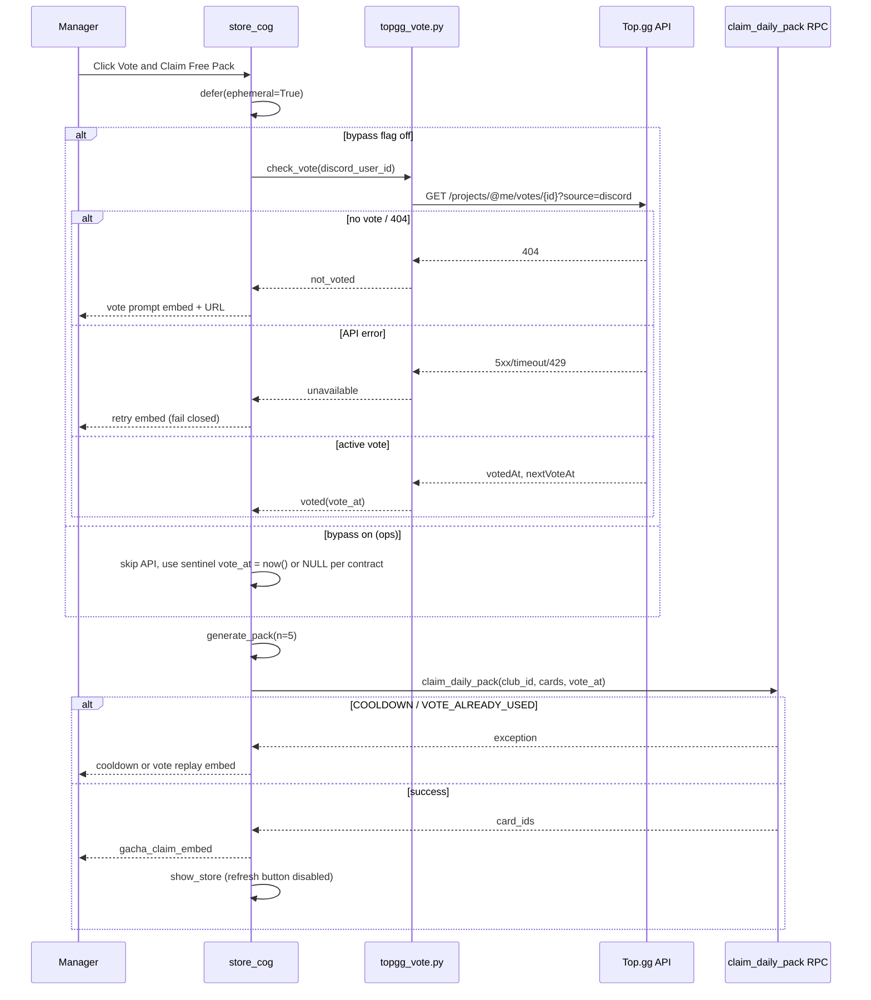

# Implementation Plan: Top.gg Vote Gate for Free Store Pack

**Branch**: `025-topgg-vote-pack` | **Date**: 2026-07-21 | **Spec**: [spec.md](./spec.md)

**Input**: Feature specification from `/specs/025-topgg-vote-pack/spec.md`

## Summary

Gate the existing `/store` free pack on a **verified Top.gg vote** at click time. Bot calls Top.gg v1 vote API (`GET /projects/@me/votes/{discord_id}?source=discord`); if no active vote, show vote URL embed. If voted, pass vote timestamp into extended RPC `claim_daily_pack` for atomic cooldown + vote consumption + card insert. Pack cooldown moves from **22h → 12h** (configurable via `game_config`). Fail closed on API errors; optional ops bypass flag defaults off. No new slash commands.

## Technical Context

**Language/Version**: Python 3.11+ / Postgres 15+

**Primary Dependencies**: Discord `store_cog`, `httpx` (async HTTP), Supabase RPC `claim_daily_pack`, Top.gg v1 REST API, existing `gacha.generate_pack`

**Storage**: `players.last_consumed_topgg_vote_at TIMESTAMPTZ` (new column); `game_config` keys for cooldown hours + bypass flag; env `TOPGG_TOKEN`

**Testing**: pytest — `tests/test_topgg_vote.py` (HTTP client mocks); SQL/RPC unit via migration smoke or lightweight RPC contract test if pattern exists

**Target Platform**: Discord bot (Render) + hosted Supabase

**Project Type**: Monorepo bot integration (external API + RPC extension)

**Performance Goals**: Vote check + claim < 10s p95; single Top.gg request per button click (no polling)

**Constraints**: AGENTS.md — Top.gg HTTP in `apps/discord_bot/core/` only; vote consumption in RPC; defer before IO; no new slash/hub surface

**Scale/Scope**: ~10–12 files; 1 migration (`069`); Store copy + changelog + SDD already updated in specify phase

## Constitution Check

*GATE: Must pass before Phase 0 research. Re-check after Phase 1 design.*

| Gate | Status | Notes |
|------|--------|-------|
| I. Monorepo | PASS | External IO in `apps/discord_bot/core/topgg_vote.py`; `packages/` untouched |
| II. DB via RPC | PASS | Vote consumption + cooldown in extended `claim_daily_pack` |
| III. Schema Rule | PASS | New column + RPC in `069_topgg_vote_pack.sql`; guard in migration + `verify_required_schema.sql` |
| IV. Slash + defer | PASS | No new slash; existing button defers first |
| V. State Rule | PASS | Packages remain stateless; no Top.gg in packages |
| VI. Friendly errors | PASS | Vote prompt / API unavailable / cooldown embeds — no raw tracebacks |
| VII. YAGNI | PASS | Check-on-click only; no webhook listener; no vote rewards beyond pack |

**Post-Phase 1 re-check**: PASS — bot verifies externally; RPC is single atomic gate for replay + cooldown; bypass is ops-only config default false.

## Project Structure

### Documentation (this feature)

```text
specs/025-topgg-vote-pack/
├── plan.md              # This file
├── research.md          # Phase 0 (existing state + API options)
├── data-model.md        # Phase 1
├── quickstart.md        # Phase 1
├── contracts/
│   ├── topgg-vote-api.md
│   ├── claim-daily-pack-vote-rpc.md
│   └── store-pack-copy.md
└── tasks.md             # /speckit.tasks — NOT created here
```

### Source Code (repository root)

```text
supabase/migrations/069_topgg_vote_pack.sql
supabase/scripts/verify_required_schema.sql          # column + RPC signature guard
scratch/apply_migration_069.py                       # local apply pattern

apps/discord_bot/core/topgg_vote.py                  # NEW — httpx client, VoteCheckResult
apps/discord_bot/cogs/store_cog.py                   # MODIFY — vote gate, copy, cooldown hours
apps/discord_bot/embeds/gacha_embeds.py              # MODIFY — vote prompt, API unavailable embeds

.env.example                                         # TOPGG_TOKEN

tests/test_topgg_vote.py                             # NEW — client unit tests

change_log.md
.specify/specs/v1.0.0/spec.md                        # US-02 (done in specify)
```

**Structure Decision**: Single bot-side module for Top.gg; RPC extended with one new parameter. UI cooldown reads same config key as RPC (via existing `get_game_config_int` helper).

## Phase 0: Research (complete)

See [research.md](./research.md). Key outcomes:

- No existing Top.gg code
- Prefer v1 vote endpoint; v0 `/check` as fallback
- Vote URL: `https://top.gg/bot/{application_id}/vote`

## Phase 1: Design

### Data model

See [data-model.md](./data-model.md).

### Contracts

| Contract | Purpose |
|----------|---------|
| [topgg-vote-api.md](./contracts/topgg-vote-api.md) | Bot HTTP client behavior |
| [claim-daily-pack-vote-rpc.md](./contracts/claim-daily-pack-vote-rpc.md) | Extended RPC signature + exceptions |
| [store-pack-copy.md](./contracts/store-pack-copy.md) | Player-facing strings |

### Claim flow (sequence)



### Bot module: `topgg_vote.py`

```python
@dataclass(frozen=True)
class VoteCheckResult:
    status: Literal["voted", "not_voted", "unavailable"]
    vote_at: datetime | None = None      # when status == "voted"
    next_vote_at: datetime | None = None

async def check_topgg_vote(
    *,
    discord_user_id: int,
    token: str,
    bot_id: int | None = None,          # v0 fallback only
    timeout: float = 8.0,
) -> VoteCheckResult: ...
```

- Read `TOPGG_TOKEN` from env (via existing settings pattern or `os.environ`).
- v1 primary: `Authorization: Bearer {token}`.
- **404** → `not_voted`.
- **2xx** with `nextVoteAt > now()` → `voted` (extract vote timestamp from `votedAt` or earliest available ISO field).
- **429/5xx/timeout/missing token** → `unavailable` (log warning, no token in logs).
- v0 fallback (optional, same module): if v1 returns 401 and token is legacy format, retry once with v0 check endpoint — document in contract; implement only if needed during integration.

### Store cog changes

1. **`show_store`**
   - Cooldown interval: `get_game_config_int(db, "daily_pack_cooldown_hours", 12)` × hours (replace hardcoded 22).
   - Embed field copy per [store-pack-copy.md](./contracts/store-pack-copy.md).
   - Button label when ready: **🗳️ Vote & Claim Free Pack**.

2. **`gacha_claim_btn`**
   - After defer, read bypass: `get_game_config_int(db, "topgg_vote_bypass_enabled", 0) == 1`.
   - If not bypass: `check_topgg_vote(...)` → branch on result.
   - On `voted`: generate pack → `claim_daily_pack` with `p_topgg_vote_at`.
   - On `not_voted`: send vote prompt embed; re-enable view; **do not** call RPC.
   - On `unavailable`: send API unavailable embed; re-enable view.

3. **Exception handling** (extend existing):
   - `COOLDOWN:` → existing cooldown embed.
   - `VOTE_ALREADY_USED` → new embed ("This vote was already used for a pack").
   - `VOTE_STALE` → treat like not voted (prompt re-vote).

### Migration `069_topgg_vote_pack.sql`

1. `ALTER TABLE players ADD COLUMN IF NOT EXISTS last_consumed_topgg_vote_at TIMESTAMPTZ;`
2. Seed `game_config`:
   - `daily_pack_cooldown_hours` → `12`
   - `topgg_vote_bypass_enabled` → `0`
3. `DROP FUNCTION IF EXISTS public.claim_daily_pack(BIGINT, JSONB);` — replace with 3-arg version.
4. New `claim_daily_pack(p_club_id, p_cards, p_topgg_vote_at TIMESTAMPTZ)` per [contract](./contracts/claim-daily-pack-vote-rpc.md).
5. Guard block + extend `verify_required_schema.sql`.

**Caller grep**: Only `store_cog.py` calls `claim_daily_pack` today — update single call site.

### Embeds (`gacha_embeds.py`)

| Function | When |
|----------|------|
| `topgg_vote_prompt_embed(vote_url: str)` | not_voted |
| `topgg_vote_unavailable_embed()` | API down / missing token |
| `topgg_vote_replay_embed()` | VOTE_ALREADY_USED |
| Existing `gacha_cooldown_embed` | update footer to 12h / config-driven |

Vote URL builder: `f"https://top.gg/bot/{interaction.client.user.id}/vote"` (or env override `TOPGG_VOTE_URL` if listing slug differs — optional YAGNI).

### Environment

`.env.example` addition:

```env
# Top.gg API token (Integrations & API on bot listing). Required for free pack vote verification.
TOPGG_TOKEN=your_topgg_api_token_here
```

Render: add `TOPGG_TOKEN` to bot service env group before deploy.

## Complexity Tracking

> No constitution violations.

## Implementation Notes (for `/speckit.tasks`)

1. Migration `069` — column, config keys, replace `claim_daily_pack` with 3-arg version; guard.
2. `verify_required_schema.sql` — `column:public.players.last_consumed_topgg_vote_at`, updated function signature.
3. `topgg_vote.py` + tests with mocked httpx responses (voted, 404, 500, timeout).
4. `store_cog.py` — vote gate, config-driven cooldown UI, button label, RPC new param.
5. `gacha_embeds.py` — three new embeds; cooldown footer copy.
6. `.env.example` + Render env note in quickstart.
7. `change_log.md` — player-facing: vote required, 12h cooldown.
8. Grep: zero remaining `INTERVAL '22 hours'` in pack claim path; zero `claim_daily_pack` 2-arg callers.
9. Manual QA: vote → claim → cooldown → stale vote prompt → API fail closed.

## Rollback

1. Revert bot deploy (vote gate removed; old 2-arg RPC call will fail if migration rolled back).
2. Forward-fix migration or restore previous `claim_daily_pack(BIGINT, JSONB)` with 22h interval if product wants revert.
3. No player card data loss — column `last_consumed_topgg_vote_at` can remain unused.

## Risks & Mitigations

| Risk | Mitigation |
|------|------------|
| Top.gg outage blocks all pack claims | Ops `topgg_vote_bypass_enabled=1` temporary; fail-closed default |
| v1 token format mismatch | Document v0 fallback in client; test with real token in staging |
| Double-click race | RPC `FOR UPDATE` + vote timestamp idempotency |
| Cooldown UI drift from RPC | Both read `daily_pack_cooldown_hours` from `game_config` |
