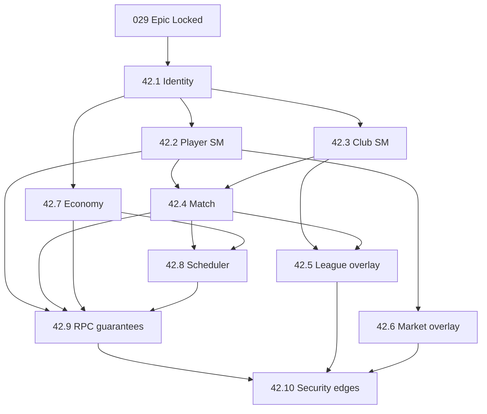

# Contract: Delivery Waves

**Parent**: [../spec.md](../spec.md) | **Plan**: [../plan.md](../plan.md)

## Wave map

| Wave | Children | Mode | Exit criteria |
|------|----------|------|---------------|
| **W0** | Epic `029` | Docs only | [x] Plan + US1–US4 contracts + quickstart; INV checklist usable; T006 Lock |
| **W1** | US-42.1, then 42.2, then 42.3 | Specify → Lock serially | Identity + player + club specs Locked |
| **W2** | US-42.4, US-42.7 | Specify (parallel OK after 42.1); implement after Lock | Match integrity + economy registry specs Locked; race/idempotency tests defined |
| **W3** | US-42.5, US-42.6 | Overlay specify | Cite `026`/`017`; no forked sport/UX; **must not invent sporting forfeits from infrastructure failure** |
| **W4** | US-42.8, US-42.9 | Specify; 42.9 may draft early | Job run-key standard + RPC guarantee template Locked; **catch-up settle-once — infra miss ≠ forfeit** |
| **W5** | US-42.10 | Specify last among deep catalogs | Exhaustive edge categories filled; threat model |
| **W6** | Implement per child plans | Serial by dependency | Child quickstarts green; epic SC-002/003 class metrics met where applicable |

## Parallelization rules

| Allowed in parallel | Not allowed in parallel |
|---------------------|-------------------------|
| Drafting multiple child **specs** | Implementing 42.4 and 42.6 against undefined 42.2 states |
| 42.7 draft after 42.1 Lock | Shipping a new faucet before 42.7 registry entry |
| 42.9 template drafting anytime | Amending INV in a child without epic update |

## Implementation dependency graph



## What `/speckit.tasks` on `029` may include

- Add AGENTS.md / v1.0.0 US-42 pointers
- Publish review process using invariant checklist
- Kickoff checklist for `/speckit.specify` US-42.1
- **Must not** include: migrations, cog rewrites, “implement all state machines”

## Child kickoff command (operator)

```text
/speckit.specify

US-42.1 — Identity & Ownership
Parent: specs/029-game-integrity
Follow contracts/child-spec-template.md
```
