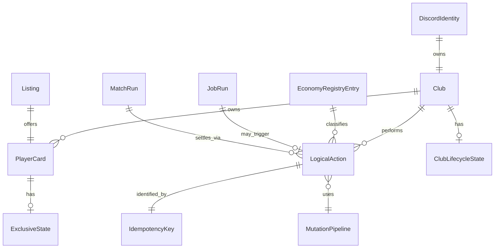

# Data Model: US-42 Game Integrity (Conceptual)

**Feature**: `029-game-integrity`  
**Date**: 2026-07-22  

This model describes **integrity concepts**. It does **not** authorize new Postgres tables. Physical tables/columns remain owned by existing migrations and by future child plans (especially US-42.9).

## 1. Entity overview

## 2. Entities

### DiscordIdentity

| Attribute | Notes |
|-----------|-------|
| Discord user id | Stable external identity |
| Display username | Cache; not ownership key |

**Rules**: Maps to ≤1 Club (INV-01). Guild membership is contextual, not a second club.

### Club

| Attribute | Notes |
|-----------|-------|
| Club id | Durable PK |
| Manager profile | Names, coins, energy — via economy pipe |
| Lifecycle state | Active / LeagueSeated / Inactive / Abandoned / AI (detail US-42.3) |
| Match lock | Present/absent (club-scoped) |

**Rules**: AI clubs never claim human-only prizes (INV-15). Soft delete only in P0.

### PlayerCard

| Attribute | Notes |
|-----------|-------|
| Card id | Durable PK |
| Owner club id | Exactly one current owner (INV-02) |
| Progression | XP/level/SP via XP pipe only |
| Exclusive state | See §3 |

### ExclusiveState (card)

Named primary state for gating. Epic freezes names; US-42.2 owns full matrix.

| State | Exclusive with match play? | Notes |
|-------|----------------------------|-------|
| RosterFree | No (eligible if other gates pass) | Default usable |
| InXI | Club match uses these | |
| Listed | Yes blocked | Marketplace |
| Evolving | Yes blocked (default) | Active evolution |
| Hospitalized | Yes blocked | |
| TrainingBusy | Yes blocked if session lock exists | Child clarifies |
| MatchLocked | Mutations blocked | Club-derived |
| Retired | Terminal | |
| SoldTransferred | Terminal for seller view | Ownership moved |

### ClubLifecycleState

| State | Meaning |
|-------|---------|
| Active | Normal play |
| LeagueSeated | In a guild season seat |
| Inactive | Threshold TBD (42.3) |
| Abandoned | Product-defined; inventory retained |
| AI | Bot-filled club |

### LogicalAction

One user or system intent that may mutate durable state.

| Attribute | Notes |
|-----------|-------|
| Action type | e.g. claim_login, buy_listing, settle_match |
| Actor | Club or system job |
| Idempotency key | Required for reward/money/ownership |
| Outcome | Applied / Replay / Rejected |

### IdempotencyKey

| Attribute | Notes |
|-----------|-------|
| Key string | Globally unique per logical grant |
| Scope | Economy ledger, match run, job run, domain log |

### MutationPipeline

| Pipeline | Allowed mutations |
|----------|-------------------|
| Economy | Coins, action energy (approved wrappers) |
| XP | Card XP → level → SP earned |
| Ownership | Card transfer, listing status |
| Competitive | Match/fixture/season results |
| Presentation | Discord/outbox only — no durable reward |

### EconomyRegistryEntry

| Attribute | Notes |
|-----------|-------|
| Source / sink code | Ledger `source` string |
| Direction | Faucet / sink / transfer |
| Key pattern | Template for idempotency |
| Owner feature | Spec ID that introduced it |

Owned by US-42.7; epic requires registration before enablement (FR-011).

### JobRun

| Attribute | Notes |
|-----------|-------|
| Job name | Scheduler catalog id |
| Run key | Catch-up safe unique key |
| Status | Succeeded / Failed / Skipped |

Owned by US-42.8.

### Listing / MatchRun

Physical models exist in transfer/match schemas. Integrity view: Listing ∈ {Active, Cancelled, Expired, Sold}; MatchRun ∈ {Created, Locked, Simulating, Settled, Rewarded, Presented, Aborted} per epic sketches.

## 3. Validation rules (cross-cutting)

1. Exclusive card states must not overlap without an explicit child exception.
2. LogicalActions that move coins/XP/ownership MUST carry an idempotency key.
3. Rejected actions leave all durable entities unchanged.
4. Replay returns prior success payload (or explicit already-done), never a second grant.
5. Pending level rewards follow **current** card owner at claim time.
6. No EconomyRegistryEntry → no new faucet/sink in production.

## 4. State transition summary

See epic `spec.md` §5 mermaid diagrams. Children expand entry/exit/failure recovery; this data model only names the entities those diagrams mutate.

## 5. Mapping to physical schema (informative)

| Concept | Typical physical home (existing) |
|---------|----------------------------------|
| Club | `players` |
| PlayerCard | `player_cards` |
| Match lock | `match_locks` |
| Economy ledger + keys | `economy_ledger` |
| XP log | `player_xp_log` / `apply_card_xp` |
| Transfer listing | transfer market tables (017 migrations) |
| League season | `league_seasons` / lifecycle tables (026+) |

Children must verify column existence in migrations before referencing (Schema Rule).
