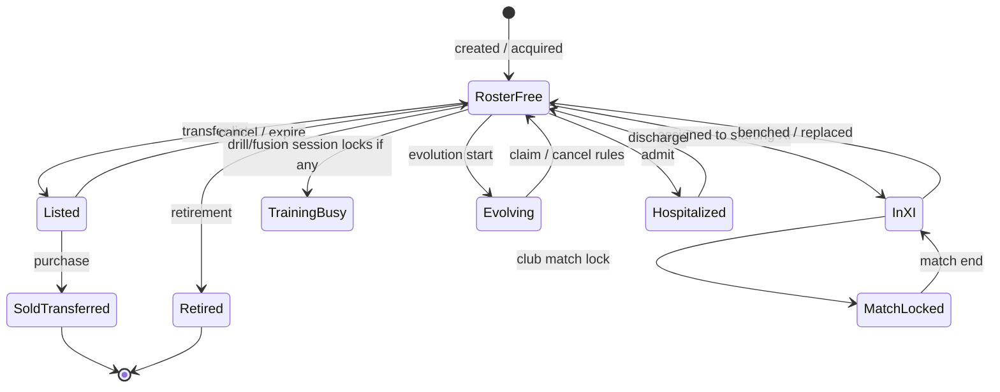
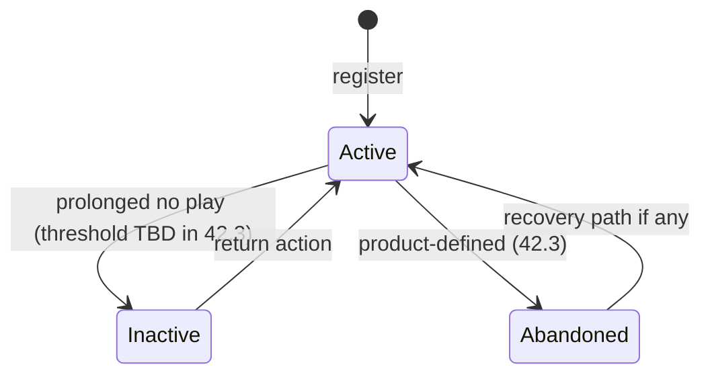
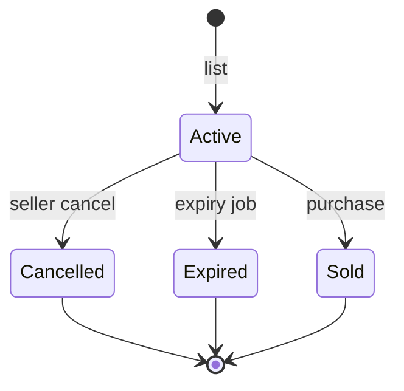
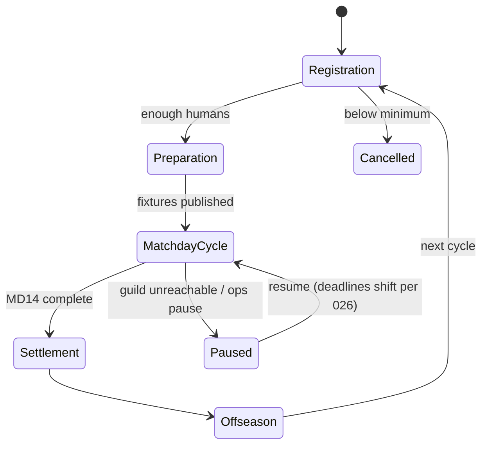
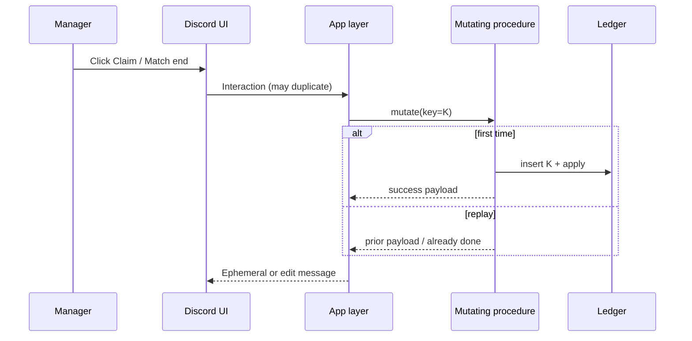
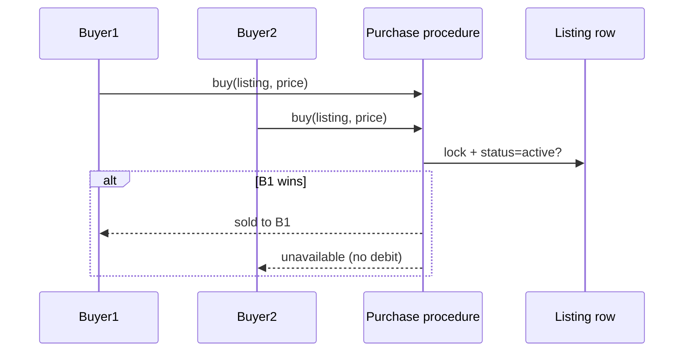

# Feature Specification: Game Integrity & State Management (US-42 Epic)

**Feature Branch**: `029-game-integrity`

**Created**: 2026-07-22

**Status**: Locked (2026-07-22) — Epic Constitution; children US-42.1–42.10 Implemented under `030`–`035`

**Input**: User description: "Design an extremely robust Game Integrity & State Management Specification (US-42) that eliminates loopholes, exploits, undefined behavior, inconsistent states, race conditions, economy abuse, multiplayer exploits, scalability issues, and long-term maintenance problems BEFORE implementation. Split into linked specs US-42.1–US-42.10 under a common epic."

**Related**: Supersedes the *mandate* of ad-hoc integrity thinking after `022-v1-stability-blueprint`. Does **not** replace gameplay specs (017–028, US-01–US-41). Child specs deepen this constitution; they must not contradict it without an explicit amendment here.

---

## 0. Epic Framing

### 0.1 Purpose

US-42 is the **architectural constitution for game integrity**. Every future feature (economy, progression, leagues, marketplace, mobile/API, trading, esports) MUST reference this epic and the relevant child spec before shipping mutations that touch ownership, rewards, competitive state, or durable inventory.

This document is intentionally an **epic**, not a single implementable feature. One pass cannot freeze every state machine and edge case without becoming unmaintainable. Implementation work is gated by **child specs** (US-42.1–US-42.10).

### 0.2 What this epic delivers now

| Deliverable | In this epic (`029`) | Deferred to child specs |
|-------------|----------------------|-------------------------|
| Design principles | Frozen | Amendments only via epic revision |
| Cross-system invariants | Frozen (core set) | Extended invariants per domain |
| Source-of-truth matrix | Frozen | Domain detail |
| System-by-system review (Current / Problem / Recommendation) | Epic-level | Deep contracts + tests |
| High-level state machines | Sketch + transition rules | Complete allowed/blocked action matrices |
| Edge-case catalog | Representative + categories | Exhaustive (≥100) in US-42.10 |
| Implementation | None | After each child `/speckit.plan` |

### 0.3 Child epic map (mandatory delivery order preference)

| ID | Child title | Primary question | Depends on | Priority |
|----|-------------|------------------|------------|----------|
| **US-42.1** | Identity & Ownership | Who owns what, across guilds and time? | — | P0 |
| **US-42.2** | Player State Machine | What may a card do in each lifecycle state? | 42.1 | P0 |
| **US-42.3** | Club State Machine | What may a club do when active / league / abandoned? | 42.1 | P0 |
| **US-42.4** | Match Integrity & Concurrency | How do matches start, resolve, reward once? | 42.1–42.3 | P0 |
| **US-42.5** | League Integrity | How do seasons survive downtime and absences? | 42.3–42.4, 026/027 | P1 |
| **US-42.6** | Marketplace Integrity | How do list/buy/expire stay atomic and fair? | 42.1–42.2, 017 | P1 |
| **US-42.7** | Economy Integrity | How do faucets/sinks stay auditable and non-inflating? | 42.1, US-25 | P0 |
| **US-42.8** | Scheduler & Background Jobs | How do missed jobs catch up without double pay? | 42.4–42.7 | P1 |
| **US-42.9** | Database Invariants & RPC Guarantees | What must every mutating RPC prove? | All above | P0 |
| **US-42.10** | Security, Anti-Abuse & Edge Cases | How do we resist exploit + ops failure catalogs? | All above | P1 |

**Delivery note (2026-07-22)**: Remaining children **US-42.6–42.10** are consolidated into one Speckit feature [`specs/035-integrity-remainder`](../035-integrity-remainder/spec.md) with workstreams W6–W10 (explicit exception to separate-folder preference above). Locked **US-42.1–42.5** stay in `030`–`034`.

**Rule**: A child may ship implementation only after its own `spec.md` is Locked and this epic’s relevant invariants remain unviolated. Parallel drafting of children is allowed; parallel *implementation* of conflicting domains is not.

### 0.4 Non-goals (this epic)

- New gameplay loops, slash commands, hub buttons, or tables beyond what integrity enforcement requires.
- Replacing Discord with another client (future clients must obey the same invariants).
- Hard multi-account ban systems as a v1 product (see Assumptions — soft economic anti-abuse first).
- Rewriting working single-pipe XP/economy unless a child proves a pipe gap.

---

## User Scenarios & Testing *(mandatory)*

### User Story 1 — Operators trust a single integrity constitution (Priority: P1)

As product owner / tech lead, I can open one epic and answer: what is always true about ownership, rewards, and state — and which child spec owns the deep rules — without hunting chat history or half-conflicting feature specs.

**Why this priority**: Without a constitution, every feature re-litigates integrity and ships silent loopholes.

**Independent Test**: A new engineer answers ten integrity questions using only this epic + child titles; zero “ask the last person who touched battle_cog.”

**Acceptance Scenarios**:

1. **Given** a proposed feature that mutates coins, XP, card ownership, or competitive results, **When** design review starts, **Then** the proposal cites US-42 and the relevant child ID before plan/tasks.
2. **Given** two specs disagree on a reward rule, **When** conflict is found, **Then** this epic’s Source of Truth matrix decides which document wins until an explicit amendment.
3. **Given** `022-v1-stability-blueprint` closed a defect, **When** a similar defect class reappears, **Then** the child integrity spec owns the permanent invariant — not another one-off fix list.

---

### User Story 2 — Managers never see duplicate rewards or vanished assets (Priority: P1)

As a manager, when I double-tap a button, reconnect mid-match, or return after bot downtime, I never receive the same coins/XP/pack/prize twice, and I never lose a card or coins to a half-applied action.

**Why this priority**: Trust dies faster from double-pay and vanished inventory than from any UX polish.

**Independent Test**: Scripted double-invoke and restart-during-mutation suites for registration, match settlement, transfer buy, daily login, pack claim, league prize, payroll — at most one durable effect per logical action.

**Acceptance Scenarios**:

1. **Given** Discord delivers two identical interactions for a reward action, **When** both complete, **Then** the second returns the prior result or a clear “already done” outcome — never a second grant.
2. **Given** the bot restarts during a match or purchase, **When** recovery runs, **Then** either the action fully completed once or fully rolled back — no orphan locks, duplicate cards, or half coins.
3. **Given** a scheduler retries a daily/weekly job, **When** the job was already successful, **Then** no second coin, prize, or standings mutation occurs.

---

### User Story 3 — Conflicting actions fail closed with one clear reason (Priority: P1)

As a manager, if my player is listed, hospitalized, evolving, match-locked, or past-grace, every surface (hub, match start, marketplace, development) agrees on “not allowed” and tells me why — I cannot bypass via another command.

**Why this priority**: Split-brain UI vs RPC is how exploits and support tickets are born.

**Independent Test**: For each blocking state in the Player/Club sketches, attempt every conflicting action from Discord hubs; all reject with named reason codes/copy families.

**Acceptance Scenarios**:

1. **Given** a card is transfer-listed, **When** the manager tries XI assign, drill, fusion, evolution start, agent sale, or match inclusion, **Then** all paths reject.
2. **Given** the club is match-locked, **When** the manager attempts roster or development mutations, **Then** all paths reject until lock clears.
3. **Given** UI is stale, **When** the manager presses an old button, **Then** server revalidation rejects; UI does not grant the action.

---

### User Story 4 — Live service survives Discord/ops failures without inventing results (Priority: P1)

As a live-service operator, when Discord is down, Top.gg is down, Render restarts, or a guild removes the bot, competitive and economic state either pauses safely or settles internally once — never invents forfeits from infrastructure failure, never double-settles on catch-up.

**Why this priority**: ElevenBoss is Discord-hosted but database-authoritative; presentation outages must not rewrite sporting or economic truth.

**Independent Test**: Simulated outage matrix (bot offline across deadlines, guild remove, Top.gg 5xx, Discord 429) shows documented recovery behavior from US-42.5 / US-42.8 without duplicate ledger rows.

**Acceptance Scenarios**:

1. **Given** bot offline across a league deadline, **When** catch-up runs, **Then** overdue transitions apply once in order (aligned with `026` rulebook).
2. **Given** Discord cannot deliver a result embed, **When** the match already settled in DB, **Then** presentation retries do not re-run rewards.
3. **Given** Top.gg is unavailable, **When** a manager tries vote-gated pack claim, **Then** claim fails closed with clear copy — no silent free pack.

---

### User Story 5 — Child specs can be written and shipped incrementally (Priority: P2)

As engineering, I can draft and implement US-42.1–US-42.10 as separate Speckit features without waiting for a thousand-page monolith, while still inheriting this constitution.

**Why this priority**: Breadth without incremental delivery is how integrity work never ships.

**Independent Test**: After epic Lock, `/speckit.specify` for US-42.1 produces a child folder that references this epic; checklist requires invariant compliance.

**Acceptance Scenarios**:

1. **Given** this epic is Draft→Locked, **When** US-42.1 is specified, **Then** it opens with “Parent: `specs/029-game-integrity`” and does not redefine single XP/economy pipes.
2. **Given** a child wants to change an epic invariant, **When** review happens, **Then** the change is an epic amendment first, then child update.
3. **Given** implementation of a child, **When** Wave exit is claimed, **Then** US-42.9 RPC guarantees and US-42.10 relevant edges are checked for that domain.

---

### Edge Cases *(epic-representative; exhaustive catalog = US-42.10)*

| ID | Scenario | Expected behavior | Recovery |
|----|----------|-------------------|----------|
| E-01 | Double `/register` confirm | At most one club | Second → already registered |
| E-02 | Match rewards after Discord timeout | DB settlement once; UI may retry display | Idempotency key = match run |
| E-03 | Two buyers same listing | One succeeds; loser unchanged | Listing row lock / status |
| E-04 | Card evolves while listed (stale UI) | Blocked — listing XOR evolution | State machine |
| E-05 | Guild deletes bot mid-season | Season pauses; no auto-forfeit from remove alone | Resume / cancel rules in 42.5 |
| E-06 | Scheduler fires twice same UTC day | Second run no-ops | Job run keys |
| E-07 | Owner leaves guild, club still exists | Club remains; guild-league seat rules apply | 42.1 + 42.5 |
| E-08 | Pending level rewards after P2P buy | Claim credits **current** owner | Existing US-24 rule elevated to invariant |
| E-09 | Energy hits max while offline | Cap held; no overflow bank | Sync on next action |
| E-10 | Migration applied mid-match | In-flight matches finish under rules active at lock; new RPCs fail closed if schema incomplete | Schema guard |
| E-11 | Friendly + league match race | Match lock / type rules; no double XP tick | 42.4 |
| E-12 | Pack claim without consumed vote | Reject | Vote ledger |
| E-13 | Payroll retry after success | No second debit | Week key |
| E-14 | User clicks expired hub view | Clear re-open message | View timeout contract |
| E-15 | Bot-controlled club in marketplace | Bots never list/buy as humans | Identity roles |

---

## Requirements *(mandatory)*

### Functional Requirements — Epic Constitution

- **FR-001**: The project MUST maintain this epic as the parent integrity constitution; child specs US-42.1–US-42.10 MUST each be separate Speckit features that declare this parent.
- **FR-002**: Every durable mutation affecting coins, gems, energy, XP, skill points, card ownership, listing state, match results, league standings, or prize payouts MUST be **idempotent** under retry, double-click, and job re-entry.
- **FR-003**: Coins and action energy MUST change only through the single economy pipeline (`apply_club_economy` / approved wrappers). Direct balance edits outside that pipeline are defects.
- **FR-004**: Card XP and derived level/skill-point earnings MUST change only through the single XP pipeline (`apply_card_xp` / approved wrappers). Direct XP/level bumps outside that pipeline are defects.
- **FR-005**: Discord UI MUST be treated as **stateless presentation**. Buttons and selects never authorize mutations alone; the authoritative guard runs in the mutation path (RPC / transactional procedure).
- **FR-006**: Conflicting card/club states MUST be mutually exclusive where defined (e.g. listed XOR in XI; hospitalized XOR match-eligible). Ambiguous overlaps MUST be resolved in child state machines — never left to “hope the UI hides the button.”
- **FR-007**: Infrastructure failure (Discord outage, Top.gg outage, host restart) MUST NOT invent sporting outcomes or free rewards. Fail closed or settle internally once; presentation is separately retryable.
- **FR-008**: Every mutating procedure MUST declare: ownership check, lock/concurrency model, idempotency key strategy, success payload, and failure reason family.
- **FR-009**: Cross-server play MUST NOT create multiple durable clubs for one Discord account. One Discord user identity maps to at most one club (see Assumptions if product later allows multi-club).
- **FR-010**: Future clients (website, mobile, public API) MUST consume the same mutation contracts; Discord-only shortcuts that bypass guards are forbidden.
- **FR-011**: Feature specs that introduce new reward sources or sinks MUST register them in the Economy Source/Sink registry (owned by US-42.7) before enablement.
- **FR-012**: Scheduled jobs MUST be catch-up safe: overdue work applies in order, already-committed work does not re-apply.
- **FR-013**: Player-facing integrity failures MUST return clear, non-raw-exception outcomes suitable for ephemeral Discord messages.
- **FR-014**: When remediation changes a manager-visible integrity rule, `change_log.md` MUST be updated.
- **FR-015**: Scope of US-42 is **integrity, state machines, invariants, abuse resistance, ops recovery** — not new gameplay systems. Gameplay remains in existing US stories and feature specs.

### Functional Requirements — Child Spec Obligations

Each child MUST, in its own `spec.md`:

| Child | MUST include |
|-------|----------------|
| US-42.1 | Identity model (Discord user ↔ Manager ↔ Club ↔ Guild membership); registration; leave/rejoin guild; bot remove/add; deletion/inactivity; ownership of cards/coins |
| US-42.2 | Full player-card state machine; allowed/blocked actions matrix; transition rules; failure recovery |
| US-42.3 | Club lifecycle states; league seat rules; abandoned/inactive definitions; AI club rules |
| US-42.4 | Match types; lock lifecycle; settlement order; reward once; disconnect/abandon; replay protection |
| US-42.5 | Alignment with `026`/`027`; pause/resume; no-show; guild unreachable; prize once; tie-breakers reference |
| US-42.6 | Listing states; purchase atomicity; expiry/cancel; price bounds; anti-flip; race outcomes |
| US-42.7 | Complete faucet/sink registry; ledger requirements; inflation monitors; gem rules if any |
| US-42.8 | Job catalog; run keys; retry/backoff; clock/timezone; crash recovery |
| US-42.9 | Constraint checklist; RPC template; migration safety; versioning of contracts |
| US-42.10 | Threat model; rate limits; alt soft-guards; exhaustive edge catalog; analytics signals |

---

## 1. Design Principles (permanent)

| # | Principle | Meaning | Why |
|---|-----------|---------|-----|
| P1 | **Single source of truth** | Durable state lives in the database; Discord messages are caches | Prevents “embed said yes, DB said no” |
| P2 | **Idempotent mutations** | Same logical action + key → same durable result | Retries and double-taps are normal in Discord |
| P3 | **RPC ownership** | Complex mutations are atomic procedures, not multi-step app loops | Half-applied states destroy trust |
| P4 | **Package purity** | Pure packages compute; apps/Discord adapt; DB enforces | Testability + multi-client future |
| P5 | **Explicit state transitions** | Entities move between named states with guards | Implicit flags become exploits |
| P6 | **Deterministic calculations** | Same inputs → same rewards/results (seeded RNG where needed) | Fairness + audit |
| P7 | **Fail closed** | Ambiguous or degraded dependency → deny grant / pause, don’t invent | Better ticket than silent exploit |
| P8 | **Presentation ≠ settlement** | Showing a result and committing a result are separate | Outages don’t rewrite history |
| P9 | **Least privilege UI** | Hubs suggest; servers decide | Stale views are expected |
| P10 | **Amend, don’t shadow** | New features extend registries/state machines; they don’t invent parallel pipes | Stops second economies |

---

## 2. System Invariants

Every invariant MUST hold after any successful mutation. Violation = Sev-Critical defect.

**Quick index**: [contracts/invariant-index.md](./contracts/invariant-index.md) (INV-01…INV-18 one-liners).

| ID | Invariant | Why it exists |
|----|-----------|---------------|
| INV-01 | A Discord user identity owns **at most one** club row | Prevents multi-club farming from one account |
| INV-02 | A player card has **exactly one** current owner club (or system pool states explicitly modeled) | Prevents duplicated inventory |
| INV-03 | A card cannot be in two exclusive states at once (see US-42.2 matrix) | Prevents play-while-listed / sell-while-hospital |
| INV-04 | Coins never go negative; failed debits leave balances unchanged | Prevents debt exploits and partial buys |
| INV-05 | Coin/energy mutations only via economy pipeline + ledger | Auditability and anti-inflation |
| INV-06 | XP/level mutations only via XP pipeline | Prevents dual progression systems |
| INV-07 | Skill points available = earned − spent (non-negative) | Prevents free allocation |
| INV-08 | A logical reward is granted **at most once** per idempotency key | Double-click / retry safety |
| INV-09 | Match settlement writes results before or with rewards in one atomic unit of work; rewards never precede durable result without key | Prevents reward-without-match |
| INV-10 | Evolution match progress ticks **at most once** per card per match result | Historical double-tick bug class |
| INV-11 | Friendly matches are sandbox: no competitive coins/XP pipes that bot/league use (log-only contract) | Prevents sandbox farming |
| INV-12 | A club has at most one **active** guild-league registration/seat per season rules | Prevents double entry |
| INV-13 | Transfer purchase: exactly one buyer succeeds; loser unchanged | Race integrity |
| INV-14 | Pending level rewards claim follows **current** card owner | Transfer fairness (US-24) |
| INV-15 | Bot/AI clubs never receive human-only prizes or create human debt via payroll | Ladder fairness |
| INV-16 | Schema guards fail deploy if required tables/RPCs/policies missing | Half-migrated production is worse than downtime |
| INV-17 | Match-lock blocks roster/dev/sale mutations until cleared | Mid-match tampering |
| INV-18 | Daily/weekly caps are enforced server-side in mutation path | UI-only caps are bypassable |

---

## 3. Source of Truth Matrix

| Concern | Source of truth | Presentation may show | Must not decide alone |
|---------|-----------------|----------------------|------------------------|
| Club coins / energy | DB club economy state + ledger | Hub embeds | Discord button |
| Card XP / level / SP | DB card progression | Profile / development | Client math |
| Card ownership | DB ownership | Marketplace / roster | Browse cache |
| Listing status | DB listing row | Transfer board | Stale embed price |
| Match result | DB match/fixture result | Live thread embeds | Commentary only |
| League phase / standings | DB season + rulebook (`026`) | `/league` hub | Admin one-off (except documented recovery) |
| Vote entitlement | Vote consumption ledger + Top.gg verify | Store copy | Trust client “I voted” |
| Feature flags | Config / DB flags | Hub visibility | Bypass via old custom_id |
| True OVR | Formula + stored overall sync rules | All OVR displays | Pack flash alone |

**Conflict rule**: If two documents disagree, prefer (1) this epic invariants, (2) Locked child US-42.x, (3) Locked domain feature spec (017/026/…), (4) `.specify/specs/v1.0.0/spec.md`, (5) informal notes. Amend higher layers deliberately.

---

## 4. System Reviews (Current → Problem → Recommendation)

Format for each domain: **Current** (as understood from project brief + feature specs; not assumed correct), **Problem**, **Recommendation**, **Decision (epic)**, **Child owner**, **Priority**, **Risk**, **Complexity**.

### 4.1 Identity

| Field | Content |
|-------|---------|
| **Current** | `/register` atomic club create; Discord id on club; already-registered guard; onboarding thread ownership checks; club used across guilds where bot is present |
| **Problem** | Leave guild / bot remove / re-add / “delete my club” / manager rename abuse / username drift largely underspecified as a lifecycle. Cross-server **behavior** exists but **policy** (which guild is “home”, league seat when multi-guild) is fragmented across league specs |
| **Recommendation** | Freeze identity graph and event catalog in US-42.1; define inactive vs abandoned; soft-delete policy; no silent second club |
| **Decision** | One Discord account → one club. Guild membership is contextual, not a second club. Hard club deletion deferred unless product explicitly requests |
| **Child** | US-42.1 |
| **Priority** | P0 |
| **Risk** | High if left undefined (orphan seats, ghost managers) |
| **Complexity** | M |

### 4.2 Player lifecycle

| Field | Content |
|-------|---------|
| **Current** | Rich rules across progression, fatigue, hospital, evolution, fusion, mentor, retirement, wages/contracts, academy, marketplace listing |
| **Problem** | Rules live in many specs; exclusive-state matrix incomplete; some gates UI-only historically |
| **Recommendation** | Canonical state machine + action matrix in US-42.2; every new feature adds rows, not side doors |
| **Decision** | Exclusive states are first-class; overlapping flags must map to one primary state for gating |
| **Child** | US-42.2 |
| **Priority** | P0 |
| **Risk** | Critical (inventory + progression exploits) |
| **Complexity** | H |

### 4.3 Club lifecycle

| Field | Content |
|-------|---------|
| **Current** | Clubs persist; AI fill for leagues; payroll exemptions for AI; squad invalid gates |
| **Problem** | Abandoned club, long inactivity, transfer-of-ownership not defined; league seat on multi-guild unclear |
| **Recommendation** | Explicit Active / LeagueRegistered / Inactive / Abandoned (+ AI) in US-42.3 |
| **Decision** | No ownership transfer in v1 integrity wave. Inactivity does not auto-delete inventory |
| **Child** | US-42.3 |
| **Priority** | P0 |
| **Risk** | High for league automation |
| **Complexity** | M |

### 4.4 Match system

| Field | Content |
|-------|---------|
| **Current** | Bot / friendly / league types; energy costs; match locks; economy/XP pipes; evolution tick inside match result; friendly sandbox |
| **Problem** | Disconnect mid-sim, abandoned live threads, duplicate finalize, stale squad snapshot still partially tribal knowledge |
| **Recommendation** | Match run identity, lock lifecycle, settlement sequence, abandon rules in US-42.4 |
| **Decision** | Settlement is DB-authoritative; Discord thread is presentation. Rewards keyed by match run id |
| **Child** | US-42.4 |
| **Priority** | P0 |
| **Risk** | Critical |
| **Complexity** | H |

### 4.5 League system

| Field | Content |
|-------|---------|
| **Current** | Strong rulebook in `026`/`027`; pause on unreachable guild; assistant manager; catch-up; prize once |
| **Problem** | Integrity epic must not fork rulebook; need binding cross-links and recovery invariants only |
| **Recommendation** | US-42.5 = integrity overlay on `026` (idempotency, pause, multi-guild seat, ops recovery) — not a second calendar |
| **Decision** | `026` owns sporting rules; US-42.5 owns integrity guarantees around them |
| **Child** | US-42.5 |
| **Priority** | P1 |
| **Risk** | High |
| **Complexity** | M (mostly binding + gaps) |

### 4.6 Marketplace

| Field | Content |
|-------|---------|
| **Current** | P2P listing, tax, races, floors, agent sale, scouting; flags; eligibility list |
| **Problem** | Expiry lag, flip timing, alt dump, listed-while-playing regressions need permanent invariants |
| **Recommendation** | Listing state machine + purchase sequence diagram in US-42.6 |
| **Decision** | Buy-it-now only; tax sink mandatory; own-listing buy forbidden; min hold before re-list (per 017) elevated to invariant |
| **Child** | US-42.6 |
| **Priority** | P1 |
| **Risk** | Critical for economy |
| **Complexity** | M |

### 4.7 Economy

| Field | Content |
|-------|---------|
| **Current** | US-25 single pipe; ledger; config; store vs development split; wages; transfer tax; packs |
| **Problem** | No single living faucet/sink registry; gem path weaker; inflation observability not constitutional |
| **Recommendation** | Registry + monitoring signals in US-42.7; every new source/sink registers before ship |
| **Decision** | Economy pipe remains singular; friendly is not a coin faucet |
| **Child** | US-42.7 |
| **Priority** | P0 |
| **Risk** | Critical |
| **Complexity** | M |

### 4.8 Progression

| Field | Content |
|-------|---------|
| **Current** | US-23/24 caps; mentor; evolution; fusion; potential clamps; claim pending |
| **Problem** | Cap bypass attempts via alternate hubs; evolution truth drift (costs/slots) historically |
| **Recommendation** | Progression integrity folded into US-42.2 + US-42.7 (SP is economy-adjacent); no separate pipe |
| **Decision** | Caps enforced in mutation RPCs; displayed costs must match config |
| **Child** | US-42.2 / US-42.7 |
| **Priority** | P0 |
| **Risk** | High |
| **Complexity** | M |

### 4.9 Scheduler

| Field | Content |
|-------|---------|
| **Current** | APScheduler in bot process; jobs re-registered on startup; league lifecycle catch-up patterns emerging |
| **Problem** | Ephemeral scheduler; clock drift; missed fires; duplicate interval jobs; no global job ledger standard |
| **Recommendation** | Job catalog + run-key standard in US-42.8 |
| **Decision** | Jobs must be catch-up safe; competitive rules stay in rulebook/RPCs, not in cron expressions |
| **Child** | US-42.8 |
| **Priority** | P1 |
| **Risk** | High |
| **Complexity** | M |

### 4.10 Discord UX

| Field | Content |
|-------|---------|
| **Current** | Defer immediately; ephemeral hubs; view timeouts; empty select patterns from 022 |
| **Problem** | Stale custom_ids after restart; button spam; permission surprises; thread deletion mid-flow |
| **Recommendation** | UX integrity rules live as cross-cutting FR in children + US-42.10; no new hubs for integrity alone |
| **Decision** | Stale interaction → safe reject + re-open guidance |
| **Child** | US-42.10 (+ all UI-touching children) |
| **Priority** | P1 |
| **Risk** | Medium (trust/support) |
| **Complexity** | L–M |

### 4.11 Database integrity

| Field | Content |
|-------|---------|
| **Current** | Migrations; RPC-first; schema guards; RLS patterns for exposed tables |
| **Problem** | Easy to add Python multi-step writes; column invented without migration; guard list lag |
| **Recommendation** | US-42.9 RPC guarantee template + constraint checklist |
| **Decision** | No column without migration; no bot-required table without RLS policy when Data API exposed |
| **Child** | US-42.9 |
| **Priority** | P0 |
| **Risk** | Critical |
| **Complexity** | H |

### 4.12 Security & anti-abuse

| Field | Content |
|-------|---------|
| **Current** | Server-side pricing; caps; floors; interaction owner checks; rate-limit resilience notes |
| **Problem** | Alt farming, automation, cross-guild abuse, replay of webhooks underspecified as threat model |
| **Recommendation** | Threat model + soft controls first in US-42.10; hard bans later if product asks |
| **Decision** | Soft economic anti-abuse is in-scope; accusation-based bans out of scope for this epic |
| **Child** | US-42.10 |
| **Priority** | P1 |
| **Risk** | High |
| **Complexity** | M |

### 4.13 Analytics & observability

| Field | Content |
|-------|---------|
| **Current** | Logging; some economy simulation scripts; limited live dashboards |
| **Problem** | No mandated integrity metrics (duplicate key hits, race losses, catch-up volume, faucet velocity) |
| **Recommendation** | Minimum metric set in US-42.10 / US-42.7 |
| **Decision** | Integrity events SHOULD be countable without reading Discord |
| **Child** | US-42.7 / US-42.10 |
| **Priority** | P2 |
| **Risk** | Medium (ops blindness) |
| **Complexity** | M |

---

## 5. High-Level State Machines (sketches)

Child specs expand each into full allowed/blocked matrices. Epic freezes **state names** and **exclusive groups**.

### 5.1 Player card (exclusive primary states)

**Epic rules**: `Listed`, `Hospitalized`, `Evolving` (active), `Retired` are mutually exclusive with match eligibility and with each other unless a child explicitly justifies a nested substate. `MatchLocked` is club-scoped but blocks card mutations. **US-42.2 (FR-020)** adds **`InAcademy`** as an exclusive primary (academy seat ↔ promote/release); see `specs/031-player-state-machine`.

### 5.2 Club

**Epic rules**: Soft primary for human clubs is Active / Inactive / Abandoned. **LeagueSeated** is a guild-season **overlay** (not a fourth soft primary) — clarified in US-42.3 (`specs/032-club-state-machine`). AI clubs are a separate **kind**, not a soft label. MatchLocked remains a club overlay (INV-17).

### 5.3 Match

```mermaid
stateDiagram-v2
    [*] --> Created: match run id issued
    Created --> Locked: energy/gates pass; lock written
    Locked --> Simulating: engine running
    Simulating --> Settled: result committed
    Settled --> Rewarded: economy/XP applied (may be same txn)
    Rewarded --> Presented: Discord updated
    Created --> Aborted: gate fail / abandon before lock
    Locked --> Aborted: hard cancel rules (rare)
```

**Epic rule**: `Rewarded` cannot precede durable `Settled` without a single atomic unit; presentation may lag.

### 5.4 Marketplace listing

### 5.5 League season (integrity view — sporting detail in 026)

### 5.6 Evolution / Hospital / Transfer

Owned deeply by US-42.2 and US-42.6; epic requires each child to publish entry/exit/failure recovery. No silent skip of claim/discharge/cancel.

---

## 6. Decision Matrices

### 6.1 Reward grant decision

| Condition | Grant? | Notes |
|-----------|--------|-------|
| Idempotency key unseen + validations pass | Yes | Write ledger/result |
| Idempotency key seen | No (return prior) | Not an error storm |
| Validation fails | No | No partial side effects |
| Dependency degraded (Top.gg, etc.) | No | Fail closed |
| Presentation failed after grant | Already granted | Retry presentation only |

### 6.2 Conflicting action decision (card)

| Action vs state | Listed | Hospital | Evolving | MatchLocked | Retired |
|-----------------|--------|----------|----------|-------------|---------|
| Start match (include) | Block | Block | Block* | Block | Block |
| Drill / fusion / allocate | Block | Block | Block* | Block | Block |
| List transfer | — | Block | Block | Block | Block |
| Agent sell | Block | Block | Block | Block | Block |
| Buy as target | — | — | — | — | Block |

\*Unless child defines a narrow allowed sub-action (e.g. view-only). Default = Block.

---

## 7. Sequence Diagrams (canonical patterns)

### 7.1 Idempotent reward

### 7.2 Concurrent purchase

---

## 8. Edge Case Category Index (exhaustive catalog → US-42.10)

US-42.10 MUST cover at least these categories with Expected / Reasoning / Recovery each:

1. Identity & guild membership events  
2. Registration & onboarding abort  
3. Match start/sim/settle/present races  
4. Friendly vs bot vs league interactions  
5. League pause, catch-up, bot fill, no-show  
6. Marketplace list/buy/cancel/expire races  
7. Economy faucet/sink double submits  
8. Progression caps and ownership change mid-reward  
9. Evolution / hospital / fatigue overlaps  
10. Scheduler miss, double fire, timezone  
11. Discord interaction expiry & spam  
12. External dependency outage (Top.gg, Discord API)  
13. Host restart / deploy / migration mid-flight  
14. Feature flag flip mid-season  
15. AI club edge behavior  
16. Capacity limits (roster full, listing caps)  
17. Permissions & admin recovery  
18. Multi-device / multi-session  
19. Clock skew / UTC day boundaries  
20. Analytics/monitoring failure (must not block grants incorrectly)

Epic acceptance does **not** require hundreds of rows here; it requires the index and the mandate that US-42.10 fill it.

---

## 9. Scalability & Future Clients

| Scale / future | Integrity implication |
|----------------|----------------------|
| 100–1,000 users | Single bot process + DB locks likely sufficient if RPCs are tight |
| 10,000+ | Job batching, listing browse pagination, hot-row contention on popular listings — design keys and indexes in US-42.9 |
| Multi-shard Discord | Identity remains Discord user id; no per-shard club |
| Website / mobile / API | Same RPCs; session auth maps to same club id; no Discord-interaction-only auth for mutations |
| Future trading / esports | Must extend state machines + economy registry; cannot bypass pipes |

---

## 10. Relationship to Existing Work

| Document | Relationship |
|----------|--------------|
| `.specify/memory/constitution.md` | Platform constitution (monorepo, Discord, scheduler). US-42 is **game** integrity constitution — complementary |
| `.specify/specs/v1.0.0/spec.md` | Gameplay source; US-42 constrains how those stories may mutate state |
| `022-v1-stability-blueprint` | **Historical registry** of defect remediations — not standing law. US-42 is the **standing constitution**; do not fork `022` content into a second SoT. Children cite `022` only as ancestry for a fixed class of bugs |
| `026` / `027` | League sporting + admin autonomy; US-42.5 integrity overlay |
| `017` | Marketplace feature; US-42.6 integrity overlay |
| US-23/24/25 | Progression/economy pipes; elevated to INV-03…INV-08 family |

---

## Key Entities

- **Integrity Constitution (this epic)**: Permanent principles, invariants, SoT matrix, child map.
- **Child Integrity Spec**: Domain-deep state machines, contracts, acceptance tests.
- **Logical Action**: One user/system intent (claim login, buy listing, settle match) identified by an idempotency key.
- **Exclusive State**: Named card/club/match/listing state that forbids conflicting actions.
- **Source / Sink Registry Entry**: Named economy movement with pipeline, key pattern, and owner feature.
- **Job Run**: One scheduler execution instance with run key and terminal status.
- **Presentation Attempt**: Non-authoritative Discord (or future client) render/retry of already-settled truth.

## Success Criteria *(mandatory)*

### Measurable Outcomes

- **SC-001**: Within one engineering onboarding session (≤2 hours of reading), a new developer can correctly answer ownership, reward-once, and exclusive-state questions using this epic + child titles without asking maintainers.
- **SC-002**: After children Lock, scripted double-invoke suites for registration, match reward, transfer buy, daily login, pack claim, and league prize show **0** duplicate durable grants across ≥100 repeated trials per action class.
- **SC-003**: Concurrent transfer purchase tests show exactly one winner and zero balance/card corruption across ≥100 race trials.
- **SC-004**: Simulated bot outage spanning ≥1 league deadline results in catch-up settlement **without** duplicate prize or fixture rows (aligned with `026`).
- **SC-005**: 100% of new mutating features in review cite US-42 + child ID before merge (process metric over next 10 features).
- **SC-006**: Support-class tickets for “coins vanished / card duplicated / paid twice” attributable to integrity gaps trend down ≥50% in the 60 days after P0 children are implemented vs the prior 60 days (ops baseline).
- **SC-007**: Child specs US-42.1–US-42.10 each exist as Speckit features referencing this parent before their implementation waves start.

## Assumptions

- One Discord account maps to one club for the foreseeable product; multi-club accounts are out of scope.
- Hard account deletion is not offered in the integrity wave; inactivity/abandonment are soft states defined in US-42.3.
- Alt-account abuse is mitigated primarily by economic floors, caps, taxes, and hold timers — not by automated ban systems in US-42.
- `026` remains the sporting league rulebook; US-42 does not redefine matchday counts or promo slots.
- Friendly matches remain non-earning sandbox for coins/competitive XP.
- Gems, if under-specified relative to coins, are treated as economy assets that must still be ledgered when mutated (detail in US-42.7).
- This epic does not require code changes by itself; implementation follows child plans.
- Exhaustive edge catalogs belong in US-42.10; this epic’s table is representative only.
- Analytics minimum set can start as structured logs + periodic queries; full dashboards may lag.

## Out of Scope

- New gameplay features, slash commands, or hub buttons solely for “integrity theater.”
- Multi-club, guild-bound separate inventories, or cross-game SSO.
- Real-money trading policies beyond existing coin economy.
- Replacing APScheduler with an external queue in this epic (may be recommended later in US-42.8 without mandating here).

---

## Clarifications Resolved (author defaults)

| Topic | Default locked in this Draft | Rationale |
|-------|------------------------------|-----------|
| Epic vs monolith | Linked children US-42.1–42.10 | User-requested; maintainable |
| Club deletion | Soft states only; no hard delete in P0 | Prevents accidental ruin + support nightmares |
| Alt accounts | Soft economic guards | Matches 017 spirit; bans need product policy |
| League sporting rules | Stay in `026` | Avoid forked calendars |
| Implementation in this folder | Spec only | Speckit.specify deliverable |
