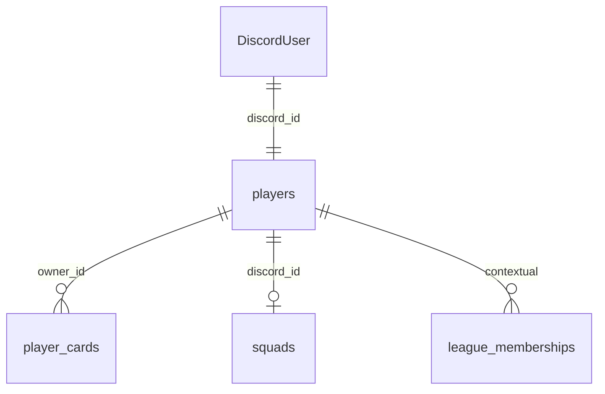

# Data Model: Identity & Ownership (US-42.1)

**Feature**: `030-identity-ownership`  
**Date**: 2026-07-22

## 1. Existing entities (unchanged keys)

### `players` (Club / human or AI)

| Column (existing) | Role |
|-------------------|------|
| `discord_id` PK | Durable human club identity (= Discord user id) |
| `username` | Cosmetic cache |
| `club_name` / `manager_name` | Presentation |
| `coins` / energy fields | Owned balances (mutated only via economy pipe) |
| `is_ai` | AI/system club discriminator |
| `created_at` | Registration time |

### `player_cards`

| Column | Role |
|--------|------|
| `id` | Card PK |
| `owner_id` → `players.discord_id` | **Current** owner (INV-02 / INV-14) |

### RegistrationAttempt

Ephemeral Discord thread/view only — **not** a DB table.

### GuildContext

Discord membership + `guild_config` / league tables — not stored as club ownership.

## 2. New / altered columns on `players` (migration 074)

| Column | Type | Default | Notes |
|--------|------|---------|-------|
| `identity_status` | `TEXT` | `'active'` | CHECK IN (`active`, `inactive`, `abandoned`) |
| `last_qualifying_activity_at` | `TIMESTAMPTZ` | `NOW()` at migrate / register | Updated by `touch_club_activity` |
| `identity_status_changed_at` | `TIMESTAMPTZ` | `NOW()` | Set when status changes |

**Constraints**:
- Human register path leaves `is_ai = false`, `identity_status = 'active'`.
- AI clubs: `identity_status` may stay `active` or be ignored by classify (`WHERE is_ai = false`).

**Config / constants** (not necessarily columns):
- Inactive after **30** UTC days without qualifying activity (Assumption; may later move to `game_config`).
- Abandoned after **90** UTC days.

## 3. Relationships

Guild membership is **not** an ER edge that owns the club.

## 4. Validation rules

1. At most one `players` row per `discord_id`.
2. `register_new_player` is all-or-nothing; failure → no orphan cards/squad.
3. Soft status never deletes rows or frees `discord_id` for a second human club.
4. Claims and card actions authorize against `player_cards.owner_id` (current).
5. `is_ai = true` rows are not created by `/register`.

## 5. State transitions (data)

| From | To | Writer |
|------|-----|--------|
| (none) | active | `register_new_player` |
| active | inactive | `classify_club_identity_status` |
| inactive | abandoned | classify |
| inactive/abandoned | active | `recover_club_identity` or classify on recent activity + recover |
| * | * | `touch_club_activity` updates timestamp; may set active if product chooses auto-wake |

## 6. RPC surface (074)

| RPC | Purpose |
|-----|---------|
| `register_new_player` (replace) | Concurrent-safe already-registered |
| `touch_club_activity(p_club_id)` | Bump activity; optional set active |
| `classify_club_identity_status(p_club_id)` or batch | Apply 30/90 rules for humans |
| `recover_club_identity(p_club_id)` | Abandoned/Inactive → active (owner-gated in app) |

Exact signatures finalized in contracts; all SECURITY DEFINER / grants consistent with peers.
