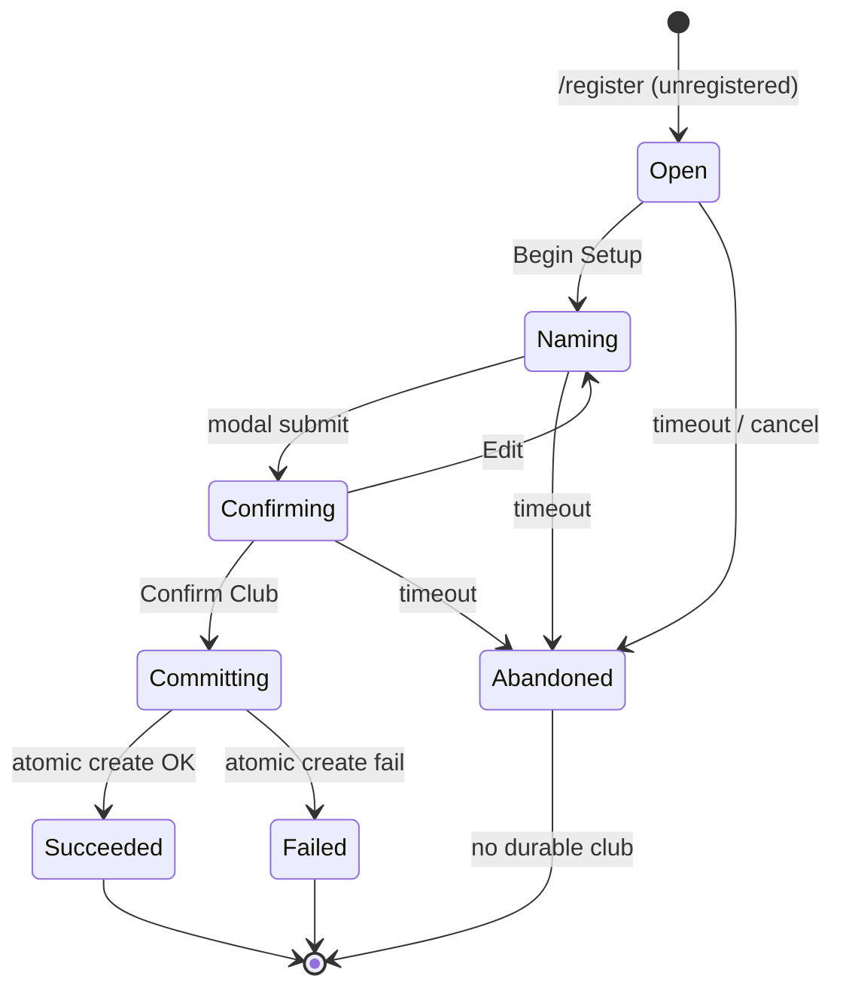

# Feature Specification: Identity & Ownership (US-42.1)

**Feature Branch**: `030-identity-ownership`

**Created**: 2026-07-22

**Status**: Locked

**Parent epic**: `specs/029-game-integrity` (US-42)

**Child ID**: US-42.1 — Identity & Ownership

**Depends on**: none

**Overlays**: US-01 registration (`.specify/specs/v1.0.0/spec.md`); league guild-unreachable rules in `026`/`027` (seat/pause only — sport stays there)

**Input**: User description: "US-42.1 — Identity & Ownership. Parent: specs/029-game-integrity. Design Discord↔Manager↔Club↔Guild membership; registration; leave/rejoin; bot remove/add; soft inactivity/abandonment; one Discord user → one club; card/coin ownership; cross-server behavior; recovery. Follow child-spec-template. Touch INV-01, INV-02, INV-09, INV-14. Do not redefine XP/economy pipes or invent multi-club accounts."

---

## User Scenarios & Testing *(mandatory)*

### User Story 1 — Register exactly one durable club (Priority: P1) 🎯 MVP

A new Discord user runs `/register`, completes onboarding, and receives exactly one club with starter squad and opening balances. A second confirm, concurrent register, or re-run after success never creates a second club.

**Why this priority**: Identity is the root of every ownership and reward claim. Duplicate clubs break INV-01 and enable multi-farming.

**Independent Test**: Double-confirm / concurrent `/register` yields ≤1 club row for that Discord user; abort before confirm leaves zero durable club state.

**Acceptance Scenarios**:

1. **Given** an unregistered user, **When** they complete Confirm Club and registration succeeds, **Then** exactly one club exists for their Discord identity with starter inventory and opening economy balances.
2. **Given** registration already succeeded, **When** they run `/register` again, **Then** they see already-registered copy and no second club or onboarding thread is created.
3. **Given** two concurrent confirm attempts, **When** both finish, **Then** at most one club exists; the loser gets a clear already-registered / conflict outcome with no partial cards.
4. **Given** the user abandons the wizard (timeout / leave), **When** time elapses, **Then** no durable club, cards, or squad rows remain.

---

### User Story 2 — Own cards and coins under one identity (Priority: P1)

A registered manager’s coins belong to their club; each player card has exactly one current owner club. After a card changes owner (e.g. transfer), claims and progression attach to the **current** owner — never a stale historical club id.

**Why this priority**: INV-02 and INV-14 are how inventory and pending rewards stay fair across marketplace and lifecycle.

**Independent Test**: Trace any card’s current owner; claim pending level rewards only for cards currently owned; coin mutations only affect the acting club.

**Acceptance Scenarios**:

1. **Given** a card owned by Club A, **When** any mutation checks ownership, **Then** only Club A’s Discord identity may authorize club-scoped actions on that card (until ownership changes).
2. **Given** a card moves to Club B, **When** pending level rewards are claimed, **Then** credit goes to Club B’s identity (current owner), not Club A.
3. **Given** Club A’s coin balance, **When** a debit/credit runs, **Then** only Club A’s balance changes via the economy pipeline (this spec does not redefine the pipe — it binds ownership of the balance to the club identity).

---

### User Story 3 — Survive guild leave, bot remove, and re-add (Priority: P1)

A manager’s club is **not** deleted when they leave a Discord server or when the bot is removed. Guild context affects league/seat/presentation; durable identity and inventory persist. Re-adding the bot or rejoining a guild does not create a new club.

**Why this priority**: Cross-server and ops events are the main source of “lost club” tickets if mis-specified.

**Independent Test**: Simulate leave guild / bot remove / re-add; club row and cards remain; league seasons pause or follow `026` overlay — no second registration.

**Acceptance Scenarios**:

1. **Given** a registered manager leaves Guild G, **When** leave is processed, **Then** their club and cards remain; they are no longer a member of G for guild-scoped league eligibility.
2. **Given** the bot is removed from Guild G, **When** `on_guild_remove` (or equivalent) runs, **Then** clubs of members are not deleted; active/registration seasons for G pause per league rules.
3. **Given** the bot is re-added and the manager is still in G (or rejoins), **When** they use gameplay commands, **Then** the same club is used — no forced re-register.
4. **Given** the manager plays in Guild H where the bot is present, **When** they never registered in H specifically, **Then** their existing global club still works (no per-guild club).

---

### User Story 4 — Soft inactivity without destroying the club (Priority: P2)

Long silence marks a club Inactive or Abandoned for integrity/league purposes, but does **not** hard-delete inventory or allow a second registration under the same Discord identity.

**Why this priority**: Prevents ghost seats and clarifies recovery without catastrophic delete. Day thresholds may be refined by US-42.3; identity consequences are frozen here.

**Independent Test**: Apply Inactive/Abandoned labels; `/register` still blocked; inventory intact; return-to-Active path documented.

**Acceptance Scenarios**:

1. **Given** a club with no qualifying activity for the Inactive threshold, **When** classification runs (or is assessed), **Then** state becomes Inactive; cards and coins remain.
2. **Given** Abandoned classification, **When** the Discord user returns and performs a qualifying action, **Then** they recover the same club (return to Active) — they do not get a new club.
3. **Given** soft-inactive/abandoned, **When** someone attempts hard delete or second register, **Then** both are rejected in P0.

---

### User Story 5 — Unregistered users cannot mutate; interactions are owner-bound (Priority: P2)

Unregistered users hitting gameplay commands get a clear register prompt. Hub buttons and onboarding threads reject non-owners. Stale views cannot create identity.

**Why this priority**: Closes silent account creation and cross-user button abuse.

**Independent Test**: Unregistered `/store` (or equivalent) → register prompt; foreign onboarding button → reject; no DB club created.

**Acceptance Scenarios**:

1. **Given** an unregistered user, **When** they invoke a gated gameplay command, **Then** they receive register guidance and no durable writes occur.
2. **Given** an onboarding thread owned by User A, **When** User B clicks a control, **Then** B is rejected and A’s wizard continues unaffected.
3. **Given** a stale register confirm after success elsewhere, **When** pressed, **Then** server revalidation yields already-registered / no-op — no second club.

---

### Edge Cases

| ID | Scenario | Expected | Recovery |
|----|----------|----------|----------|
| E1 | Confirm after already registered mid-animation | Reject second create; show already registered | Idempotent register |
| E2 | RPC fails mid-register | Full rollback; no orphan cards | Retry register cleanly |
| E3 | Bot restart mid-wizard (pre-RPC) | No club; user restarts `/register` | Ephemeral wizard state only |
| E4 | Bot restart after RPC success, before thread delete | Club exists; user may see odd thread — durable OK | Already-registered on re-run |
| E5 | User in 0 guilds but club exists | Club persists; guild-league unavailable | Play in any mutual guild later |
| E6 | Discord username changes | Club identity unchanged; cached username may refresh on next write | Do not key ownership on username |
| E7 | Manager renames club/manager (if allowed) | Same club id; cosmetic only | Rate-limit abuse (Assumption) |
| E8 | AI/bot club | Not tied to a human Discord registration path | INV-15 remains; US-42.3 detail |
| E9 | Card with stale `club_id` field vs `owner_id` | `owner_id` wins for claims/ownership | Align on read/claim |
| E10 | Leave guild during league season | Club kept; seat/season rules per 026/42.5 | Pause/withdraw — not delete club |
| E11 | Two devices register at once | ≤1 club | Unique Discord identity constraint |
| E12 | Whitespace-only club name | Reject | No create |
| E13 | Guild deleted / unavailable | Same as bot remove for seasons; clubs remain | League overlay |
| E14 | User banned from guild | Club remains; loses that guild context | — |
| E15 | Pending rewards after P2P buy | Current owner claims | INV-14 |

---

## Requirements *(mandatory)*

### Functional Requirements

- **FR-001**: System MUST treat Discord user id as the durable external identity key for human clubs.
- **FR-002**: System MUST enforce **at most one** human club per Discord user identity (INV-01).
- **FR-003**: System MUST create human clubs only through the atomic registration path (no silent create on other commands).
- **FR-004**: Registration MUST be idempotent under double-confirm and concurrency: second success path does not create a second club.
- **FR-005**: Aborting onboarding before successful registration MUST leave zero durable club/card/squad rows for that attempt.
- **FR-006**: Unregistered users MUST be blocked from gated gameplay mutations with clear register guidance.
- **FR-007**: Each player card MUST have exactly one current owner club identity (INV-02); ownership checks MUST use that current owner.
- **FR-008**: Club coin (and club energy) balances are owned by the club identity; mutations MUST go through the existing economy pipeline (do not redefine the pipe).
- **FR-009**: Pending level-reward claims MUST credit the **current** card owner (INV-14).
- **FR-010**: Leaving a guild MUST NOT delete the club or cards.
- **FR-011**: Bot removal from a guild MUST NOT delete member clubs; league seasons for that guild follow pause/unreachable rules from league specs.
- **FR-012**: Re-adding the bot or rejoining a guild MUST reuse the existing club — never force a second registration.
- **FR-013**: There is **no** per-guild club and **no** required “home guild”; the club is global wherever the bot and user share a guild (or DMs where product allows).
- **FR-014**: Soft states Inactive and Abandoned MUST NOT hard-delete inventory or free the Discord identity for a second club in P0.
- **FR-015**: Returning users in Inactive/Abandoned MUST recover the same club (return toward Active) rather than re-register.
- **FR-016**: Interactive surfaces that mutate identity or club-scoped state MUST verify the acting Discord user is the club owner (or onboarding thread owner).
- **FR-017**: Username / display-name drift MUST NOT change ownership keys.
- **FR-018**: Match settlement and reward attachment for a club MUST use the club’s durable identity (supports INV-09 at identity boundary — full match rules in US-42.4).
- **FR-019**: AI/system clubs MUST be distinguishable from human-registered clubs and MUST NOT be creatable via `/register`.
- **FR-020**: This feature MUST NOT introduce multi-club accounts, hard club deletion, or ownership transfer between Discord users in P0.
- **FR-021**: Child specs US-42.2+ MUST cite this ownership model; they MUST NOT invent alternate owner keys.
- **FR-022**: Player-facing identity/ownership rule changes that managers see MUST update `change_log.md` when implemented.

### Key Entities

- **DiscordIdentity**: External person key = Discord user id; username is cosmetic cache.
- **ManagerProfile**: Manager name and related presentation fields on the club.
- **Club (human)**: Durable game account keyed by Discord identity; owns coins/energy and cards.
- **Club (AI/system)**: Non-human club for league fill / bots; not registered via `/register`.
- **GuildContext**: Membership of a Discord user (and bot) in a guild; affects league/seat/presentation only.
- **PlayerCardOwnership**: Current owner club identity on a card; history may exist but current owner is authoritative.
- **RegistrationAttempt**: Pre-commit onboarding session (thread/UI); non-durable until atomic success.
- **SoftLifecycleLabel**: Active / Inactive / Abandoned (identity consequences here; automation thresholds shared with US-42.3).

---

## A. Epic invariant touch list

| INV | How US-42.1 extends / enforces |
|-----|--------------------------------|
| **INV-01** | Primary — one Discord user → one human club; register idempotency |
| **INV-02** | Primary — card current owner uniqueness and check rules |
| **INV-04** | Bound — coin balance belongs to club; failed debit unchanged (pipe owns mechanics) |
| **INV-05** | Bound — club economy ownership; no alternate balance store |
| **INV-08** | Bound — registration / already-registered as reward-adjacent once-only create |
| **INV-09** | Bound — settlement/rewards attach to durable club identity |
| **INV-14** | Primary — claims follow current owner |
| **INV-15** | Bound — AI clubs ≠ human register path |
| **INV-16** | Bound — uniqueness/constraints for identity must remain schema-guarded when changed |

Does **not** weaken any epic INV. Does **not** redefine INV-06 XP pipe.

---

## B. State machine / lifecycle

### B.1 DiscordIdentity (human)

| State | Meaning |
|-------|---------|
| Unknown | Never successfully registered |
| Registered | Has exactly one human club |

Transitions: Unknown → Registered via successful registration only. No Registered → Unknown in P0 (no hard delete).

### B.2 RegistrationAttempt

| State | Allowed | Blocked |
|-------|---------|---------|
| Open/Naming/Confirming | Owner interactions only | Other users; gameplay create |
| Committing | Server commit once | Second parallel create for same id |
| Succeeded | — | Further creates |
| Abandoned/Failed | New `/register` if still Unknown | Partial DB rows |

**Failure recovery**: Rollback all durable writes on commit failure; discard wizard UI; user may retry.

### B.3 Club soft lifecycle (identity view)

Aligns with epic names; **day thresholds and league seat automation owned with US-42.3**.

| State | Entry | Exit | Ownership impact |
|-------|-------|------|------------------|
| Active | Register success or return from Inactive/Abandoned | Inactivity threshold | Full human club rights |
| Inactive | No qualifying activity for Inactive threshold | Qualifying action → Active | Same club; may lose some league eligibility (42.3/42.5) |
| Abandoned | Prolonged inactivity / product rule | Qualifying recovery → Active | Same club; still blocks second register |
| AI | System create | System only | Not human identity |

**Qualifying activity (default)**: Successful gated gameplay mutation or explicit recovery action — exact list refined in US-42.3; identity rule is “same club recovers.”

### B.4 GuildContext events

| Event | Club | Cards | League |
|-------|------|-------|--------|
| User leaves guild | Persist | Persist | Lose membership-scoped seat per 026/42.5 |
| Bot removed | Persist | Persist | Pause/unreachable per 026 |
| Bot re-added | Persist | Persist | Resume/recovery per 026 — no re-register |
| User joins new guild with bot | Persist | Persist | May join that guild’s league with **same** club |

---

## C. Logical actions & idempotency

| Action | Actor | Idempotency key pattern | Pipeline | Success | Reject reasons |
|--------|-------|-------------------------|----------|---------|----------------|
| `register_club` | Discord user | Natural key = `discord_id` unique; replay → already exists | Ownership | One club + starter inventory | Already registered; invalid names; RPC fail |
| `gate_unregistered` | Any command | N/A (read) | Presentation | Prompt | — |
| `refresh_username_cache` | System/app | Optional per session | Presentation | Updated cache | — |
| `classify_inactive` | Job (future) | `inactive:{club_id}:{as_of_date}` | Ownership label | Label set | Already labeled |
| `recover_club` | Owner | `recover:{club_id}` or natural | Ownership label | Active | Not owner |
| `on_guild_remove_identity` | System | Season pause keys in league domain | Competitive overlay | Seasons paused; clubs untouched | Transient Discord errors skip pause (026) |
| `claim_pending_level_rewards` | Owner | Existing claim flags / owner scoped | Progression (existing) | SP to current owner | Not owner; none pending |
| `authorize_card_action` | Owner | N/A (guard) | Ownership | Allow | Wrong owner; unregistered |

---

## D. Source of truth

| Concern | Durable truth | Presentation may show | Must not decide alone |
|---------|---------------|----------------------|------------------------|
| Who is registered | Club row keyed by Discord id | `/register` already-registered embed | Wizard thread existence |
| Card owner | Current owner identity on card | Roster / market embeds | Stale browse cache |
| Coin owner | Club balance via economy pipe | Profile / store | Button alone |
| Guild membership | Discord guild membership + bot presence | League hub | Assumed home guild |
| Soft lifecycle label | Stored/derived label (42.3 automation) | Profile badges (optional) | Deleting inventory |
| Pending rewards payee | Current card owner at claim | DM / hub Claim | Frozen historical club id |

Cite parent SoT matrix (`specs/029-game-integrity/spec.md` §3): Discord UI is presentation; DB is truth.

---

## E. Outage & catch-up

| Failure | Behavior |
|---------|----------|
| Discord down mid-wizard (pre-commit) | No club; user retries later |
| Discord down after commit | Club exists; presentation/thread cleanup may retry; `/register` shows already registered |
| Bot restart mid-commit | Atomic RPC → all-or-nothing; no half club |
| Bot removed from guild | Clubs kept; seasons paused (league); identity unchanged |
| Top.gg / other deps | Irrelevant to identity create (packs remain fail-closed elsewhere) |
| DB timeout on register | Fail closed; no partial; user retries |

---

## F. Implementation non-goals

- Multi-club / guild-bound separate inventories
- Hard delete club / GDPR wipe tooling (separate product decision)
- Transfer club ownership between Discord users
- Ban/alt detection systems (US-42.10 soft economics)
- Redefining `apply_club_economy` or `apply_card_xp`
- Full Inactive day-threshold automation (US-42.3 owns scheduling detail; this spec freezes identity consequences)
- New slash commands beyond existing `/register` behavior fixes
- Player card exclusive-state matrix (US-42.2)
- League sporting calendar (026 / US-42.5)

---

## G. Acceptance tests (integrity)

| Test | Pass condition |
|------|----------------|
| Double-invoke register | ≤1 club for discord id |
| Concurrent register | ≤1 club; loser clear error |
| Stale confirm after success | No second club |
| Restart after success | Same club; already-registered |
| Leave guild | Club+cards remain |
| Bot remove | Clubs remain; seasons paused not deleted |
| Owner check | Non-owner interaction rejected |
| Pending rewards after owner change | Current owner credited |
| Unregistered gated command | No durable write |

---

## Success Criteria *(mandatory)*

### Measurable Outcomes

- **SC-001**: In 100 scripted double-register / concurrent-register trials, durable human clubs created per Discord id = **1** (never 2+).
- **SC-002**: In 20 leave-guild and 20 bot-remove simulations, **0** clubs or cards are deleted as a side effect.
- **SC-003**: After ownership change of a card with pending level rewards, claim credits the new owner in **100%** of audited cases.
- **SC-004**: Unregistered users attempting ≥5 gated commands produce **0** durable club rows and always receive register guidance.
- **SC-005**: A new engineer can explain “one Discord → one club” and “guild leave does not delete club” from this spec alone in ≤15 minutes (spot check).
- **SC-006**: Support tickets of class “I left the server and lost my club” attributable to delete-on-leave design = **0** after implementation of this contract (ops window 60 days).

## Assumptions

- Discord user id is stable for the life of the account; username is not an ownership key.
- Opening balances and starter squad contents remain as defined by US-01 / current registration product — this spec owns **identity cardinality and durability**, not gacha contents.
- Soft Inactive = **30 UTC days** without qualifying activity; Abandoned = **90 UTC days** — provisional defaults until US-42.3 locks automation; identity consequences above still hold if numbers change.
- Qualifying activity defaults to any successful economy/XP/match/league gated mutation by that club; cosmetic profile views do not count.
- Manager/club rename may exist as cosmetic updates with abuse rate limits; rename never creates a new club id.
- DMs: if product allows some commands in DM, they still use the same global club.
- AI clubs are created only by system league/fill paths.
- US-42.3 may add richer club-state automation but must not violate INV-01/02 or hard-delete in P0.
- Economy and XP pipes remain singular per epic; this child only binds **who** owns balances and cards.

## Out of Scope

- Implementing US-42.2–42.10 contents
- Marketplace purchase atomicity details (US-42.6) beyond ownership after sale
- Match lock / settlement sequencing (US-42.4) beyond identity attachment
- Exhaustive anti-abuse catalog (US-42.10)
