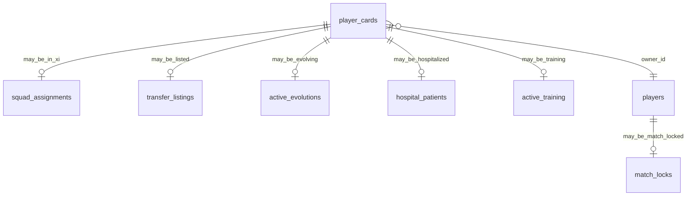

# Data Model: Player State Machine (US-42.2)

**Feature**: `031-player-state-machine`  
**Date**: 2026-07-22

## 1. No new durable “state” table (MVP)

Primary state is **derived**. Inputs:

### From `player_cards`

| Field | Contributes to |
|-------|----------------|
| `owner_id` | Ownership (US-42.1) |
| `is_retired` | Retired |
| `in_hospital` | Hospitalized |
| `injury_tier` | Modifier InjuryPlayOn (also blocks list) |
| `in_academy` | InAcademy |
| `fatigue` | Modifier FatigueBand |

### From related tables

| Source | Contributes to |
|--------|----------------|
| Squad assignment present | InXI vs RosterFree |
| Active transfer listing | Listed |
| `active_evolutions` status=`active` | Evolving |
| `active_training` row (if any) | TrainingBusy |
| Card no longer owned / sold | SoldTransferred (seller perspective) |
| `match_locks` for owner | Overlay MatchLocked |

## 2. Derive priority (conflict / classification)

When classifying (and for ops reconcile):

1. Retired  
2. SoldTransferred (not owned by viewer)  
3. Listed  
4. Hospitalized  
5. Evolving  
6. TrainingBusy  
7. InAcademy  
8. InXI  
9. RosterFree  

If multiple busy proofs exist, mutations **Block** with `state_conflict` until reconciled to this priority (spec FR-014).

## 3. Action vocabulary (assert `p_action` values)

Stable string codes (SQL + pure must match):

| Code | Meaning |
|------|---------|
| `view_profile` | View-only |
| `assign_xi` | Put into starting XI |
| `bench` | Remove from XI |
| `match_include` | Eligible for match squad |
| `drill` | Stat drill |
| `fusion` | Fusion keeper or fodder |
| `allocate` | Skill allocate / mentor |
| `recover_fatigue` | Active recovery |
| `start_evolution` | Start evo |
| `claim_evolution` | Claim evo reward |
| `cancel_evolution` | Cancel evo |
| `admit_hospital` | Admit |
| `discharge_hospital` | Discharge |
| `list_transfer` | Create P2P listing |
| `cancel_listing` | Cancel listing |
| `agent_sell` | Agent sale |
| `academy_seat` | Seat in academy |
| `academy_promote` | Promote from academy |
| `academy_release` | Release from academy |
| `retire` | Retire card |

## 4. SQL objects (075)

| Object | Role |
|--------|------|
| `derive` logic inside assert (or SQL function returning state text) | Optional `card_primary_state(p_card_id)` for debugging |
| `assert_card_action_allowed(p_owner_id, p_card_id, p_action)` | Raises on Block |
| Grants + verify guards | Required |

## 5. Relationships (conceptual)

