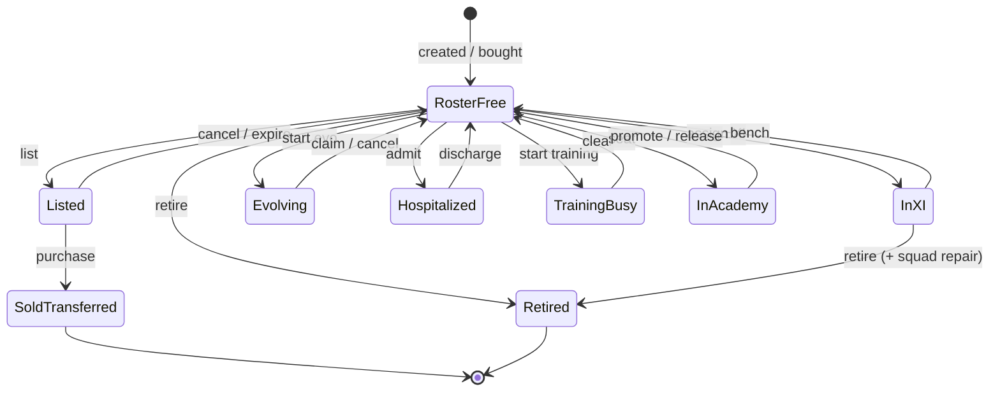

# Feature Specification: Player State Machine (US-42.2)

**Feature Branch**: `031-player-state-machine`

**Created**: 2026-07-22

**Status**: Locked

**Parent epic**: `specs/029-game-integrity` (US-42)

**Child ID**: US-42.2 — Player State Machine

**Depends on**: US-42.1 (`specs/030-identity-ownership`) — current `owner_id` is the only ownership key

**Overlays**: Transfer eligibility (`017`); hospital/fatigue (`002`/`009`+); evolutions (`018`/`028`); academy (`015`); retirement (`007`); match locks (US-22 / US-42.4 for match run detail)

**Input**: User description: "US-42.2 — Player State Machine. Parent 029; depends 030. Exclusive primary states; full allowed/blocked matrix; entry/exit/failure recovery; align ownership; no XP/economy pipe rewrite; no multi-club. Child template; INV-02, INV-03, INV-10, INV-17."

---

## User Scenarios & Testing *(mandatory)*

### User Story 1 — One primary exclusive state per card (Priority: P1) 🎯 MVP

A manager’s player card is always in exactly one **primary exclusive state** (plus optional overlays). Conflicting busy states (Listed vs Hospitalized vs Evolving vs Academy vs TrainingBusy vs Retired) cannot all be true at once; if data is corrupted, the system fails closed on mutations and prefers a documented recovery priority.

**Why this priority**: INV-03 is the root of “play while listed / sell while hospital” exploits.

**Independent Test**: For each exclusive pair, attempt to enter B while in A → reject; derive_primary_state on fixture cards matches expected label.

**Acceptance Scenarios**:

1. **Given** a card in Listed, **When** the manager tries hospital admit, evolution start, academy seat, or XI assign, **Then** the action is rejected with a clear reason and state unchanged.
2. **Given** a card in Hospitalized, **When** the manager tries list, drill, fusion, match include, or agent sell, **Then** rejected.
3. **Given** contradictory flags somehow coexist, **When** a mutation runs, **Then** it fails closed (or auto-reconciles only via an explicit recovery procedure — never silently allows the conflicted action).

---

### User Story 2 — Every hub action agrees with the matrix (Priority: P1)

Whether the manager uses Development, Marketplace, Squad, Battle, Hospital, or Academy, the same card state blocks or allows the same actions. UI may hide buttons; RPC still enforces.

**Why this priority**: Split-brain UI vs server is how exploits and tickets happen (epic US3).

**Independent Test**: For each action column in the matrix, attempt from at least two surfaces (or RPC + one hub) while in blocking states → identical Block outcome family.

**Acceptance Scenarios**:

1. **Given** a Listed card, **When** drill is attempted from `/development` and list cancel is available from marketplace, **Then** drill Blocks; cancel Allowed.
2. **Given** MatchLocked club, **When** squad swap or evolution claim is attempted, **Then** both Block until lock clears.
3. **Given** a stale embed offering Start Evolution on a now-Listed card, **When** pressed, **Then** server rejects; no evolution row created.

---

### User Story 3 — Safe transitions with recovery (Priority: P1)

Entering and leaving Evolving, Hospitalized, Listed, InAcademy, TrainingBusy, Retired, and SoldTransferred follow explicit entry/exit rules. Cancel/expire/discharge/claim leave the card in a legal RosterFree or InXI state without orphan locks.

**Why this priority**: Half-applied transitions create stuck cards (support class).

**Independent Test**: Happy-path enter/exit for each busy state; cancel/expire/discharge mid-flow; double-invoke enter → at most one durable busy record.

**Acceptance Scenarios**:

1. **Given** RosterFree (not InXI), **When** list succeeds, **Then** primary = Listed; card cannot enter XI until cancel/expire/sale.
2. **Given** Listed, **When** cancel or expire succeeds, **Then** primary = RosterFree; listing not Active.
3. **Given** Evolving, **When** claim or cancel completes, **Then** primary returns to RosterFree or InXI as applicable; no second active evolution on that card.
4. **Given** purchase of a listing, **When** sale commits, **Then** seller view is SoldTransferred (card gone); buyer owns RosterFree card under their `owner_id`.

---

### User Story 4 — Match lock and XI overlays (Priority: P2)

MatchLocked is a **club overlay**: while the club is match-locked, roster and development mutations on cards are blocked. InXI is compatible with MatchLocked (starters stay InXI) but cards cannot be reassigned until unlock. Evolution match ticks still happen at most once per match result (INV-10) — owned with US-42.4 for settlement wiring.

**Why this priority**: INV-17; mid-match tampering.

**Independent Test**: With match_locks row present, attempt squad/dev/sale mutations → Block; after release, Allowed again for legal states.

**Acceptance Scenarios**:

1. **Given** club MatchLocked and card InXI, **When** bench swap attempted, **Then** Block.
2. **Given** club MatchLocked and card RosterFree, **When** evolution start attempted, **Then** Block.
3. **Given** lock released, **When** same actions retried on eligible cards, **Then** Allowed subject to other states.

---

### User Story 5 — Modifiers do not invent a second exclusive state (Priority: P2)

Injury-without-hospital (play-on), fatigue bands, and contract/wage flags are **modifiers**. They may further restrict match eligibility or XI assign but do not replace primary exclusive states. Hospitalized remains the exclusive medical busy state.

**Why this priority**: Prevents “injured but listed” ambiguity and keeps the matrix teachable.

**Independent Test**: Card with injury_tier set, `in_hospital=false`, RosterFree → can be listed? **Block** (align 017). Can play? Subject to injury rules (play-on path) — document; not Listed/Hospital exclusive conflict.

**Acceptance Scenarios**:

1. **Given** injury_tier set and not hospitalized, **When** transfer list attempted, **Then** Block (same family as hospital/injury listing block).
2. **Given** high fatigue only, **When** list attempted, **Then** Allowed if otherwise RosterFree (fatigue alone does not create exclusive busy) — unless a later overlay amends.
3. **Given** Hospitalized, **When** classify primary state, **Then** Hospitalized (not “Injured modifier”).

---

### Edge Cases

| ID | Scenario | Expected | Recovery |
|----|----------|----------|----------|
| E1 | Double-tap evolution start | ≤1 active evolution | Idempotent / unique active index |
| E2 | List while evolution claim in flight | One wins; other Block | Row locks |
| E3 | Discharge last hospital patient | State RosterFree; UI empty-state | 022 pattern |
| E4 | Expire listing while buyer confirming | Buyer loses race; no debit | 017 / 42.6 |
| E5 | Retire while InXI | Auto-promote or squad_invalid; card Retired | 007 |
| E6 | Match end without releasing lock | Mutations stay Blocked | Ops/release RPC; 42.4 |
| E7 | Academy seat while Listed | Block | Matrix |
| E8 | Fusion fodder that is Evolving | Block | Matrix |
| E9 | View-only profile while Listed | Allowed | Presentation |
| E10 | Stale custom_id after restart | Server revalidate → Block/reason | Presentation ≠ auth |
| E11 | Bot offline mid-admit | All-or-nothing hospital RPC | Retry |
| E12 | Card sold; seller embed still shows Sell | Actions fail ownership (US-42.1) | — |
| E13 | Active training row orphaned | Treat TrainingBusy; provide clear cancel/expire path | Recovery job optional |
| E14 | InXI + try list | Block (must bench first) | — |
| E15 | Evolving + match tick | Progress once per match result max | INV-10 / 42.4 |

---

## Requirements *(mandatory)*

### Functional Requirements

- **FR-001**: Every player card MUST have exactly one **primary exclusive state** from the frozen set in §B at any time for gating purposes.
- **FR-002**: System MUST enforce the Allowed/Blocked matrix in §B for all listed actions; Discord UI MUST NOT be the sole enforcer.
- **FR-003**: Mutations MUST re-check current `owner_id` (US-42.1 / INV-02) before applying state transitions.
- **FR-004**: Exclusive busy states Listed, Hospitalized, Evolving (active), TrainingBusy, InAcademy, and Retired MUST be mutually exclusive with each other.
- **FR-005**: InXI MUST be mutually exclusive with Listed, Hospitalized, TrainingBusy, InAcademy, Retired (cannot be starting XI while those busy states hold). **Evolving MAY coexist with InXI** so match-based evolution tracks can progress via Starting XI appearances (US-18 / match tick).
- **FR-006**: MatchLocked MUST block roster assignment changes and development/sale/list/evo-start/claim/cancel/hospital/academy mutations until cleared (INV-17).
- **FR-007**: View-only actions (open profile, browse) MUST remain Allowed unless ownership fails.
- **FR-008**: Entry to a busy state MUST fail closed if any conflicting exclusive state is present.
- **FR-009**: Exit paths (cancel list, expire list, discharge, evo claim/cancel, academy promote/release, training clear, retire) MUST leave a legal primary state and MUST NOT leave orphan Active listings/evolutions/hospital rows for that card.
- **FR-010**: Double-invoke enter of the same busy state MUST result in at most one durable busy record.
- **FR-011**: SoldTransferred is terminal for the seller’s ownership; buyer receives the card as RosterFree under buyer `owner_id`.
- **FR-012**: Evolution match progress MUST tick at most once per card per match settlement (INV-10); this child defines the state permission; US-42.4 owns settlement wiring.
- **FR-013**: Injury-without-hospital, fatigue, and wage/contract flags are modifiers; listing MUST Block when injury_tier is set or hospitalized (align 017).
- **FR-014**: If contradictory exclusive flags are detected, mutations MUST Block with a reconciliation reason; optional admin/ops reconcile follows documented priority in §B (Retired > SoldTransferred > Listed > Hospitalized > Evolving > TrainingBusy > InAcademy > InXI > RosterFree).
- **FR-015**: Reason codes/copy families MUST be stable enough that hubs can show why an action is blocked (state name + short cause).
- **FR-016**: This feature MUST NOT redefine XP or economy pipes; costs/rewards stay in existing RPCs.
- **FR-017**: No new slash commands or hubs — extend enforcement inside existing RPCs/helpers and hub disable logic.
- **FR-018**: Pure derive/gate helpers (if implemented) MUST live under `packages/` without Discord imports; Discord only presents.
- **FR-019**: Player-facing rule changes that managers see MUST update `change_log.md` when shipped.
- **FR-020**: InAcademy is an official exclusive primary state (epic sketch extension justified by academy + transfer rules).

### Key Entities

- **PlayerCard**: Inventory unit with `owner_id` and flags/relations that derive primary state.
- **PrimaryExclusiveState**: One of RosterFree, InXI, Listed, Evolving, Hospitalized, TrainingBusy, InAcademy, Retired, SoldTransferred.
- **StateOverlay**: MatchLocked (club-scoped).
- **StateModifier**: InjuryPlayOn, FatigueBand, ContractGate (non-exclusive).
- **CardAction**: Named mutation/intent in the matrix (assign XI, drill, list, …).
- **BusyRecord**: Durable row proving a busy state (active listing, active evolution, hospital patient, academy seat, active_training).

---

## A. Epic invariant touch list

| INV | Role in US-42.2 |
|-----|-----------------|
| **INV-02** | Bound — owner check on every transition |
| **INV-03** | Primary — exclusive states + matrix |
| **INV-06** | Bound — progression mutations still via XP pipe when allowed |
| **INV-10** | Primary permission — evo tick only when state/match rules allow; once per match |
| **INV-13** | Bound — Listed sale races (detail 42.6) |
| **INV-14** | Bound — after SoldTransferred, claims follow new owner |
| **INV-17** | Primary — MatchLocked overlay blocks mutations |
| **INV-18** | Bound — caps still server-side when action Allowed |

Does not weaken epic INVs. Extends exclusive set with **InAcademy** (FR-020).

---

## B. State machine / lifecycle

### B.1 Primary exclusive states

| State | Proof (informative) | Entry | Exit |
|-------|---------------------|-------|------|
| **RosterFree** | Owned; not InXI; no busy proof | Create/acquire; bench; cancel busy | Assign XI; enter busy; retire; sell |
| **InXI** | Squad assignment slot 1–11 | Assign/swap into XI | Bench/replace; retire path |
| **Listed** | Active transfer listing | `create_transfer_listing` | Cancel, expire, sold |
| **Evolving** | `active_evolutions` status active | `start_player_evolution` | Claim complete / cancel |
| **Hospitalized** | `in_hospital` / hospital patient open | Admit | Discharge |
| **TrainingBusy** | `active_training` row (if used) | Start lasting training session | Complete/cancel/clear |
| **InAcademy** | `in_academy` | Seat in academy | Promote / release / age-out rules |
| **Retired** | `is_retired` | Retire RPC | Terminal |
| **SoldTransferred** | No longer owned by seller | Purchase commit | Terminal (seller) |

### B.2 Overlay

| Overlay | Proof | Effect |
|---------|-------|--------|
| **MatchLocked** | `match_locks` for club | Block mutations in FR-006; does not by itself remove InXI |

### B.3 Modifiers (non-exclusive)

| Modifier | Effect summary |
|----------|----------------|
| InjuryPlayOn (`injury_tier` set, not hospital) | Block list/agent-sell (align 017); match eligibility per injury rules |
| FatigueBand | May affect performance/recovery UI; does not alone create exclusive busy |
| ContractGate / payroll | May block XI/match per wages specs; orthogonal to card exclusive busy |

### B.4 Transition diagram (primary)

MatchLocked is not shown as a node; it overlays InXI/RosterFree.

### B.5 Action matrix

Legend: **A** = Allowed (if owner + other non-state gates pass); **B** = Blocked; **V** = View-only Allowed; **—** = N/A

| Action | RosterFree | InXI | Listed | Evolving | Hospital | TrainBusy | Academy | Retired | Sold | MatchLocked* |
|--------|------------|------|--------|----------|----------|-----------|---------|---------|------|--------------|
| View profile | V | V | V | V | V | V | V | V | B† | V |
| Assign to XI | A | — | B | A | B | B | B | B | B | B |
| Bench from XI | — | A | B | A | B | B | B | B | B | B |
| Include in match | A‡ | A‡ | B | A‡ | B | B | B | B | B | B§ |
| Stat drill | A | A | B | B | B | B | B | B | B | B |
| Fusion (as keeper/fodder) | A | B¶ | B | B | B | B | B | B | B | B |
| Allocate / mentor | A | A | B | B | B | B | B | B | B | B |
| Fatigue recover | A | A | B | B | B | B | B | B | B | B |
| Start evolution | A | A | B | B | B | B | B | B | B | B |
| Claim / cancel evolution | — | — | B | A | B | B | B | B | B | B |
| Admit hospital | A | B | B | B | — | B | B | B | B | B |
| Discharge hospital | — | — | B | B | A | B | B | B | B | B |
| List transfer | A | B | — | B | B | B | B | B | B | B |
| Cancel listing | — | — | A | — | — | — | — | — | — | B |
| Agent sell | A | B | B | B | B | B | B | B | B | B |
| Academy seat | A | B | B | B | B | B | — | B | B | B |
| Academy promote/release | — | — | B | B | B | B | A | B | B | B |
| Retire | A | A | B | B | B | B | B | — | B | B |

\*MatchLocked column overrides: when overlay active, treat mutation cells as **B** even if base state would be A (view still V).  
†Sold: seller no longer owns — ownership fail.  
‡Match include also subject to injury/fatigue/squad validity modifiers.  
§During MatchLocked, match already in progress — no new include/reassign.  
¶Fusion fodder/keeper typically cannot be InXI (existing guards).

**Default for unspecified future actions**: Block if any exclusive busy (Listed/Hospital/Evolving/TrainBusy/Academy/Retired) or MatchLocked; Allowed only on RosterFree/InXI when clearly safe.

### B.6 Failure recovery

| Failure | Behavior |
|---------|----------|
| RPC fails mid-transition | Transaction rollback; prior primary state kept |
| Double enter busy | Second → already busy / unique violation mapped to clear reason |
| Orphan busy proof | Mutations that require RosterFree Block; provide cancel/expire/discharge path; optional reconcile job later |
| Contradictory flags | Block + reason `state_conflict`; ops may apply priority Retired > SoldTransferred > Listed > Hospitalized > Evolving > TrainingBusy > InAcademy > InXI > RosterFree |
| Stale UI | Revalidate; Block with current state reason |

---

## C. Logical actions & idempotency

| Action | Actor | Idempotency / concurrency | Pipeline | Success | Reject reasons |
|--------|-------|---------------------------|----------|---------|----------------|
| `derive_card_state` | System/UI | Read-only | Presentation | Primary+overlay+modifiers | — |
| `assign_xi` / `bench` | Owner | Squad RPC lock | Ownership | InXI ↔ RosterFree | Busy exclusive; MatchLocked; ownership |
| `start_evolution` | Owner | Unique active evo per card | Ownership + economy | Evolving | Matrix; caps; MatchLocked |
| `claim_evolution` / `cancel_evolution` | Owner | Single complete | Ownership + XP/stats via existing | RosterFree | Not Evolving; MatchLocked |
| `admit_hospital` / `discharge` | Owner | Patient uniqueness | Ownership | Hospitalized ↔ RosterFree | Matrix |
| `list_transfer` / `cancel_listing` | Owner | Listing status | Ownership | Listed ↔ RosterFree | Matrix; 017 bounds |
| `purchase_listing` | Buyer | Listing row lock | Ownership + economy | Seller SoldTransferred; buyer RosterFree | Race; funds; 42.6 |
| `seat_academy` / `promote` / `release` | Owner | Seat caps | Ownership | InAcademy ↔ RosterFree | Matrix |
| `retire_card` | Owner | Once | Ownership | Retired | Matrix; MatchLocked |
| `assert_not_match_locked` | System | — | — | Continue | MatchLocked |
| `tick_evolution_match` | Match settle | Once per card/match | Progression | Progress++ | INV-10; not if invalid state |

---

## D. Source of truth

| Concern | Durable truth | Presentation | Must not decide alone |
|---------|---------------|--------------|------------------------|
| Primary state | DB flags + busy tables | Hub disables / badges | Embed alone |
| MatchLocked | `match_locks` | Battle UI | Client clock |
| Owner | `player_cards.owner_id` | Roster | Stale card_id |
| Listing active | Listing status | Transfer board | Cached price |

Parent SoT (`029` §3): Discord is presentation; mutation RPCs authorize.

---

## E. Outage & catch-up

| Failure | Behavior |
|---------|----------|
| Bot restart mid-hub | Stale button → server Block/re-open |
| Bot restart mid-RPC | All-or-nothing; no half Listed+Evolving |
| Discord timeout after success | Durable state kept; retry presentation |
| Lock not released after crash | Stay MatchLocked until release/recovery (42.4) |
| Expire job delayed | Card remains Listed until expire; cannot dual-use |

---

## F. Implementation non-goals

- New slash commands or hubs
- Rewriting economy/XP pipes
- Full marketplace race redesign (US-42.6)
- Match settlement engine (US-42.4)
- Club Inactive/Abandoned automation (US-42.3)
- Hard delete cards/clubs
- Multi-club
- Changing sporting injury probability formulas (only gating)
- Exhaustive edge catalog (US-42.10) beyond this child’s edges

---

## G. Acceptance tests (integrity)

| Test | Pass |
|------|------|
| Exclusive pair enter | Second busy rejected |
| Matrix spot-check (≥12 action×state cells) | Matches §B.5 |
| Double-invoke start evo / list | ≤1 busy record |
| Stale UI after list | Evo start Block |
| MatchLocked overlay | Squad/dev Block |
| Discharge / cancel list | Returns RosterFree; proofs cleared |
| Owner mismatch | All mutations Block |
| Contradictory flags fixture | Mutation Block or explicit reconcile |

---

## Success Criteria *(mandatory)*

### Measurable Outcomes

- **SC-001**: 100% of exclusive busy pairs in §B.4 tested with “enter B while in A” → reject (automated matrix or parameterized tests).
- **SC-002**: Double-invoke list and double-invoke evolution start produce ≤1 durable busy record each across ≥50 trials (or equivalent SQL unique-constraint proof + unit tests).
- **SC-003**: With MatchLocked present, 100% of sampled mutation RPCs in the Block set return lock failure (no silent success).
- **SC-004**: After cancel list / discharge / evo cancel, card derive_primary_state is RosterFree (or InXI if still assigned — discharge/list paths must not leave InXI+Listed).
- **SC-005**: A new engineer can answer “can I drill a Listed card?” from this spec alone in ≤10 minutes (spot check).
- **SC-006**: Support tickets of class “card stuck in training/evo/list” attributable to missing exit rules trend down after ship (ops 60-day qualitative).

## Assumptions

- Epic exclusive names remain authoritative; **InAcademy** is an allowed extension (FR-020) without weakening INV-03.
- `TrainingBusy` applies when an `active_training` (or successor) row exists; if drills are instantaneous with no row, TrainingBusy is unused and matrix cells behave as RosterFree/InXI.
- Fusion never targets InXI keepers/fodder (existing product rule).
- Agent sell and P2P list share the same busy exclusions unless a future amendment says otherwise.
- US-42.4 will reference this matrix for match-include eligibility; this child does not redefine match run IDs.
- US-42.6 will deepen listing concurrency; this child owns card-side permissions.
- Reason copy can be phased: RPC stable reason codes first, hub polish second.
- Derive helpers may start as pure package functions reading flag dicts — not a new DB enum column required for MVP if existing flags suffice.

## Out of Scope

- Implementing US-42.3–42.10
- Changing transfer tax, evo costs, or hospital math
- Soft club lifecycle (already US-42.1/42.3)
