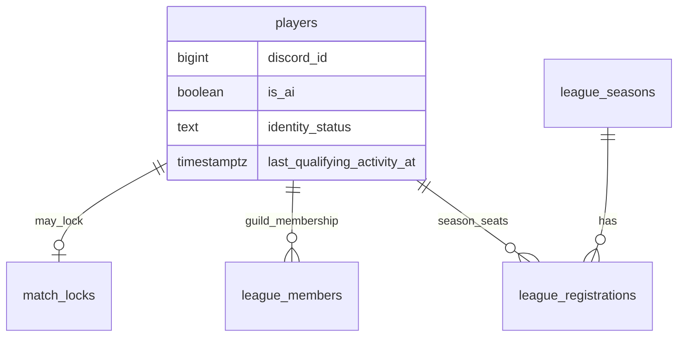

# Data Model: Club State Machine (US-42.3)

**Feature**: `032-club-state-machine`  
**Date**: 2026-07-22

## 1. Durable inputs (existing)

### `players` (human + AI)

| Field | Role |
|-------|------|
| `discord_id` | Club id |
| `is_ai` | ClubKind (Human if false) |
| `identity_status` | Soft primary: `active` / `inactive` / `abandoned` |
| `last_qualifying_activity_at` | Threshold clock |
| `identity_status_changed_at` | Audit |

### Overlays (existing tables)

| Source | Overlay |
|--------|---------|
| `match_locks.discord_id` | MatchLocked |
| `league_registrations(season_id, player_id)` status ∈ registered/locked | LeagueSeated(G,S) for V1 |
| `league_members(guild_id, player_id)` | Legacy/permanent membership (seat-adjacent) |

No new soft-status column in MVP.

## 2. Soft primary derive

Same as US-42.1 / `identity.classify_status`:

- AI → skip soft labels (kind AI)
- days ≥ 90 → Abandoned
- days ≥ 30 → Inactive
- else Active

## 3. Club action vocabulary (`p_action`)

| Code | Meaning |
|------|---------|
| `view_hub` | View-only |
| `recover` | Explicit soft recover |
| `store_faucet` | Daily login / energy refill |
| `development_mutate` | Drill/fusion/allocate/evo/recover fatigue (club auth; card assert still applies) |
| `squad_mutate` | Squad/formation |
| `market_mutate` | List/agent sell auth |
| `match_start` | Start bot/friendly/league match |
| `league_join` | **New** season registration |
| `league_remain` | Mid-season continuity (not a user button) |

## 4. SQL objects (076)

| Object | Role |
|--------|------|
| `assert_club_action_allowed(p_club_id BIGINT, p_action TEXT)` | Raises `CLUB_STATE: …` on Block |
| `register_league_season(p_player_id, p_guild_id, p_season_id)` | Atomic join + assert + touch |
| Grants + verify guards | Required |

## 5. Relationships

