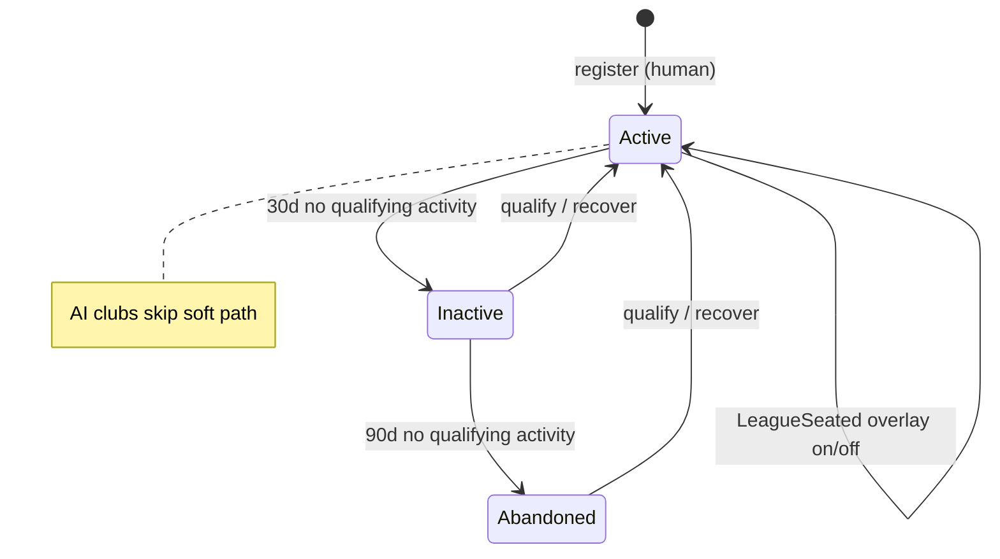

# Feature Specification: Club State Machine (US-42.3)

**Feature Branch**: `032-club-state-machine`

**Created**: 2026-07-22

**Status**: Locked

**Parent epic**: `specs/029-game-integrity` (US-42)

**Child ID**: US-42.3 — Club State Machine

**Depends on**: US-42.1 (`specs/030-identity-ownership`) — one Discord user → one human club; soft lifecycle labels already exist; no hard delete

**Overlays**: League sporting calendar (`026` / `027`) — this child bounds **club eligibility and seat behavior**, not season calendars; Match overlay (US-42.4 for run detail; INV-17 lock already exists); Marketplace (`017` / US-42.6) for sale eligibility at club level; Player card matrix (`031`) remains card-scoped

**Input**: User description: "US-42.3 — Club State Machine. Parent 029; depends 030. Club lifecycle, abandoned/inactive thresholds, league seat bounds. Non-goals: no second league calendar (026); no player-card matrix rewrite (031). Child template; INV touch club lifecycle."

---

## User Scenarios & Testing *(mandatory)*

### User Story 1 — Soft lifecycle is explicit and recoverable (Priority: P1) 🎯 MVP

A human club is always classifiable as **Active**, **Inactive**, or **Abandoned** using frozen day thresholds and a clear qualifying-activity definition. Soft states never destroy inventory or free the Discord identity for a second club. Returning managers recover the **same** club into Active.

**Why this priority**: Epic §4.3 and US-42.1 FR-014/015 require thresholds and automation ownership here; support class “lost club after silence” dies if soft states are vague.

**Independent Test**: Fixture clubs at day 0 / 30 / 90 classify correctly; recovery action returns Abandoned → Active on same club id; second `/register` still rejected.

**Acceptance Scenarios**:

1. **Given** a human club with last qualifying activity < Inactive threshold, **When** status is assessed, **Then** it is Active.
2. **Given** no qualifying activity for ≥ Inactive threshold and < Abandoned threshold, **When** assessed, **Then** Inactive; cards and coins remain; Discord identity still owns that club.
3. **Given** no qualifying activity for ≥ Abandoned threshold, **When** assessed, **Then** Abandoned; inventory remains; second registration is still impossible.
4. **Given** Inactive or Abandoned, **When** the owner performs a qualifying recovery or gated mutation, **Then** the same club becomes Active (or is treated Active for subsequent gates).

---

### User Story 2 — Club action matrix agrees across hubs (Priority: P1)

Whether the manager uses League, Battle, Development, Store, Marketplace, or Squad, club-level gates (soft lifecycle + league seat + MatchLocked + Human vs AI) Block or Allow the same way. UI may hide; server enforces.

**Why this priority**: Split-brain club gates cause “why can’t I join league?” tickets and exploits.

**Independent Test**: For each club action in §B.5, attempt from RPC (or two surfaces) while Inactive / Abandoned / LeagueSeated / MatchLocked / AI → matching Allow/Block family.

**Acceptance Scenarios**:

1. **Given** Inactive human club, **When** they open Store claim daily login or Development drill, **Then** Allowed (soft state does not freeze economy/progression faucets) — unless MatchLocked blocks mutations that require it.
2. **Given** Inactive or Abandoned human club, **When** they try to **join a new league season registration**, **Then** Blocked with a clear recover/play-first reason (or Allowed only after Active recovery — see matrix).
3. **Given** MatchLocked, **When** they try squad swap or start another match, **Then** Block until lock clears.
4. **Given** an AI/system club, **When** a human Discord user tries to “own” or register as that club, **Then** Block; AI clubs are never created via `/register`.

---

### User Story 3 — League seat bounds without rewriting the calendar (Priority: P1)

A human club may hold a **guild-scoped league seat** for a season under `026` rules. This child freezes **club-side** bounds: one seat per club per guild season; leaving the guild mid-season does not delete the club; assistant/AI fill rules stay in `026`. Soft Inactive/Abandoned affects **new** registration eligibility, not mid-season table destruction.

**Why this priority**: Epic problem statement called multi-guild / abandoned seat policy fragmented; `026` owns sport — we own club eligibility edges.

**Independent Test**: Same club cannot double-register into the same guild season; leave guild mid-season → club persists, season handling per `026`; Inactive club cannot newly register until Active (matrix).

**Acceptance Scenarios**:

1. **Given** Active human club not seated in Guild G’s open registration, **When** they register for that season, **Then** Allowed subject to `026` eligibility (deposit, roster, etc.).
2. **Given** already seated in Guild G’s season S, **When** they attempt a second join for S, **Then** Block (idempotent already-seated).
3. **Given** seated mid-season and they leave Guild G, **When** leave is processed, **Then** club and cards remain; sporting continuity follows `026` (assistant / forfeit rules) — **not** hard withdraw+delete.
4. **Given** Abandoned club, **When** registration for a new season is attempted, **Then** Block until recovery to Active (offseason cleanup may replace inactive humans per `026` — this child does not invent a second calendar).

---

### User Story 4 — AI clubs are first-class and bounded (Priority: P2)

AI/system clubs exist only to complete league tables. They are distinguishable from human clubs, never registered via `/register`, never claim human identity, and never consume human promotion/prize identity (`026` / INV-15). Soft Inactive/Abandoned classification does **not** apply to AI clubs.

**Why this priority**: INV-15 and `026` bot-fill rules need a club-kind gate in the integrity matrix.

**Independent Test**: Create/fill path only via system; classify_lifecycle on AI → AI (not Abandoned); human register cannot target AI row.

**Acceptance Scenarios**:

1. **Given** preparation needs bot fill, **When** seats are filled, **Then** AI clubs are created/reused by system only.
2. **Given** an AI club, **When** soft lifecycle classification runs, **Then** kind remains AI; no Inactive/Abandoned human label applied.
3. **Given** settlement prizes/promotion, **When** an AI occupies a table position, **Then** human prize/promotion identity is preserved per `026` (this child asserts club-kind bound; sporting assignment stays `026`).

---

### User Story 5 — Qualifying activity is teachable (Priority: P2)

Managers and ops can predict what “counts” toward staying Active. Cosmetic views do not; successful gated gameplay mutations and explicit recovery do. Thresholds are frozen defaults (aligned with US-42.1 implementation) and may be tuned later without changing state names.

**Why this priority**: Ambiguous activity lists cause false Abandoned labels and angry returns.

**Independent Test**: Profile view alone does not reset inactivity; successful drill / match settlement / login claim / explicit recover does.

**Acceptance Scenarios**:

1. **Given** Inactive club, **When** owner only views profile/hub without mutating, **Then** remains Inactive.
2. **Given** Inactive club, **When** owner successfully completes a qualifying mutation or explicit recover, **Then** becomes Active and activity timestamp updates.
3. **Given** thresholds of 30 days Inactive and 90 days Abandoned (defaults), **When** ops or docs explain soft states, **Then** those numbers are the cited defaults unless product amends this spec.

---

### Edge Cases

| ID | Scenario | Expected | Recovery |
|----|----------|----------|----------|
| E1 | Double-tap league join | ≤1 seat for club×guild×season | Idempotent already-seated |
| E2 | Join while MatchLocked | Block | Retry after unlock |
| E3 | Classify job runs twice same day | Same label; no inventory change | Idempotent classify key |
| E4 | Abandoned + `/register` | Already-registered / same club | Recover path, not new club |
| E5 | Leave all guilds, club exists | Club Active/Inactive/Abandoned as classified; no league seat | Join any mutual guild later |
| E6 | Bot removed mid-season | Club kept; season pause per `026` | Resume per `026` |
| E7 | Human Inactive but already seated | Stay on table; assistant rules per `026`; no mid-season kick solely for Inactive | Offseason replace/mark per `026` |
| E8 | Two guilds, two seasons | Same club may seat in each guild’s season independently | One seat per guild×season |
| E9 | Stale “Join League” embed after Abandoned | Server Block + recover copy | Reopen hub |
| E10 | AI club row mistaken for human | Kind check fails human-only actions | Ops reconcile |
| E11 | Clock skew near threshold | Classification uses durable last-activity timestamp | Fail closed to more restrictive label if equal boundary — document |
| E12 | Recover while MatchLocked | Soft label may become Active; mutations still MatchLocked-blocked | Unlock then play |
| E13 | Payroll / wages on Inactive | Existing wage RPCs still apply unless a later overlay amends | Not rewritten here |
| E14 | Soft state + Listed cards | Card matrix (`031`) still governs cards; club soft state does not cancel listings | Cancel/expire per market rules |

---

## Requirements *(mandatory)*

### Functional Requirements

- **FR-001**: Every human club MUST have exactly one soft lifecycle primary among Active, Inactive, Abandoned for gating purposes (aligned with US-42.1 labels).
- **FR-002**: Default thresholds MUST be **Inactive = 30 days** and **Abandoned = 90 days** since last qualifying activity (same as US-42.1 pure defaults); changing thresholds requires amending this spec (or documented config with same state names).
- **FR-003**: Soft states MUST NOT hard-delete clubs, cards, or coin balances, and MUST NOT free Discord identity for a second human club (INV-01).
- **FR-004**: Returning owners MUST recover the same club to Active via qualifying activity or explicit recover — never via second `/register`.
- **FR-005**: System MUST define **qualifying activity** as: successful gated club mutations that already touch activity (economy/XP/match/league join or play paths) and/or explicit `recover_club` — **not** view-only hub opens or profile peeks.
- **FR-006**: Club-level actions MUST obey the Allow/Block matrix in §B.5; Discord UI MUST NOT be the sole enforcer.
- **FR-007**: **LeagueSeated** is a **guild-season overlay** (not a replacement soft primary): a club may be Active/Inactive/Abandoned and also seated in zero or more guild seasons subject to bounds.
- **FR-008**: A human club MUST hold at most **one seat per guild per season**; double-join is idempotent AlreadySeated.
- **FR-009**: Leaving a guild or bot removal MUST NOT delete the club; mid-season sporting continuity is owned by `026` / US-42.5 — this child only forbids delete and forbids inventing a second calendar.
- **FR-010**: Inactive/Abandoned MUST Block **new** league season registration until Active (or until an explicit product exception is amended here); they MUST NOT by themselves forfeit an in-progress seated season mid-cycle.
- **FR-011**: **MatchLocked** remains a club overlay that Blocks match-start and roster/dev mutations per existing INV-17 / US-42.2 — this child cites it in the club matrix, does not redefine lock acquisition.
- **FR-012**: Clubs MUST be kind **Human** or **AI**; AI clubs MUST NOT be creatable via `/register` and MUST NOT receive human soft Inactive/Abandoned labels (INV-15).
- **FR-013**: AI clubs MUST NOT consume human promotion/prize identity when `026` awards humans — club-kind bound; sporting assignment stays in `026`.
- **FR-014**: Classification and recovery MUST be idempotent under double-invoke (same label / same club).
- **FR-015**: Reason families MUST be stable enough for hubs (`CLUB_STATE: Inactive blocks league_join`, etc.).
- **FR-016**: This feature MUST NOT rewrite the `026`/`027` season calendar, deadlines, or sporting forfeit table.
- **FR-017**: This feature MUST NOT rewrite the US-42.2 player-card exclusive matrix or add parallel card busy states.
- **FR-018**: This feature MUST NOT redefine XP or economy pipes; ownership of balances remains US-42.1 / US-25.
- **FR-019**: No new slash commands or hubs for integrity alone — extend existing gates and optional profile soft-status presentation.
- **FR-020**: Player-facing rule changes managers see MUST update `change_log.md` when shipped.

### Key Entities

- **Club**: Durable manager club (human or AI).
- **ClubSoftLifecycle**: Active | Inactive | Abandoned (human only).
- **ClubKind**: Human | AI.
- **LeagueSeatOverlay**: Seated in guild season S (0..N seats across guilds).
- **MatchLockedOverlay**: Club in active match lock.
- **ClubAction**: Named club-scoped intent (join league, start match, recover, …).
- **QualifyingActivity**: Mutation class that refreshes last-activity and can recover soft state.

---

## A. Epic invariant touch list

| INV | Role in US-42.3 |
|-----|-----------------|
| **INV-01** | Bound — soft states never allow second human club |
| **INV-02** | Bound — club remains owner of its cards through soft states |
| **INV-04/05** | Bound — economy still via pipe; soft state doesn’t invent balances |
| **INV-09** | Bound — settlement attaches to durable club identity |
| **INV-15** | Primary — AI vs human club kind + fill bounds |
| **INV-17** | Bound — MatchLocked overlay in club action matrix |

Does not weaken epic INVs. Clarifies epic §5.2: **LeagueSeated is overlay**; soft primary remains Active/Inactive/Abandoned.

---

## B. State machine / lifecycle

### B.1 Soft primary (human)

| State | Entry | Exit |
|-------|-------|------|
| **Active** | Register; recover; qualifying activity while soft | Cross Inactive threshold without activity |
| **Inactive** | ≥30d no qualifying activity | Qualifying activity / recover → Active; or cross Abandoned |
| **Abandoned** | ≥90d no qualifying activity | Qualifying activity / recover → Active |

### B.2 Overlays

| Overlay | Proof (informative) | Effect |
|---------|---------------------|--------|
| **LeagueSeated(G,S)** | Member/participant row for guild G season S | In-season continuity per `026`; Blocks duplicate join for G,S |
| **MatchLocked** | `match_locks` for club | Blocks mutations in matrix MatchLocked column |

### B.3 Kind

| Kind | Entry | Notes |
|------|-------|-------|
| **Human** | `/register` only | Soft lifecycle applies |
| **AI** | System league fill only | No human soft labels; no `/register` |

### B.4 Transition diagram

### B.5 Club action matrix

Legend: **A** = Allowed (if other non-club gates pass); **B** = Blocked; **V** = View-only Allowed; **—** = N/A

| Action | Active | Inactive | Abandoned | LeagueSeated* | MatchLocked* | AI kind |
|--------|--------|----------|-----------|---------------|--------------|---------|
| View hubs / profile | V | V | V | V | V | V† |
| Recover soft status | — | A | A | A | A‡ | — |
| Daily login / energy refill | A | A | A | A | A§ | B |
| Stat drill / fusion / allocate / recover fatigue | A | A | A | A | B | B |
| Start / claim / cancel evolution | A | A | A | A | B | B |
| Squad edit / formation | A | A | A | A | B | B‖ |
| Agent sell / list transfer (club auth) | A | A | A | A | B | B |
| Start bot/friendly/league match | A | A | A | A | B | B‖ |
| Join **new** league season registration | A | B | B | AlreadySeated→A idempotent | B | B |
| Remain mid-season seated | A | A | A | A | A | A (bots) |
| Withdraw mid-season (if product offers) | per `026` | per `026` | per `026` | per `026` | B | — |
| Second `/register` | B | B | B | B | B | B |
| Create via `/register` | Human only | — | — | — | — | B |

\*Overlays stack: if MatchLocked, use MatchLocked column for mutations; LeagueSeated does not by itself Block development.  
†AI “view” is ops/system; humans don’t operate AI clubs via hubs.  
‡Recover may flip soft label while MatchLocked; gated mutations still Block.  
§Store faucets Allowed unless a specific RPC already asserts match lock — prefer Allow for login/refill.  
‖AI clubs play via system automation, not human hub.

**Default for unspecified club actions**: Block for AI human-hub paths; for human soft states Allow progression/economy, Block competitive **entry** (new season register) when Inactive/Abandoned.

### B.6 Failure recovery

| Failure | Behavior |
|---------|----------|
| Classify mid-outage | Retry; idempotent label; no inventory wipe |
| Recover RPC fails | Soft label unchanged; retry |
| Join league fails after debit | `026` atomicity — no seat without valid join; this child doesn’t fork calendar |
| Double recover | Still Active; no duplicate side effects |

---

## C. Logical actions & idempotency

| Action | Actor | Idempotency key pattern | Pipeline | Success | Reject reasons |
|--------|-------|-------------------------|----------|---------|----------------|
| `classify_club_lifecycle` | Job/on-read | `classify:{club_id}:{utc_date}` | Ownership label | Label set | AI skipped |
| `recover_club` | Owner | Natural / `recover:{club_id}` | Ownership label | Active | Not owner; AI |
| `assert_club_action_allowed` | System | N/A (guard) | Ownership | Continue | Soft/overlay/kind matrix |
| `league_join` | Owner | Season×guild×club natural | Competitive (`026`) | Seated | Inactive/Abandoned; already seated; MatchLocked; `026` gates |
| `touch_qualifying_activity` | System | Best-effort on mutation | Ownership | Timestamp | — |
| `ai_fill_seat` | System | Season×slot | Competitive | AI club seated | Human-only slots |

---

## D. Source of truth

| Concern | Durable truth | Presentation | Must not decide alone |
|---------|---------------|--------------|------------------------|
| Soft lifecycle | Stored/derived label + last qualifying activity | Optional profile badge | Hub button alone |
| League seat | Season participant/member rows (`026`) | League hub | Stale join embed |
| Match lock | `match_locks` | Battle UI | Client timer |
| Club kind | Durable human vs AI marker | Bot badge in standings | Username lookalike |
| Card busy | US-42.2 proofs | Card embeds | Club soft state alone |

Cite parent SoT matrix (`specs/029-game-integrity/spec.md` §3).

---

## E. Outage & catch-up

| Failure | Behavior |
|---------|----------|
| Bot down across inactivity threshold | Next classify/on-read applies label; no backdated wipe |
| Bot down mid league join | `026` fail closed / settle-once — no second calendar here |
| Discord leave while Abandoned | Club remains Abandoned until recover |
| Scheduler missed classify days | Catch-up classify to current thresholds; still no delete |
| Dependency (Top.gg) down | Irrelevant to soft lifecycle; packs stay fail-closed elsewhere |

---

## F. Implementation non-goals

- Second league calendar, deadline engine, or sporting forfeit table (`026`/`027` / US-42.5)
- Rewriting player-card exclusive matrix (`031`)
- Hard club delete / GDPR wipe / ownership transfer between Discord users
- Multi-club accounts or per-guild inventories
- New integrity-only slash commands or hubs
- Redefining `apply_club_economy` / `apply_card_xp`
- Full US-42.4 match run state machine (only cite MatchLocked)
- Marketplace purchase race depth (US-42.6)
- Alt/ban hard enforcement (US-42.10)

---

## G. Acceptance tests (integrity)

| Test | Expected |
|------|----------|
| Double-invoke recover | Single Active club; no duplicate side effects |
| Concurrent classify | Stable label; no inventory change |
| Stale Join League after Abandoned | Block + clear reason; no seat |
| Restart after recover success | Still Active same club |
| Leave guild mid-season | Club not deleted |
| AI fill | AI kind; not human Inactive |
| Inactive new season join | Block |
| Active progression while Inactive? | **Allowed** per matrix (Inactive still may drill/login) |
| View-only does not qualify | Still Inactive |

---

## Success Criteria *(mandatory)*

### Measurable Outcomes

- **SC-001**: In scripted fixtures, classification at day 29 / 30 / 90 matches Active / Inactive / Abandoned defaults with **0** inventory deletions.
- **SC-002**: In 20 Abandoned + `/register` attempts, **0** second human clubs created; all recover or already-registered.
- **SC-003**: In 20 Inactive/Abandoned **new** league join attempts, **100%** Block (or require Active first) with stable reason family.
- **SC-004**: In 20 leave-guild mid-season simulations, **0** clubs deleted as a side effect of soft/seat policy.
- **SC-005**: AI fill path creates **0** human-registerable clubs; soft classify never marks AI as Abandoned.
- **SC-006**: A new engineer can explain Active/Inactive/Abandoned + “LeagueSeated is overlay” + “no second calendar” from this spec in ≤15 minutes (spot check).

---

## Assumptions

- US-42.1 thresholds (30/90) and `identity_status` / activity touch already exist; this child **owns** club action matrix, seat bounds, AI kind rules, and any automation gaps — it does not re-litigate one-club identity.
- `026` continues to own assistant manager, forfeit, bot strength, and offseason replace-of-inactive-humans sporting behavior; US-42.5 may add integrity overlays later.
- Same global club may participate in multiple guilds’ leagues over time (one seat per guild×season).
- Cosmetic profile/hub views never count as qualifying activity.
- Optional soft-status UI is presentation-only; absence of badge does not weaken server gates.

---

## Dependencies

| Depends on | Why |
|------------|-----|
| `specs/029-game-integrity` | Parent constitution |
| `specs/030-identity-ownership` | One club; soft labels; no delete-on-leave |
| `specs/026-league-lifecycle-rulebook` (+ `027`) | Season calendar & seating sport |
| `specs/031-player-state-machine` | Card busy matrix stays separate |

**Downstream**: US-42.4 (match), US-42.5 (league integrity overlay), US-42.7 (economy registry may cite club soft gates).
