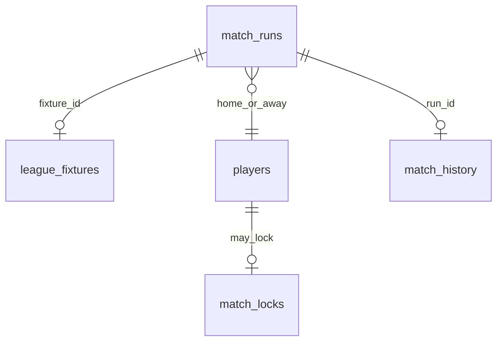

# Data Model: Match Integrity (US-42.4)

**Feature**: `033-match-integrity`  
**Date**: 2026-07-22

## 1. Existing durable entities

### `match_runs` (019+)

| Field | Role |
|-------|------|
| `id` | Match run identity / reward key root |
| `run_type` | `bot` \| `friendly` \| `league` |
| `status` | `streaming` \| `completing` \| `completed` \| `abandoned` \| `failed` |
| `home_discord_id` / `away_discord_id` / `active_discord_id` | Participants |
| `fixture_id` | League binding (unique active while streaming/completing) |
| `completion_key` | Optional unique settle key |
| `squad_snapshot` | Frozen XI truth for sim |

### `match_locks`

| Field | Role |
|-------|------|
| `discord_id` | Club under MatchLocked overlay |

### `match_history` / economy ledger

| Concern | Idempotency |
|---------|-------------|
| Coins/energy | `match:{run_id}:{club_id}` |
| XP / evo | `xp_applied_at` on history + `process_match_result` |
| League history | unique `(player_id, fixture_id)` |

## 2. Logical lifecycle mapping

| Spec state | Typical `match_runs.status` |
|------------|------------------------------|
| Created / Locked / Simulating | `streaming` (+ lock row) |
| Settled + Rewarded | `completed` (rewards applied) |
| Aborted | `abandoned` / `failed` |
| Presented | Not a DB column — Discord best-effort after `completed` |

## 3. SQL objects (077)

| Object | Role |
|--------|------|
| `abandon_match_run(p_run_id UUID, p_reason TEXT DEFAULT NULL)` | Terminal abort + release participant locks |
| `reconcile_orphaned_match_locks()` | Delete locks with no active streaming/completing run |
| Grants + verify | Required |

## 4. Relationships

