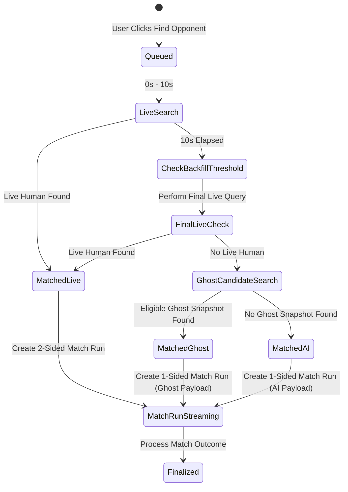

# Data Model: Feature 054 — Instant PvP Backfill and Ghost Managers

**Branch**: `054-instant-pvp-backfill` | **Date**: 2026-08-05

## Entity Definitions

### 1. `pvp_ghost_snapshots` Table

Stores recent frozen squad snapshots of real managers for use as Ghost opponents.

| Column | Type | Constraints | Description |
|---|---|---|---|
| `owner_id` | `BIGINT` | `PRIMARY KEY, REFERENCES players(discord_id)` | Manager owner ID |
| `club_name` | `TEXT` | `NOT NULL` | Club name at snapshot capture time |
| `global_lp` | `INTEGER` | `NOT NULL` | Global LP at snapshot capture time |
| `global_division` | `TEXT` | `NOT NULL` | Global division name |
| `division_rank` | `INTEGER` | `NOT NULL` | Calculated division rank (1-N) |
| `xi_rating` | `NUMERIC(6,2)` | `NOT NULL` | Average OVR rating of starting XI (0.00 to 99.99) |
| `snapshot_json` | `JSONB` | `NOT NULL` | Canonical snapshot payload (squad, card_meta, formation, tactics) |
| `snapshot_schema` | `INTEGER` | `NOT NULL DEFAULT 1` | Version schema of payload format |
| `captured_at` | `TIMESTAMPTZ` | `NOT NULL` | Timestamp when snapshot was created/refreshed |
| `last_selected_at` | `TIMESTAMPTZ` | `NULLABLE` | Timestamp when last selected as opponent |
| `selection_count` | `INTEGER` | `NOT NULL DEFAULT 0` | Total times selected as a ghost opponent |
| `eligible` | `BOOLEAN` | `NOT NULL DEFAULT TRUE` | Active eligibility flag (e.g. false if squad invalidated) |
| `updated_at` | `TIMESTAMPTZ` | `NOT NULL DEFAULT NOW()` | Record update timestamp |

**Indexes**:
- `idx_pvp_ghost_snapshots_eligibility`: `(eligible, captured_at DESC)`
- `idx_pvp_ghost_snapshots_match`: `(eligible, division_rank, global_lp, xi_rating, captured_at)`

---

### 2. `pvp_ghost_encounters` Table

Tracks ghost and AI backfill encounters for cooldowns, daily caps, and analytical auditing.

| Column | Type | Constraints | Description |
|---|---|---|---|
| `run_id` | `UUID` | `PRIMARY KEY` | Match run identifier |
| `challenger_id` | `BIGINT` | `NOT NULL, REFERENCES players(discord_id)` | Searching manager ID |
| `ghost_owner_id` | `BIGINT` | `NULLABLE, REFERENCES players(discord_id)` | Ghost owner ID (NULL for Ranked AI) |
| `opponent_mode` | `TEXT` | `NOT NULL` | `'ghost'` or `'ai_backfill'` |
| `snapshot_captured_at` | `TIMESTAMPTZ` | `NULLABLE` | Capture timestamp of ghost snapshot used |
| `created_at` | `TIMESTAMPTZ` | `NOT NULL DEFAULT NOW()` | Encounter creation timestamp |

**Indexes**:
- `idx_pvp_ghost_encounters_challenger_daily`: `(challenger_id, created_at)`
- `idx_pvp_ghost_encounters_cooldown`: `(challenger_id, ghost_owner_id, created_at DESC)`

---

### 3. Queue & Match Table Alterations

#### `pvp_matchmaking_queue`
- `ADD COLUMN backfill_after TIMESTAMPTZ`: Timestamp after which queue entry can be matched with Ghost or AI backfill (typically `joined_at + INTERVAL '10 seconds'`).
- `ADD COLUMN preferred_mode TEXT NOT NULL DEFAULT 'automatic'`: Matchmaking mode preference.

#### `match_runs`
- `ADD COLUMN opponent_mode TEXT NOT NULL DEFAULT 'live'`: Classification of opponent (`'live'`, `'ghost'`, `'ai_backfill'`).

#### `match_history`
- `ADD COLUMN opponent_mode TEXT NOT NULL DEFAULT 'live'`: Classification of opponent (`'live'`, `'ghost'`, `'ai_backfill'`).
- `ADD COLUMN opponent_snapshot_age_seconds INTEGER NULLABLE`: Age of ghost snapshot in seconds at match time.

---

## State Machine & Flow Diagrams

### Matchmaking Selection State Machine

---

## Validation & Eligibility Rules

1. **Ghost Snapshot Eligibility**:
   - Must contain exactly 11 active non-retired cards.
   - `captured_at >= NOW() - INTERVAL '7 days'`.
   - `eligible = TRUE`.
   - Owner is not suspended or deleted.

2. **Ghost Candidate Selection Constraints**:
   - `ghost_owner_id != challenger_id`.
   - No block record in `pvp_blocks` between challenger and ghost owner.
   - No encounter between challenger and ghost owner in past 24 hours (`pvp_ghost_encounters` & `match_history`).
   - Maximum 2 encounters between challenger and ghost owner in past 7 days.
   - Challenger daily backfill count (`opponent_mode IN ('ghost', 'ai_backfill')` on current UTC day) < 3.

3. **Candidate Scoring Order**:
   1. `ABS(division_rank - challenger_division_rank) ASC`
   2. `ABS(xi_rating - challenger_xi_rating) ASC`
   3. `ABS(global_lp - challenger_global_lp) ASC`
   4. `captured_at DESC` (freshest snapshot)
   5. `last_selected_at ASC NULLS FIRST`
   6. `selection_count ASC`
